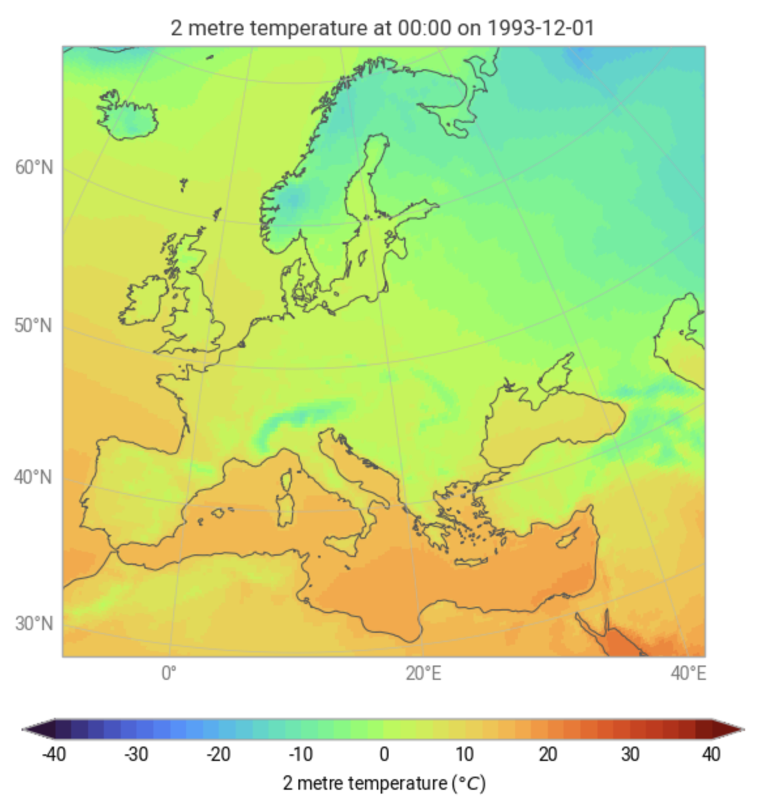

Welcome to the earthkit-plots documentation
======================================================

|Static Badge| |image1| |License: Apache 2.0|

.. |Static Badge| image:: https://github.com/ecmwf/codex/raw/refs/heads/main/ESEE/foundation_badge.svg
   :target: https://github.com/ecmwf/codex/raw/refs/heads/main/ESEE
.. |image1| image:: https://github.com/ecmwf/codex/raw/refs/heads/main/Project%20Maturity/incubating_badge.svg
   :target: https://github.com/ecmwf/codex/raw/refs/heads/main/Project%20Maturity
.. |License: Apache 2.0| image:: https://img.shields.io/badge/License-Apache%202.0-blue.svg
   :target: https://opensource.org/licenses/apache-2-0

**earthkit-plots** leverages the power of the **earthkit** ecosystem to make producing publication-quality scientific graphics as simple and convenient as possible.

It is built on top of popular data science and visualisation tools like **numpy**, **xarray**, **matplotlib** and **cartopy**, but provides a very high-level API enriched with domain-specific knowledge, making it exceptionally easy to use.

Key features include:

⚡ **Concise, high-level API**
Generate high-quality visualisations with minimal code.

🧠 **Intelligent formatting**
Titles and labels automatically adapt based on common metadata standards.

🎨 **Customisable style libraries**
Easily swap styles to match your organisation, project, or personal preferences.

🔍 **Automatic data styling**
Detects metadata like variables and units to optionally apply appropriate formatting and styling.

🌍 **Complex grids supported out-of-the-box**
Visualise grids like HEALPix and reduced Gaussian without any extra legwork.

.. important::

    This software is **Incubating** and subject to ECMWF's guidelines on `Software Maturity <https://github.com/ecmwf/codex/raw/refs/heads/main/Project%20Maturity>`_.

**Quick start**

.. code-block:: python

    earthkit.plots.quickplot(data, domain="Europe", units="celsius")

.. toctree::
   :maxdepth: 1
   :caption: Examples

   examples/examples/examples.ipynb
   examples/gallery/gallery.ipynb

.. toctree::
   :maxdepth: 1
   :caption: Documentation

   user-guide
   _api/index
   development

.. toctree::
   :maxdepth: 1
   :caption: Installation

   install
   release-notes/index
   licence

.. toctree::
   :maxdepth: 1
   :caption: Projects

   earthkit <https://earthkit.readthedocs.io/en/latest>
