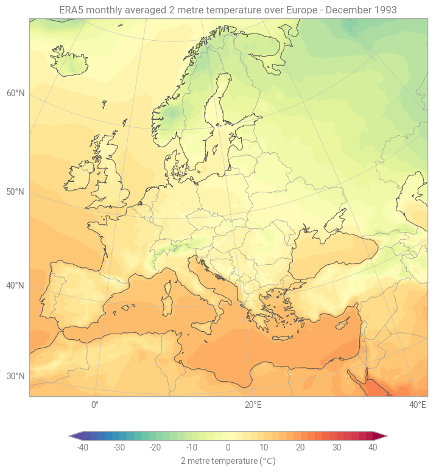

Welcome to the earthkit-plots documentation
======================================================

|Static Badge| |image1| |License: Apache 2.0|

.. |Static Badge| image:: https://github.com/ecmwf/codex/raw/refs/heads/main/ESEE/foundation_badge.svg
   :target: https://github.com/ecmwf/codex/raw/refs/heads/main/ESEE
.. |image1| image:: https://github.com/ecmwf/codex/raw/refs/heads/main/Project%20Maturity/incubating_badge.svg
   :target: https://github.com/ecmwf/codex/raw/refs/heads/main/Project%20Maturity
.. |License: Apache 2.0| image:: https://img.shields.io/badge/License-Apache%202.0-blue.svg
   :target: https://opensource.org/licenses/apache-2-0

**earthkit-plots** is a high-level Python library for producing publication-quality
scientific graphics with minimal code. Built on **matplotlib**, **cartopy**,
**xarray**, and the broader **earthkit** ecosystem, it enriches these tools with
domain-specific knowledge so you can focus on your data rather than plot
configuration.

Key features:

- **Concise API** - generate complex visualisations in just a few lines.
- **Automatic data extraction** - reads GRIB, netCDF, and zarr data; works with
  xarray DataArrays and NumPy arrays; handles geographic coordinates, grids, and
  CRS automatically.
- **Intelligent formatting** - titles, labels, and colour scales adapt based on
  detected metadata, variables, and units.
- **Style libraries** - swap styles to match your organisation, project, or
  preferences.
- **Complex grids out of the box** - HEALPix, reduced Gaussian, and more with no
  extra legwork.

.. important::

    This software is **Incubating** and subject to ECMWF's guidelines on `Software Maturity <https://github.com/ecmwf/codex/raw/refs/heads/main/Project%20Maturity>`_.

**Quick start**

**earthkit-plots** provides a high level api to quickly visualise data.

.. code-block:: python

    (
        ekp.geo.plot(era5_2t, domain="Europe", units="celsius")
        .title("ERA5 monthly averaged {variable_name} over {domain} - {time:%B %Y}")
        .borders()
        .gridlines()
        .show()
    )

.. toctree::
   :maxdepth: 1
   :caption: Examples

   examples/examples/examples.ipynb
   examples/gallery/gallery.ipynb

.. toctree::
   :maxdepth: 1
   :caption: Documentation

   styles-gallery
   api
   development

.. toctree::
   :maxdepth: 1
   :caption: Installation

   install
   release-notes/index
   licence

.. toctree::
   :maxdepth: 1
   :caption: Projects

   earthkit <https://earthkit.readthedocs.io/en/latest>
