.. _styles-gallery:

Styles gallery
==============

This page lists all built-in styles shipped with **earthkit-plots**.
Each entry shows the style name and a preview of the colorbar.
Click the copy button next to any name to copy it for use in your code::

    chart.contourf(data, style="temperature-2m-turbo-celsius")

.. note::

   Many styles have units in their colorbar labels (e.g. °C, m/s).
   These styles will attempt to automatically convert the units of
   your data to match the style's units.

.. raw:: html

   
   

     <input id="ek-search" type="search" placeholder="Search by style name, parameter name, short name, standard name…" oninput="ekFilter()">
     

   

   

.. raw:: html

   

   <h2 class="ek-section-heading">Divergence</h2>

.. raw:: html

   

<code class="ek-style-name">sh-blured-fm50t50lst-cell</code>
<button class="ek-copy-btn" onclick="ekCopy(this, 'sh-blured-fm50t50lst-cell')"><svg xmlns="http://www.w3.org/2000/svg" width="14" height="14" viewBox="0 0 24 24" fill="none" stroke="currentColor" stroke-width="2" stroke-linecap="round" stroke-linejoin="round"><path stroke="none" d="M0 0h24v24H0z" fill="none"/><path d="M7 7m0 2.667a2.667 2.667 0 0 1 2.667 -2.667h8.666a2.667 2.667 0 0 1 2.667 2.667v8.666a2.667 2.667 0 0 1 -2.667 2.667h-8.666a2.667 2.667 0 0 1 -2.667 -2.667z" /><path d="M4.012 16.737a2.005 2.005 0 0 1 -1.012 -1.737v-10c0 -1.1 .9 -2 2 -2h10c.75 0 1.158 .385 1.5 1" /></svg> Copy this style name</button>

.. image:: _static/styles/sh-blured-fm50t50lst-cell.png
   :alt: colorbar preview

.. raw:: html

   

.. raw:: html

   

<code class="ek-style-name">sh-blured-fm50t50lst</code>
<button class="ek-copy-btn" onclick="ekCopy(this, 'sh-blured-fm50t50lst')"><svg xmlns="http://www.w3.org/2000/svg" width="14" height="14" viewBox="0 0 24 24" fill="none" stroke="currentColor" stroke-width="2" stroke-linecap="round" stroke-linejoin="round"><path stroke="none" d="M0 0h24v24H0z" fill="none"/><path d="M7 7m0 2.667a2.667 2.667 0 0 1 2.667 -2.667h8.666a2.667 2.667 0 0 1 2.667 2.667v8.666a2.667 2.667 0 0 1 -2.667 2.667h-8.666a2.667 2.667 0 0 1 -2.667 -2.667z" /><path d="M4.012 16.737a2.005 2.005 0 0 1 -1.012 -1.737v-10c0 -1.1 .9 -2 2 -2h10c.75 0 1.158 .385 1.5 1" /></svg> Copy this style name</button>

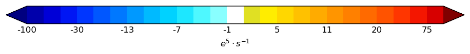

.. raw:: html

   

.. raw:: html

   

<code class="ek-style-name">sh-blured-fm50t50lst-less</code>
<button class="ek-copy-btn" onclick="ekCopy(this, 'sh-blured-fm50t50lst-less')"><svg xmlns="http://www.w3.org/2000/svg" width="14" height="14" viewBox="0 0 24 24" fill="none" stroke="currentColor" stroke-width="2" stroke-linecap="round" stroke-linejoin="round"><path stroke="none" d="M0 0h24v24H0z" fill="none"/><path d="M7 7m0 2.667a2.667 2.667 0 0 1 2.667 -2.667h8.666a2.667 2.667 0 0 1 2.667 2.667v8.666a2.667 2.667 0 0 1 -2.667 2.667h-8.666a2.667 2.667 0 0 1 -2.667 -2.667z" /><path d="M4.012 16.737a2.005 2.005 0 0 1 -1.012 -1.737v-10c0 -1.1 .9 -2 2 -2h10c.75 0 1.158 .385 1.5 1" /></svg> Copy this style name</button>

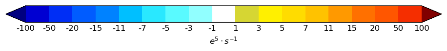

.. raw:: html

   

.. raw:: html

   

<code class="ek-style-name">sh-blu-fm50tm1lst</code>
<button class="ek-copy-btn" onclick="ekCopy(this, 'sh-blu-fm50tm1lst')"><svg xmlns="http://www.w3.org/2000/svg" width="14" height="14" viewBox="0 0 24 24" fill="none" stroke="currentColor" stroke-width="2" stroke-linecap="round" stroke-linejoin="round"><path stroke="none" d="M0 0h24v24H0z" fill="none"/><path d="M7 7m0 2.667a2.667 2.667 0 0 1 2.667 -2.667h8.666a2.667 2.667 0 0 1 2.667 2.667v8.666a2.667 2.667 0 0 1 -2.667 2.667h-8.666a2.667 2.667 0 0 1 -2.667 -2.667z" /><path d="M4.012 16.737a2.005 2.005 0 0 1 -1.012 -1.737v-10c0 -1.1 .9 -2 2 -2h10c.75 0 1.158 .385 1.5 1" /></svg> Copy this style name</button>

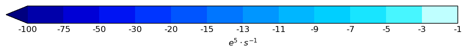

.. raw:: html

   

.. raw:: html

   

<code class="ek-style-name">sh-red-f1t50lst</code>
<button class="ek-copy-btn" onclick="ekCopy(this, 'sh-red-f1t50lst')"><svg xmlns="http://www.w3.org/2000/svg" width="14" height="14" viewBox="0 0 24 24" fill="none" stroke="currentColor" stroke-width="2" stroke-linecap="round" stroke-linejoin="round"><path stroke="none" d="M0 0h24v24H0z" fill="none"/><path d="M7 7m0 2.667a2.667 2.667 0 0 1 2.667 -2.667h8.666a2.667 2.667 0 0 1 2.667 2.667v8.666a2.667 2.667 0 0 1 -2.667 2.667h-8.666a2.667 2.667 0 0 1 -2.667 -2.667z" /><path d="M4.012 16.737a2.005 2.005 0 0 1 -1.012 -1.737v-10c0 -1.1 .9 -2 2 -2h10c.75 0 1.158 .385 1.5 1" /></svg> Copy this style name</button>

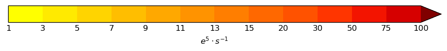

.. raw:: html

   

.. raw:: html

   

<code class="ek-style-name">sh-viobrn-fm50t50lst-less</code>
<button class="ek-copy-btn" onclick="ekCopy(this, 'sh-viobrn-fm50t50lst-less')"><svg xmlns="http://www.w3.org/2000/svg" width="14" height="14" viewBox="0 0 24 24" fill="none" stroke="currentColor" stroke-width="2" stroke-linecap="round" stroke-linejoin="round"><path stroke="none" d="M0 0h24v24H0z" fill="none"/><path d="M7 7m0 2.667a2.667 2.667 0 0 1 2.667 -2.667h8.666a2.667 2.667 0 0 1 2.667 2.667v8.666a2.667 2.667 0 0 1 -2.667 2.667h-8.666a2.667 2.667 0 0 1 -2.667 -2.667z" /><path d="M4.012 16.737a2.005 2.005 0 0 1 -1.012 -1.737v-10c0 -1.1 .9 -2 2 -2h10c.75 0 1.158 .385 1.5 1" /></svg> Copy this style name</button>

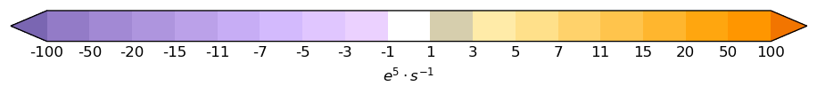

.. raw:: html

   

.. raw:: html

   

<code class="ek-style-name">ct-blured-fm5t50</code>
<button class="ek-copy-btn" onclick="ekCopy(this, 'ct-blured-fm5t50')"><svg xmlns="http://www.w3.org/2000/svg" width="14" height="14" viewBox="0 0 24 24" fill="none" stroke="currentColor" stroke-width="2" stroke-linecap="round" stroke-linejoin="round"><path stroke="none" d="M0 0h24v24H0z" fill="none"/><path d="M7 7m0 2.667a2.667 2.667 0 0 1 2.667 -2.667h8.666a2.667 2.667 0 0 1 2.667 2.667v8.666a2.667 2.667 0 0 1 -2.667 2.667h-8.666a2.667 2.667 0 0 1 -2.667 -2.667z" /><path d="M4.012 16.737a2.005 2.005 0 0 1 -1.012 -1.737v-10c0 -1.1 .9 -2 2 -2h10c.75 0 1.158 .385 1.5 1" /></svg> Copy this style name</button>

.. raw:: html

   

.. raw:: html

   

.. raw:: html

   

   <h2 class="ek-section-heading">Instantaneous 10 metre wind gust</h2>

.. raw:: html

   

<code class="ek-style-name">sh-red-f10t70lst</code>
<button class="ek-copy-btn" onclick="ekCopy(this, 'sh-red-f10t70lst')"><svg xmlns="http://www.w3.org/2000/svg" width="14" height="14" viewBox="0 0 24 24" fill="none" stroke="currentColor" stroke-width="2" stroke-linecap="round" stroke-linejoin="round"><path stroke="none" d="M0 0h24v24H0z" fill="none"/><path d="M7 7m0 2.667a2.667 2.667 0 0 1 2.667 -2.667h8.666a2.667 2.667 0 0 1 2.667 2.667v8.666a2.667 2.667 0 0 1 -2.667 2.667h-8.666a2.667 2.667 0 0 1 -2.667 -2.667z" /><path d="M4.012 16.737a2.005 2.005 0 0 1 -1.012 -1.737v-10c0 -1.1 .9 -2 2 -2h10c.75 0 1.158 .385 1.5 1" /></svg> Copy this style name</button>

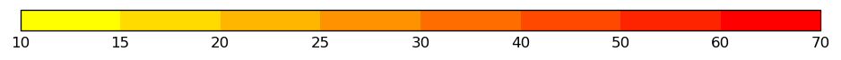

.. raw:: html

   

.. raw:: html

   

<code class="ek-style-name">sh-all-f2t50i2</code>
<button class="ek-copy-btn" onclick="ekCopy(this, 'sh-all-f2t50i2')"><svg xmlns="http://www.w3.org/2000/svg" width="14" height="14" viewBox="0 0 24 24" fill="none" stroke="currentColor" stroke-width="2" stroke-linecap="round" stroke-linejoin="round"><path stroke="none" d="M0 0h24v24H0z" fill="none"/><path d="M7 7m0 2.667a2.667 2.667 0 0 1 2.667 -2.667h8.666a2.667 2.667 0 0 1 2.667 2.667v8.666a2.667 2.667 0 0 1 -2.667 2.667h-8.666a2.667 2.667 0 0 1 -2.667 -2.667z" /><path d="M4.012 16.737a2.005 2.005 0 0 1 -1.012 -1.737v-10c0 -1.1 .9 -2 2 -2h10c.75 0 1.158 .385 1.5 1" /></svg> Copy this style name</button>

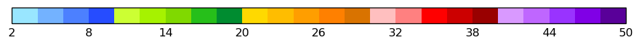

.. raw:: html

   

.. raw:: html

   

<code class="ek-style-name">sh-grn-f10t100lst</code>
<button class="ek-copy-btn" onclick="ekCopy(this, 'sh-grn-f10t100lst')"><svg xmlns="http://www.w3.org/2000/svg" width="14" height="14" viewBox="0 0 24 24" fill="none" stroke="currentColor" stroke-width="2" stroke-linecap="round" stroke-linejoin="round"><path stroke="none" d="M0 0h24v24H0z" fill="none"/><path d="M7 7m0 2.667a2.667 2.667 0 0 1 2.667 -2.667h8.666a2.667 2.667 0 0 1 2.667 2.667v8.666a2.667 2.667 0 0 1 -2.667 2.667h-8.666a2.667 2.667 0 0 1 -2.667 -2.667z" /><path d="M4.012 16.737a2.005 2.005 0 0 1 -1.012 -1.737v-10c0 -1.1 .9 -2 2 -2h10c.75 0 1.158 .385 1.5 1" /></svg> Copy this style name</button>

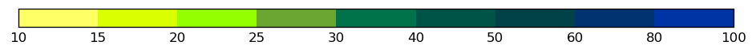

.. raw:: html

   

.. raw:: html

   

<code class="ek-style-name">sh-all-f03t70-beauf</code>
<button class="ek-copy-btn" onclick="ekCopy(this, 'sh-all-f03t70-beauf')"><svg xmlns="http://www.w3.org/2000/svg" width="14" height="14" viewBox="0 0 24 24" fill="none" stroke="currentColor" stroke-width="2" stroke-linecap="round" stroke-linejoin="round"><path stroke="none" d="M0 0h24v24H0z" fill="none"/><path d="M7 7m0 2.667a2.667 2.667 0 0 1 2.667 -2.667h8.666a2.667 2.667 0 0 1 2.667 2.667v8.666a2.667 2.667 0 0 1 -2.667 2.667h-8.666a2.667 2.667 0 0 1 -2.667 -2.667z" /><path d="M4.012 16.737a2.005 2.005 0 0 1 -1.012 -1.737v-10c0 -1.1 .9 -2 2 -2h10c.75 0 1.158 .385 1.5 1" /></svg> Copy this style name</button>

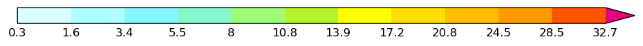

.. raw:: html

   

.. raw:: html

   

<code class="ek-style-name">ct-red-i5</code>
<button class="ek-copy-btn" onclick="ekCopy(this, 'ct-red-i5')"><svg xmlns="http://www.w3.org/2000/svg" width="14" height="14" viewBox="0 0 24 24" fill="none" stroke="currentColor" stroke-width="2" stroke-linecap="round" stroke-linejoin="round"><path stroke="none" d="M0 0h24v24H0z" fill="none"/><path d="M7 7m0 2.667a2.667 2.667 0 0 1 2.667 -2.667h8.666a2.667 2.667 0 0 1 2.667 2.667v8.666a2.667 2.667 0 0 1 -2.667 2.667h-8.666a2.667 2.667 0 0 1 -2.667 -2.667z" /><path d="M4.012 16.737a2.005 2.005 0 0 1 -1.012 -1.737v-10c0 -1.1 .9 -2 2 -2h10c.75 0 1.158 .385 1.5 1" /></svg> Copy this style name</button>

*(Levels are determined from data at plot time)*

.. raw:: html

   

.. raw:: html

   

.. raw:: html

   

   <h2 class="ek-section-heading">Wind speed</h2>

.. raw:: html

   

<code class="ek-style-name">sh-grn-f30t100i10</code>
<button class="ek-copy-btn" onclick="ekCopy(this, 'sh-grn-f30t100i10')"><svg xmlns="http://www.w3.org/2000/svg" width="14" height="14" viewBox="0 0 24 24" fill="none" stroke="currentColor" stroke-width="2" stroke-linecap="round" stroke-linejoin="round"><path stroke="none" d="M0 0h24v24H0z" fill="none"/><path d="M7 7m0 2.667a2.667 2.667 0 0 1 2.667 -2.667h8.666a2.667 2.667 0 0 1 2.667 2.667v8.666a2.667 2.667 0 0 1 -2.667 2.667h-8.666a2.667 2.667 0 0 1 -2.667 -2.667z" /><path d="M4.012 16.737a2.005 2.005 0 0 1 -1.012 -1.737v-10c0 -1.1 .9 -2 2 -2h10c.75 0 1.158 .385 1.5 1" /></svg> Copy this style name</button>

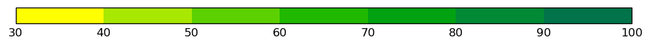

.. raw:: html

   

.. raw:: html

   

<code class="ek-style-name">sh-all-f30t100i10</code>
<button class="ek-copy-btn" onclick="ekCopy(this, 'sh-all-f30t100i10')"><svg xmlns="http://www.w3.org/2000/svg" width="14" height="14" viewBox="0 0 24 24" fill="none" stroke="currentColor" stroke-width="2" stroke-linecap="round" stroke-linejoin="round"><path stroke="none" d="M0 0h24v24H0z" fill="none"/><path d="M7 7m0 2.667a2.667 2.667 0 0 1 2.667 -2.667h8.666a2.667 2.667 0 0 1 2.667 2.667v8.666a2.667 2.667 0 0 1 -2.667 2.667h-8.666a2.667 2.667 0 0 1 -2.667 -2.667z" /><path d="M4.012 16.737a2.005 2.005 0 0 1 -1.012 -1.737v-10c0 -1.1 .9 -2 2 -2h10c.75 0 1.158 .385 1.5 1" /></svg> Copy this style name</button>

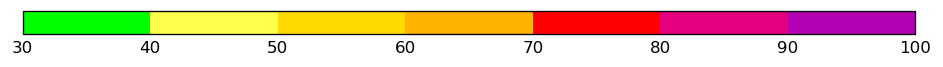

.. raw:: html

   

.. raw:: html

   

<code class="ek-style-name">ct-grn-f30-i10</code>
<button class="ek-copy-btn" onclick="ekCopy(this, 'ct-grn-f30-i10')"><svg xmlns="http://www.w3.org/2000/svg" width="14" height="14" viewBox="0 0 24 24" fill="none" stroke="currentColor" stroke-width="2" stroke-linecap="round" stroke-linejoin="round"><path stroke="none" d="M0 0h24v24H0z" fill="none"/><path d="M7 7m0 2.667a2.667 2.667 0 0 1 2.667 -2.667h8.666a2.667 2.667 0 0 1 2.667 2.667v8.666a2.667 2.667 0 0 1 -2.667 2.667h-8.666a2.667 2.667 0 0 1 -2.667 -2.667z" /><path d="M4.012 16.737a2.005 2.005 0 0 1 -1.012 -1.737v-10c0 -1.1 .9 -2 2 -2h10c.75 0 1.158 .385 1.5 1" /></svg> Copy this style name</button>

*(Levels are determined from data at plot time)*

.. raw:: html

   

.. raw:: html

   

.. raw:: html

   

   <h2 class="ek-section-heading">2 metre temperature</h2>

.. raw:: html

   

<code class="ek-style-name">2m-temperature-spectral-kelvin</code>
<button class="ek-copy-btn" onclick="ekCopy(this, '2m-temperature-spectral-kelvin')"><svg xmlns="http://www.w3.org/2000/svg" width="14" height="14" viewBox="0 0 24 24" fill="none" stroke="currentColor" stroke-width="2" stroke-linecap="round" stroke-linejoin="round"><path stroke="none" d="M0 0h24v24H0z" fill="none"/><path d="M7 7m0 2.667a2.667 2.667 0 0 1 2.667 -2.667h8.666a2.667 2.667 0 0 1 2.667 2.667v8.666a2.667 2.667 0 0 1 -2.667 2.667h-8.666a2.667 2.667 0 0 1 -2.667 -2.667z" /><path d="M4.012 16.737a2.005 2.005 0 0 1 -1.012 -1.737v-10c0 -1.1 .9 -2 2 -2h10c.75 0 1.158 .385 1.5 1" /></svg> Copy this style name</button>

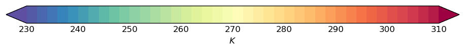

.. raw:: html

   

.. raw:: html

   

<code class="ek-style-name">2m-temperature-spectral-fahrenheit</code>
<button class="ek-copy-btn" onclick="ekCopy(this, '2m-temperature-spectral-fahrenheit')"><svg xmlns="http://www.w3.org/2000/svg" width="14" height="14" viewBox="0 0 24 24" fill="none" stroke="currentColor" stroke-width="2" stroke-linecap="round" stroke-linejoin="round"><path stroke="none" d="M0 0h24v24H0z" fill="none"/><path d="M7 7m0 2.667a2.667 2.667 0 0 1 2.667 -2.667h8.666a2.667 2.667 0 0 1 2.667 2.667v8.666a2.667 2.667 0 0 1 -2.667 2.667h-8.666a2.667 2.667 0 0 1 -2.667 -2.667z" /><path d="M4.012 16.737a2.005 2.005 0 0 1 -1.012 -1.737v-10c0 -1.1 .9 -2 2 -2h10c.75 0 1.158 .385 1.5 1" /></svg> Copy this style name</button>

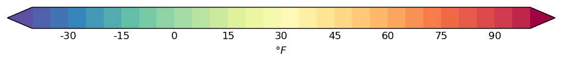

.. raw:: html

   

.. raw:: html

   

<code class="ek-style-name">2m-temperature-spectral-celsius</code>
<button class="ek-copy-btn" onclick="ekCopy(this, '2m-temperature-spectral-celsius')"><svg xmlns="http://www.w3.org/2000/svg" width="14" height="14" viewBox="0 0 24 24" fill="none" stroke="currentColor" stroke-width="2" stroke-linecap="round" stroke-linejoin="round"><path stroke="none" d="M0 0h24v24H0z" fill="none"/><path d="M7 7m0 2.667a2.667 2.667 0 0 1 2.667 -2.667h8.666a2.667 2.667 0 0 1 2.667 2.667v8.666a2.667 2.667 0 0 1 -2.667 2.667h-8.666a2.667 2.667 0 0 1 -2.667 -2.667z" /><path d="M4.012 16.737a2.005 2.005 0 0 1 -1.012 -1.737v-10c0 -1.1 .9 -2 2 -2h10c.75 0 1.158 .385 1.5 1" /></svg> Copy this style name</button>

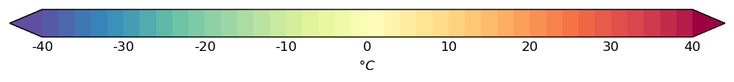

.. raw:: html

   

.. raw:: html

   

<code class="ek-style-name">sh-all-fm48t56i4</code>
<button class="ek-copy-btn" onclick="ekCopy(this, 'sh-all-fm48t56i4')"><svg xmlns="http://www.w3.org/2000/svg" width="14" height="14" viewBox="0 0 24 24" fill="none" stroke="currentColor" stroke-width="2" stroke-linecap="round" stroke-linejoin="round"><path stroke="none" d="M0 0h24v24H0z" fill="none"/><path d="M7 7m0 2.667a2.667 2.667 0 0 1 2.667 -2.667h8.666a2.667 2.667 0 0 1 2.667 2.667v8.666a2.667 2.667 0 0 1 -2.667 2.667h-8.666a2.667 2.667 0 0 1 -2.667 -2.667z" /><path d="M4.012 16.737a2.005 2.005 0 0 1 -1.012 -1.737v-10c0 -1.1 .9 -2 2 -2h10c.75 0 1.158 .385 1.5 1" /></svg> Copy this style name</button>

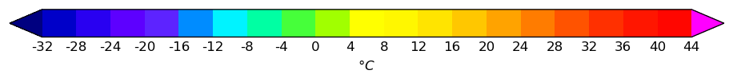

.. raw:: html

   

.. raw:: html

   

<code class="ek-style-name">sh-all-fm64t52i4</code>
<button class="ek-copy-btn" onclick="ekCopy(this, 'sh-all-fm64t52i4')"><svg xmlns="http://www.w3.org/2000/svg" width="14" height="14" viewBox="0 0 24 24" fill="none" stroke="currentColor" stroke-width="2" stroke-linecap="round" stroke-linejoin="round"><path stroke="none" d="M0 0h24v24H0z" fill="none"/><path d="M7 7m0 2.667a2.667 2.667 0 0 1 2.667 -2.667h8.666a2.667 2.667 0 0 1 2.667 2.667v8.666a2.667 2.667 0 0 1 -2.667 2.667h-8.666a2.667 2.667 0 0 1 -2.667 -2.667z" /><path d="M4.012 16.737a2.005 2.005 0 0 1 -1.012 -1.737v-10c0 -1.1 .9 -2 2 -2h10c.75 0 1.158 .385 1.5 1" /></svg> Copy this style name</button>

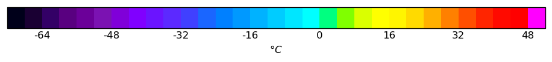

.. raw:: html

   

.. raw:: html

   

<code class="ek-style-name">ct-red-i2-dash</code>
<button class="ek-copy-btn" onclick="ekCopy(this, 'ct-red-i2-dash')"><svg xmlns="http://www.w3.org/2000/svg" width="14" height="14" viewBox="0 0 24 24" fill="none" stroke="currentColor" stroke-width="2" stroke-linecap="round" stroke-linejoin="round"><path stroke="none" d="M0 0h24v24H0z" fill="none"/><path d="M7 7m0 2.667a2.667 2.667 0 0 1 2.667 -2.667h8.666a2.667 2.667 0 0 1 2.667 2.667v8.666a2.667 2.667 0 0 1 -2.667 2.667h-8.666a2.667 2.667 0 0 1 -2.667 -2.667z" /><path d="M4.012 16.737a2.005 2.005 0 0 1 -1.012 -1.737v-10c0 -1.1 .9 -2 2 -2h10c.75 0 1.158 .385 1.5 1" /></svg> Copy this style name</button>

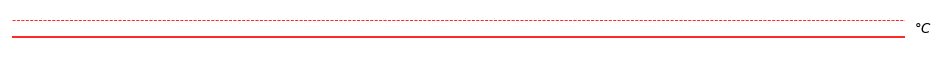

.. raw:: html

   

.. raw:: html

   

<code class="ek-style-name">sh-all-fm32t42i2</code>
<button class="ek-copy-btn" onclick="ekCopy(this, 'sh-all-fm32t42i2')"><svg xmlns="http://www.w3.org/2000/svg" width="14" height="14" viewBox="0 0 24 24" fill="none" stroke="currentColor" stroke-width="2" stroke-linecap="round" stroke-linejoin="round"><path stroke="none" d="M0 0h24v24H0z" fill="none"/><path d="M7 7m0 2.667a2.667 2.667 0 0 1 2.667 -2.667h8.666a2.667 2.667 0 0 1 2.667 2.667v8.666a2.667 2.667 0 0 1 -2.667 2.667h-8.666a2.667 2.667 0 0 1 -2.667 -2.667z" /><path d="M4.012 16.737a2.005 2.005 0 0 1 -1.012 -1.737v-10c0 -1.1 .9 -2 2 -2h10c.75 0 1.158 .385 1.5 1" /></svg> Copy this style name</button>

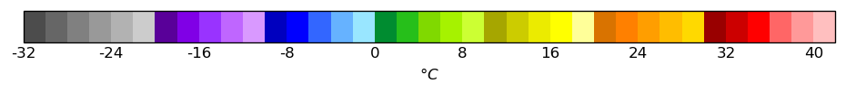

.. raw:: html

   

.. raw:: html

   

<code class="ek-style-name">sh-all-fm48t56i4-ct-wh</code>
<button class="ek-copy-btn" onclick="ekCopy(this, 'sh-all-fm48t56i4-ct-wh')"><svg xmlns="http://www.w3.org/2000/svg" width="14" height="14" viewBox="0 0 24 24" fill="none" stroke="currentColor" stroke-width="2" stroke-linecap="round" stroke-linejoin="round"><path stroke="none" d="M0 0h24v24H0z" fill="none"/><path d="M7 7m0 2.667a2.667 2.667 0 0 1 2.667 -2.667h8.666a2.667 2.667 0 0 1 2.667 2.667v8.666a2.667 2.667 0 0 1 -2.667 2.667h-8.666a2.667 2.667 0 0 1 -2.667 -2.667z" /><path d="M4.012 16.737a2.005 2.005 0 0 1 -1.012 -1.737v-10c0 -1.1 .9 -2 2 -2h10c.75 0 1.158 .385 1.5 1" /></svg> Copy this style name</button>

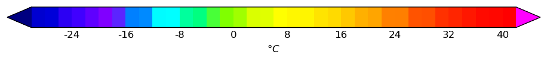

.. raw:: html

   

.. raw:: html

   

<code class="ek-style-name">sh-all-fm52t48i4</code>
<button class="ek-copy-btn" onclick="ekCopy(this, 'sh-all-fm52t48i4')"><svg xmlns="http://www.w3.org/2000/svg" width="14" height="14" viewBox="0 0 24 24" fill="none" stroke="currentColor" stroke-width="2" stroke-linecap="round" stroke-linejoin="round"><path stroke="none" d="M0 0h24v24H0z" fill="none"/><path d="M7 7m0 2.667a2.667 2.667 0 0 1 2.667 -2.667h8.666a2.667 2.667 0 0 1 2.667 2.667v8.666a2.667 2.667 0 0 1 -2.667 2.667h-8.666a2.667 2.667 0 0 1 -2.667 -2.667z" /><path d="M4.012 16.737a2.005 2.005 0 0 1 -1.012 -1.737v-10c0 -1.1 .9 -2 2 -2h10c.75 0 1.158 .385 1.5 1" /></svg> Copy this style name</button>

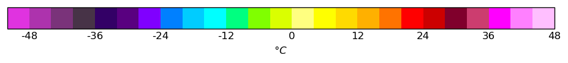

.. raw:: html

   

.. raw:: html

   

<code class="ek-style-name">sh-all-fm52t48i4-light</code>
<button class="ek-copy-btn" onclick="ekCopy(this, 'sh-all-fm52t48i4-light')"><svg xmlns="http://www.w3.org/2000/svg" width="14" height="14" viewBox="0 0 24 24" fill="none" stroke="currentColor" stroke-width="2" stroke-linecap="round" stroke-linejoin="round"><path stroke="none" d="M0 0h24v24H0z" fill="none"/><path d="M7 7m0 2.667a2.667 2.667 0 0 1 2.667 -2.667h8.666a2.667 2.667 0 0 1 2.667 2.667v8.666a2.667 2.667 0 0 1 -2.667 2.667h-8.666a2.667 2.667 0 0 1 -2.667 -2.667z" /><path d="M4.012 16.737a2.005 2.005 0 0 1 -1.012 -1.737v-10c0 -1.1 .9 -2 2 -2h10c.75 0 1.158 .385 1.5 1" /></svg> Copy this style name</button>

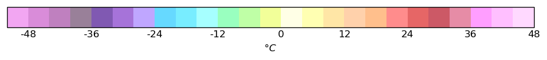

.. raw:: html

   

.. raw:: html

   

<code class="ek-style-name">sh-gry-fm72t56lst</code>
<button class="ek-copy-btn" onclick="ekCopy(this, 'sh-gry-fm72t56lst')"><svg xmlns="http://www.w3.org/2000/svg" width="14" height="14" viewBox="0 0 24 24" fill="none" stroke="currentColor" stroke-width="2" stroke-linecap="round" stroke-linejoin="round"><path stroke="none" d="M0 0h24v24H0z" fill="none"/><path d="M7 7m0 2.667a2.667 2.667 0 0 1 2.667 -2.667h8.666a2.667 2.667 0 0 1 2.667 2.667v8.666a2.667 2.667 0 0 1 -2.667 2.667h-8.666a2.667 2.667 0 0 1 -2.667 -2.667z" /><path d="M4.012 16.737a2.005 2.005 0 0 1 -1.012 -1.737v-10c0 -1.1 .9 -2 2 -2h10c.75 0 1.158 .385 1.5 1" /></svg> Copy this style name</button>

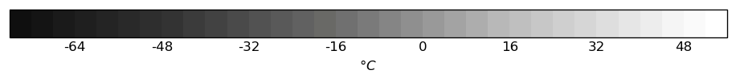

.. raw:: html

   

.. raw:: html

   

<code class="ek-style-name">ct-red-i4-t3</code>
<button class="ek-copy-btn" onclick="ekCopy(this, 'ct-red-i4-t3')"><svg xmlns="http://www.w3.org/2000/svg" width="14" height="14" viewBox="0 0 24 24" fill="none" stroke="currentColor" stroke-width="2" stroke-linecap="round" stroke-linejoin="round"><path stroke="none" d="M0 0h24v24H0z" fill="none"/><path d="M7 7m0 2.667a2.667 2.667 0 0 1 2.667 -2.667h8.666a2.667 2.667 0 0 1 2.667 2.667v8.666a2.667 2.667 0 0 1 -2.667 2.667h-8.666a2.667 2.667 0 0 1 -2.667 -2.667z" /><path d="M4.012 16.737a2.005 2.005 0 0 1 -1.012 -1.737v-10c0 -1.1 .9 -2 2 -2h10c.75 0 1.158 .385 1.5 1" /></svg> Copy this style name</button>

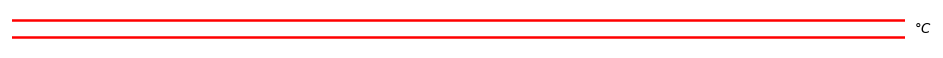

*(Levels are determined from data at plot time)*

.. raw:: html

   

.. raw:: html

   

<code class="ek-style-name">sh-all-fm80t56i4-v2</code>
<button class="ek-copy-btn" onclick="ekCopy(this, 'sh-all-fm80t56i4-v2')"><svg xmlns="http://www.w3.org/2000/svg" width="14" height="14" viewBox="0 0 24 24" fill="none" stroke="currentColor" stroke-width="2" stroke-linecap="round" stroke-linejoin="round"><path stroke="none" d="M0 0h24v24H0z" fill="none"/><path d="M7 7m0 2.667a2.667 2.667 0 0 1 2.667 -2.667h8.666a2.667 2.667 0 0 1 2.667 2.667v8.666a2.667 2.667 0 0 1 -2.667 2.667h-8.666a2.667 2.667 0 0 1 -2.667 -2.667z" /><path d="M4.012 16.737a2.005 2.005 0 0 1 -1.012 -1.737v-10c0 -1.1 .9 -2 2 -2h10c.75 0 1.158 .385 1.5 1" /></svg> Copy this style name</button>

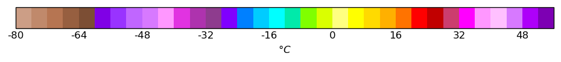

.. raw:: html

   

.. raw:: html

   

<code class="ek-style-name">sh-all-fm50t58i2</code>
<button class="ek-copy-btn" onclick="ekCopy(this, 'sh-all-fm50t58i2')"><svg xmlns="http://www.w3.org/2000/svg" width="14" height="14" viewBox="0 0 24 24" fill="none" stroke="currentColor" stroke-width="2" stroke-linecap="round" stroke-linejoin="round"><path stroke="none" d="M0 0h24v24H0z" fill="none"/><path d="M7 7m0 2.667a2.667 2.667 0 0 1 2.667 -2.667h8.666a2.667 2.667 0 0 1 2.667 2.667v8.666a2.667 2.667 0 0 1 -2.667 2.667h-8.666a2.667 2.667 0 0 1 -2.667 -2.667z" /><path d="M4.012 16.737a2.005 2.005 0 0 1 -1.012 -1.737v-10c0 -1.1 .9 -2 2 -2h10c.75 0 1.158 .385 1.5 1" /></svg> Copy this style name</button>

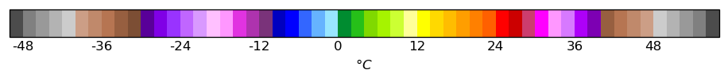

.. raw:: html

   

.. raw:: html

   

<code class="ek-style-name">transparent-zero-blue</code>
<button class="ek-copy-btn" onclick="ekCopy(this, 'transparent-zero-blue')"><svg xmlns="http://www.w3.org/2000/svg" width="14" height="14" viewBox="0 0 24 24" fill="none" stroke="currentColor" stroke-width="2" stroke-linecap="round" stroke-linejoin="round"><path stroke="none" d="M0 0h24v24H0z" fill="none"/><path d="M7 7m0 2.667a2.667 2.667 0 0 1 2.667 -2.667h8.666a2.667 2.667 0 0 1 2.667 2.667v8.666a2.667 2.667 0 0 1 -2.667 2.667h-8.666a2.667 2.667 0 0 1 -2.667 -2.667z" /><path d="M4.012 16.737a2.005 2.005 0 0 1 -1.012 -1.737v-10c0 -1.1 .9 -2 2 -2h10c.75 0 1.158 .385 1.5 1" /></svg> Copy this style name</button>

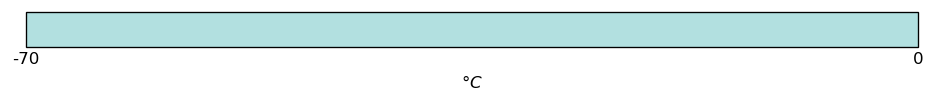

.. raw:: html

   

.. raw:: html

   

.. raw:: html

   

   <h2 class="ek-section-heading">Wind speed</h2>

.. raw:: html

   

<code class="ek-style-name">ct-ylw-f30-i10</code>
<button class="ek-copy-btn" onclick="ekCopy(this, 'ct-ylw-f30-i10')"><svg xmlns="http://www.w3.org/2000/svg" width="14" height="14" viewBox="0 0 24 24" fill="none" stroke="currentColor" stroke-width="2" stroke-linecap="round" stroke-linejoin="round"><path stroke="none" d="M0 0h24v24H0z" fill="none"/><path d="M7 7m0 2.667a2.667 2.667 0 0 1 2.667 -2.667h8.666a2.667 2.667 0 0 1 2.667 2.667v8.666a2.667 2.667 0 0 1 -2.667 2.667h-8.666a2.667 2.667 0 0 1 -2.667 -2.667z" /><path d="M4.012 16.737a2.005 2.005 0 0 1 -1.012 -1.737v-10c0 -1.1 .9 -2 2 -2h10c.75 0 1.158 .385 1.5 1" /></svg> Copy this style name</button>

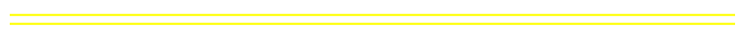

*(Levels are determined from data at plot time)*

.. raw:: html

   

.. raw:: html

   

.. raw:: html

   

   <h2 class="ek-section-heading">Potential vorticity</h2>

.. raw:: html

   

<code class="ek-style-name">sh-blu-f02t30</code>
<button class="ek-copy-btn" onclick="ekCopy(this, 'sh-blu-f02t30')"><svg xmlns="http://www.w3.org/2000/svg" width="14" height="14" viewBox="0 0 24 24" fill="none" stroke="currentColor" stroke-width="2" stroke-linecap="round" stroke-linejoin="round"><path stroke="none" d="M0 0h24v24H0z" fill="none"/><path d="M7 7m0 2.667a2.667 2.667 0 0 1 2.667 -2.667h8.666a2.667 2.667 0 0 1 2.667 2.667v8.666a2.667 2.667 0 0 1 -2.667 2.667h-8.666a2.667 2.667 0 0 1 -2.667 -2.667z" /><path d="M4.012 16.737a2.005 2.005 0 0 1 -1.012 -1.737v-10c0 -1.1 .9 -2 2 -2h10c.75 0 1.158 .385 1.5 1" /></svg> Copy this style name</button>

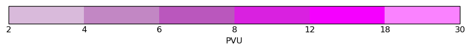

.. raw:: html

   

.. raw:: html

   

<code class="ek-style-name">sh-gry-f0t20lst</code>
<button class="ek-copy-btn" onclick="ekCopy(this, 'sh-gry-f0t20lst')"><svg xmlns="http://www.w3.org/2000/svg" width="14" height="14" viewBox="0 0 24 24" fill="none" stroke="currentColor" stroke-width="2" stroke-linecap="round" stroke-linejoin="round"><path stroke="none" d="M0 0h24v24H0z" fill="none"/><path d="M7 7m0 2.667a2.667 2.667 0 0 1 2.667 -2.667h8.666a2.667 2.667 0 0 1 2.667 2.667v8.666a2.667 2.667 0 0 1 -2.667 2.667h-8.666a2.667 2.667 0 0 1 -2.667 -2.667z" /><path d="M4.012 16.737a2.005 2.005 0 0 1 -1.012 -1.737v-10c0 -1.1 .9 -2 2 -2h10c.75 0 1.158 .385 1.5 1" /></svg> Copy this style name</button>

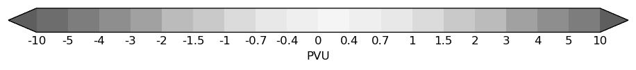

.. raw:: html

   

.. raw:: html

   

<code class="ek-style-name">ct-vio-i1-t1</code>
<button class="ek-copy-btn" onclick="ekCopy(this, 'ct-vio-i1-t1')"><svg xmlns="http://www.w3.org/2000/svg" width="14" height="14" viewBox="0 0 24 24" fill="none" stroke="currentColor" stroke-width="2" stroke-linecap="round" stroke-linejoin="round"><path stroke="none" d="M0 0h24v24H0z" fill="none"/><path d="M7 7m0 2.667a2.667 2.667 0 0 1 2.667 -2.667h8.666a2.667 2.667 0 0 1 2.667 2.667v8.666a2.667 2.667 0 0 1 -2.667 2.667h-8.666a2.667 2.667 0 0 1 -2.667 -2.667z" /><path d="M4.012 16.737a2.005 2.005 0 0 1 -1.012 -1.737v-10c0 -1.1 .9 -2 2 -2h10c.75 0 1.158 .385 1.5 1" /></svg> Copy this style name</button>

*(Levels are determined from data at plot time)*

.. raw:: html

   

.. raw:: html

   

.. raw:: html

   

   <h2 class="ek-section-heading">Potential vorticity</h2>

.. raw:: html

   

<code class="ek-style-name">ct-magenta-i2-t3</code>
<button class="ek-copy-btn" onclick="ekCopy(this, 'ct-magenta-i2-t3')"><svg xmlns="http://www.w3.org/2000/svg" width="14" height="14" viewBox="0 0 24 24" fill="none" stroke="currentColor" stroke-width="2" stroke-linecap="round" stroke-linejoin="round"><path stroke="none" d="M0 0h24v24H0z" fill="none"/><path d="M7 7m0 2.667a2.667 2.667 0 0 1 2.667 -2.667h8.666a2.667 2.667 0 0 1 2.667 2.667v8.666a2.667 2.667 0 0 1 -2.667 2.667h-8.666a2.667 2.667 0 0 1 -2.667 -2.667z" /><path d="M4.012 16.737a2.005 2.005 0 0 1 -1.012 -1.737v-10c0 -1.1 .9 -2 2 -2h10c.75 0 1.158 .385 1.5 1" /></svg> Copy this style name</button>

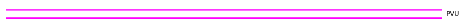

*(Levels are determined from data at plot time)*

.. raw:: html

   

.. raw:: html

   

.. raw:: html

   

   <h2 class="ek-section-heading">Vorticity (relative)</h2>

.. raw:: html

   

<code class="ek-style-name">sh-blured-fm50t50lst-narrow-range</code>
<button class="ek-copy-btn" onclick="ekCopy(this, 'sh-blured-fm50t50lst-narrow-range')"><svg xmlns="http://www.w3.org/2000/svg" width="14" height="14" viewBox="0 0 24 24" fill="none" stroke="currentColor" stroke-width="2" stroke-linecap="round" stroke-linejoin="round"><path stroke="none" d="M0 0h24v24H0z" fill="none"/><path d="M7 7m0 2.667a2.667 2.667 0 0 1 2.667 -2.667h8.666a2.667 2.667 0 0 1 2.667 2.667v8.666a2.667 2.667 0 0 1 -2.667 2.667h-8.666a2.667 2.667 0 0 1 -2.667 -2.667z" /><path d="M4.012 16.737a2.005 2.005 0 0 1 -1.012 -1.737v-10c0 -1.1 .9 -2 2 -2h10c.75 0 1.158 .385 1.5 1" /></svg> Copy this style name</button>

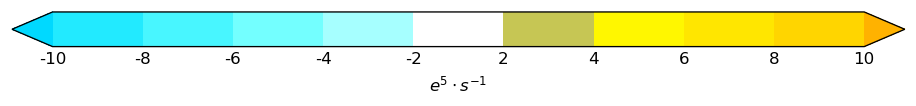

.. raw:: html

   

.. raw:: html

   

.. raw:: html

   

   <h2 class="ek-section-heading">Vertical velocity</h2>

.. raw:: html

   

<code class="ek-style-name">sh-blured-fm5t5lst</code>
<button class="ek-copy-btn" onclick="ekCopy(this, 'sh-blured-fm5t5lst')"><svg xmlns="http://www.w3.org/2000/svg" width="14" height="14" viewBox="0 0 24 24" fill="none" stroke="currentColor" stroke-width="2" stroke-linecap="round" stroke-linejoin="round"><path stroke="none" d="M0 0h24v24H0z" fill="none"/><path d="M7 7m0 2.667a2.667 2.667 0 0 1 2.667 -2.667h8.666a2.667 2.667 0 0 1 2.667 2.667v8.666a2.667 2.667 0 0 1 -2.667 2.667h-8.666a2.667 2.667 0 0 1 -2.667 -2.667z" /><path d="M4.012 16.737a2.005 2.005 0 0 1 -1.012 -1.737v-10c0 -1.1 .9 -2 2 -2h10c.75 0 1.158 .385 1.5 1" /></svg> Copy this style name</button>

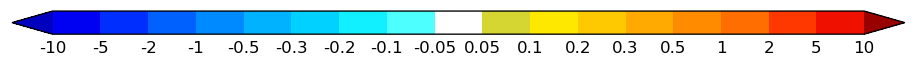

.. raw:: html

   

.. raw:: html

   

<code class="ek-style-name">sh-blu-fm5tm005lst</code>
<button class="ek-copy-btn" onclick="ekCopy(this, 'sh-blu-fm5tm005lst')"><svg xmlns="http://www.w3.org/2000/svg" width="14" height="14" viewBox="0 0 24 24" fill="none" stroke="currentColor" stroke-width="2" stroke-linecap="round" stroke-linejoin="round"><path stroke="none" d="M0 0h24v24H0z" fill="none"/><path d="M7 7m0 2.667a2.667 2.667 0 0 1 2.667 -2.667h8.666a2.667 2.667 0 0 1 2.667 2.667v8.666a2.667 2.667 0 0 1 -2.667 2.667h-8.666a2.667 2.667 0 0 1 -2.667 -2.667z" /><path d="M4.012 16.737a2.005 2.005 0 0 1 -1.012 -1.737v-10c0 -1.1 .9 -2 2 -2h10c.75 0 1.158 .385 1.5 1" /></svg> Copy this style name</button>

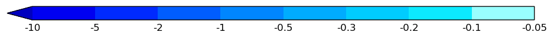

.. raw:: html

   

.. raw:: html

   

<code class="ek-style-name">sh-red-f005t5lst</code>
<button class="ek-copy-btn" onclick="ekCopy(this, 'sh-red-f005t5lst')"><svg xmlns="http://www.w3.org/2000/svg" width="14" height="14" viewBox="0 0 24 24" fill="none" stroke="currentColor" stroke-width="2" stroke-linecap="round" stroke-linejoin="round"><path stroke="none" d="M0 0h24v24H0z" fill="none"/><path d="M7 7m0 2.667a2.667 2.667 0 0 1 2.667 -2.667h8.666a2.667 2.667 0 0 1 2.667 2.667v8.666a2.667 2.667 0 0 1 -2.667 2.667h-8.666a2.667 2.667 0 0 1 -2.667 -2.667z" /><path d="M4.012 16.737a2.005 2.005 0 0 1 -1.012 -1.737v-10c0 -1.1 .9 -2 2 -2h10c.75 0 1.158 .385 1.5 1" /></svg> Copy this style name</button>

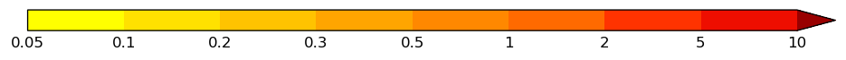

.. raw:: html

   

.. raw:: html

   

<code class="ek-style-name">sh-viobrn-fm5t5lst</code>
<button class="ek-copy-btn" onclick="ekCopy(this, 'sh-viobrn-fm5t5lst')"><svg xmlns="http://www.w3.org/2000/svg" width="14" height="14" viewBox="0 0 24 24" fill="none" stroke="currentColor" stroke-width="2" stroke-linecap="round" stroke-linejoin="round"><path stroke="none" d="M0 0h24v24H0z" fill="none"/><path d="M7 7m0 2.667a2.667 2.667 0 0 1 2.667 -2.667h8.666a2.667 2.667 0 0 1 2.667 2.667v8.666a2.667 2.667 0 0 1 -2.667 2.667h-8.666a2.667 2.667 0 0 1 -2.667 -2.667z" /><path d="M4.012 16.737a2.005 2.005 0 0 1 -1.012 -1.737v-10c0 -1.1 .9 -2 2 -2h10c.75 0 1.158 .385 1.5 1" /></svg> Copy this style name</button>

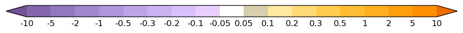

.. raw:: html

   

.. raw:: html

   

<code class="ek-style-name">ct-blured-lst</code>
<button class="ek-copy-btn" onclick="ekCopy(this, 'ct-blured-lst')"><svg xmlns="http://www.w3.org/2000/svg" width="14" height="14" viewBox="0 0 24 24" fill="none" stroke="currentColor" stroke-width="2" stroke-linecap="round" stroke-linejoin="round"><path stroke="none" d="M0 0h24v24H0z" fill="none"/><path d="M7 7m0 2.667a2.667 2.667 0 0 1 2.667 -2.667h8.666a2.667 2.667 0 0 1 2.667 2.667v8.666a2.667 2.667 0 0 1 -2.667 2.667h-8.666a2.667 2.667 0 0 1 -2.667 -2.667z" /><path d="M4.012 16.737a2.005 2.005 0 0 1 -1.012 -1.737v-10c0 -1.1 .9 -2 2 -2h10c.75 0 1.158 .385 1.5 1" /></svg> Copy this style name</button>

.. raw:: html

   

.. raw:: html

   

.. raw:: html

   

   <h2 class="ek-section-heading">Wind speed</h2>

.. raw:: html

   

<code class="ek-style-name">sh-red-f5t70lst</code>
<button class="ek-copy-btn" onclick="ekCopy(this, 'sh-red-f5t70lst')"><svg xmlns="http://www.w3.org/2000/svg" width="14" height="14" viewBox="0 0 24 24" fill="none" stroke="currentColor" stroke-width="2" stroke-linecap="round" stroke-linejoin="round"><path stroke="none" d="M0 0h24v24H0z" fill="none"/><path d="M7 7m0 2.667a2.667 2.667 0 0 1 2.667 -2.667h8.666a2.667 2.667 0 0 1 2.667 2.667v8.666a2.667 2.667 0 0 1 -2.667 2.667h-8.666a2.667 2.667 0 0 1 -2.667 -2.667z" /><path d="M4.012 16.737a2.005 2.005 0 0 1 -1.012 -1.737v-10c0 -1.1 .9 -2 2 -2h10c.75 0 1.158 .385 1.5 1" /></svg> Copy this style name</button>

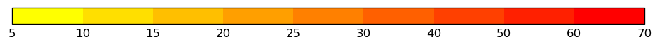

.. raw:: html

   

.. raw:: html

   

<code class="ek-style-name">sh-all-f5t70lst</code>
<button class="ek-copy-btn" onclick="ekCopy(this, 'sh-all-f5t70lst')"><svg xmlns="http://www.w3.org/2000/svg" width="14" height="14" viewBox="0 0 24 24" fill="none" stroke="currentColor" stroke-width="2" stroke-linecap="round" stroke-linejoin="round"><path stroke="none" d="M0 0h24v24H0z" fill="none"/><path d="M7 7m0 2.667a2.667 2.667 0 0 1 2.667 -2.667h8.666a2.667 2.667 0 0 1 2.667 2.667v8.666a2.667 2.667 0 0 1 -2.667 2.667h-8.666a2.667 2.667 0 0 1 -2.667 -2.667z" /><path d="M4.012 16.737a2.005 2.005 0 0 1 -1.012 -1.737v-10c0 -1.1 .9 -2 2 -2h10c.75 0 1.158 .385 1.5 1" /></svg> Copy this style name</button>

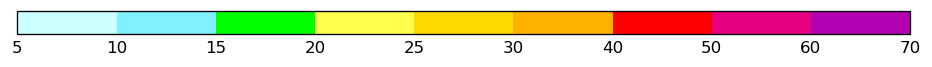

.. raw:: html

   

.. raw:: html

   

.. raw:: html

   

   <h2 class="ek-section-heading">850Ws Mean</h2>

.. raw:: html

   

<code class="ek-style-name">ct-blk-i5-t2</code>
<button class="ek-copy-btn" onclick="ekCopy(this, 'ct-blk-i5-t2')"><svg xmlns="http://www.w3.org/2000/svg" width="14" height="14" viewBox="0 0 24 24" fill="none" stroke="currentColor" stroke-width="2" stroke-linecap="round" stroke-linejoin="round"><path stroke="none" d="M0 0h24v24H0z" fill="none"/><path d="M7 7m0 2.667a2.667 2.667 0 0 1 2.667 -2.667h8.666a2.667 2.667 0 0 1 2.667 2.667v8.666a2.667 2.667 0 0 1 -2.667 2.667h-8.666a2.667 2.667 0 0 1 -2.667 -2.667z" /><path d="M4.012 16.737a2.005 2.005 0 0 1 -1.012 -1.737v-10c0 -1.1 .9 -2 2 -2h10c.75 0 1.158 .385 1.5 1" /></svg> Copy this style name</button>

.. image:: _static/styles/ct-blk-i5-t2.png
   :alt: contour line sample

*(Levels are determined from data at plot time)*

.. raw:: html

   

.. raw:: html

   

<code class="ek-style-name">ct-blk-i5-t1</code>
<button class="ek-copy-btn" onclick="ekCopy(this, 'ct-blk-i5-t1')"><svg xmlns="http://www.w3.org/2000/svg" width="14" height="14" viewBox="0 0 24 24" fill="none" stroke="currentColor" stroke-width="2" stroke-linecap="round" stroke-linejoin="round"><path stroke="none" d="M0 0h24v24H0z" fill="none"/><path d="M7 7m0 2.667a2.667 2.667 0 0 1 2.667 -2.667h8.666a2.667 2.667 0 0 1 2.667 2.667v8.666a2.667 2.667 0 0 1 -2.667 2.667h-8.666a2.667 2.667 0 0 1 -2.667 -2.667z" /><path d="M4.012 16.737a2.005 2.005 0 0 1 -1.012 -1.737v-10c0 -1.1 .9 -2 2 -2h10c.75 0 1.158 .385 1.5 1" /></svg> Copy this style name</button>

*(Levels are determined from data at plot time)*

.. raw:: html

   

.. raw:: html

   

<code class="ek-style-name">ct-blue-i5-t2</code>
<button class="ek-copy-btn" onclick="ekCopy(this, 'ct-blue-i5-t2')"><svg xmlns="http://www.w3.org/2000/svg" width="14" height="14" viewBox="0 0 24 24" fill="none" stroke="currentColor" stroke-width="2" stroke-linecap="round" stroke-linejoin="round"><path stroke="none" d="M0 0h24v24H0z" fill="none"/><path d="M7 7m0 2.667a2.667 2.667 0 0 1 2.667 -2.667h8.666a2.667 2.667 0 0 1 2.667 2.667v8.666a2.667 2.667 0 0 1 -2.667 2.667h-8.666a2.667 2.667 0 0 1 -2.667 -2.667z" /><path d="M4.012 16.737a2.005 2.005 0 0 1 -1.012 -1.737v-10c0 -1.1 .9 -2 2 -2h10c.75 0 1.158 .385 1.5 1" /></svg> Copy this style name</button>

.. image:: _static/styles/ct-blue-i5-t2.png
   :alt: contour line sample

*(Levels are determined from data at plot time)*

.. raw:: html

   

.. raw:: html

   

.. raw:: html

   

   <h2 class="ek-section-heading">850Ws Spread</h2>

.. raw:: html

   

<code class="ek-style-name">sh-range-f02t30</code>
<button class="ek-copy-btn" onclick="ekCopy(this, 'sh-range-f02t30')"><svg xmlns="http://www.w3.org/2000/svg" width="14" height="14" viewBox="0 0 24 24" fill="none" stroke="currentColor" stroke-width="2" stroke-linecap="round" stroke-linejoin="round"><path stroke="none" d="M0 0h24v24H0z" fill="none"/><path d="M7 7m0 2.667a2.667 2.667 0 0 1 2.667 -2.667h8.666a2.667 2.667 0 0 1 2.667 2.667v8.666a2.667 2.667 0 0 1 -2.667 2.667h-8.666a2.667 2.667 0 0 1 -2.667 -2.667z" /><path d="M4.012 16.737a2.005 2.005 0 0 1 -1.012 -1.737v-10c0 -1.1 .9 -2 2 -2h10c.75 0 1.158 .385 1.5 1" /></svg> Copy this style name</button>

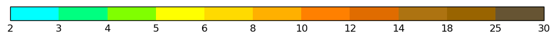

.. raw:: html

   

.. raw:: html

   

.. raw:: html

   

   <h2 class="ek-section-heading">Drought code</h2>

.. raw:: html

   

<code class="ek-style-name">drought-code-1</code>
<button class="ek-copy-btn" onclick="ekCopy(this, 'drought-code-1')"><svg xmlns="http://www.w3.org/2000/svg" width="14" height="14" viewBox="0 0 24 24" fill="none" stroke="currentColor" stroke-width="2" stroke-linecap="round" stroke-linejoin="round"><path stroke="none" d="M0 0h24v24H0z" fill="none"/><path d="M7 7m0 2.667a2.667 2.667 0 0 1 2.667 -2.667h8.666a2.667 2.667 0 0 1 2.667 2.667v8.666a2.667 2.667 0 0 1 -2.667 2.667h-8.666a2.667 2.667 0 0 1 -2.667 -2.667z" /><path d="M4.012 16.737a2.005 2.005 0 0 1 -1.012 -1.737v-10c0 -1.1 .9 -2 2 -2h10c.75 0 1.158 .385 1.5 1" /></svg> Copy this style name</button>

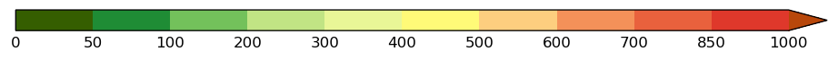

.. raw:: html

   

.. raw:: html

   

<code class="ek-style-name">drought-code-2</code>
<button class="ek-copy-btn" onclick="ekCopy(this, 'drought-code-2')"><svg xmlns="http://www.w3.org/2000/svg" width="14" height="14" viewBox="0 0 24 24" fill="none" stroke="currentColor" stroke-width="2" stroke-linecap="round" stroke-linejoin="round"><path stroke="none" d="M0 0h24v24H0z" fill="none"/><path d="M7 7m0 2.667a2.667 2.667 0 0 1 2.667 -2.667h8.666a2.667 2.667 0 0 1 2.667 2.667v8.666a2.667 2.667 0 0 1 -2.667 2.667h-8.666a2.667 2.667 0 0 1 -2.667 -2.667z" /><path d="M4.012 16.737a2.005 2.005 0 0 1 -1.012 -1.737v-10c0 -1.1 .9 -2 2 -2h10c.75 0 1.158 .385 1.5 1" /></svg> Copy this style name</button>

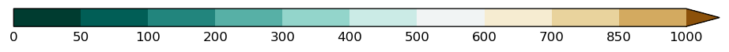

.. raw:: html

   

.. raw:: html

   

.. raw:: html

   

   <h2 class="ek-section-heading">Forest fire weather index</h2>

.. raw:: html

   

<code class="ek-style-name">fwi-1</code>
<button class="ek-copy-btn" onclick="ekCopy(this, 'fwi-1')"><svg xmlns="http://www.w3.org/2000/svg" width="14" height="14" viewBox="0 0 24 24" fill="none" stroke="currentColor" stroke-width="2" stroke-linecap="round" stroke-linejoin="round"><path stroke="none" d="M0 0h24v24H0z" fill="none"/><path d="M7 7m0 2.667a2.667 2.667 0 0 1 2.667 -2.667h8.666a2.667 2.667 0 0 1 2.667 2.667v8.666a2.667 2.667 0 0 1 -2.667 2.667h-8.666a2.667 2.667 0 0 1 -2.667 -2.667z" /><path d="M4.012 16.737a2.005 2.005 0 0 1 -1.012 -1.737v-10c0 -1.1 .9 -2 2 -2h10c.75 0 1.158 .385 1.5 1" /></svg> Copy this style name</button>

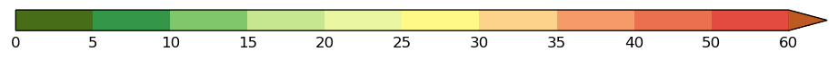

.. raw:: html

   

.. raw:: html

   

<code class="ek-style-name">fwi-3</code>
<button class="ek-copy-btn" onclick="ekCopy(this, 'fwi-3')"><svg xmlns="http://www.w3.org/2000/svg" width="14" height="14" viewBox="0 0 24 24" fill="none" stroke="currentColor" stroke-width="2" stroke-linecap="round" stroke-linejoin="round"><path stroke="none" d="M0 0h24v24H0z" fill="none"/><path d="M7 7m0 2.667a2.667 2.667 0 0 1 2.667 -2.667h8.666a2.667 2.667 0 0 1 2.667 2.667v8.666a2.667 2.667 0 0 1 -2.667 2.667h-8.666a2.667 2.667 0 0 1 -2.667 -2.667z" /><path d="M4.012 16.737a2.005 2.005 0 0 1 -1.012 -1.737v-10c0 -1.1 .9 -2 2 -2h10c.75 0 1.158 .385 1.5 1" /></svg> Copy this style name</button>

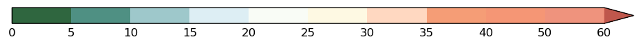

.. raw:: html

   

.. raw:: html

   

.. raw:: html

   

   <h2 class="ek-section-heading">Fine fuel moisture code</h2>

.. raw:: html

   

<code class="ek-style-name">risico-1</code>
<button class="ek-copy-btn" onclick="ekCopy(this, 'risico-1')"><svg xmlns="http://www.w3.org/2000/svg" width="14" height="14" viewBox="0 0 24 24" fill="none" stroke="currentColor" stroke-width="2" stroke-linecap="round" stroke-linejoin="round"><path stroke="none" d="M0 0h24v24H0z" fill="none"/><path d="M7 7m0 2.667a2.667 2.667 0 0 1 2.667 -2.667h8.666a2.667 2.667 0 0 1 2.667 2.667v8.666a2.667 2.667 0 0 1 -2.667 2.667h-8.666a2.667 2.667 0 0 1 -2.667 -2.667z" /><path d="M4.012 16.737a2.005 2.005 0 0 1 -1.012 -1.737v-10c0 -1.1 .9 -2 2 -2h10c.75 0 1.158 .385 1.5 1" /></svg> Copy this style name</button>

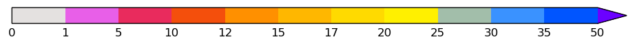

.. raw:: html

   

.. raw:: html

   

<code class="ek-style-name">risico-2</code>
<button class="ek-copy-btn" onclick="ekCopy(this, 'risico-2')"><svg xmlns="http://www.w3.org/2000/svg" width="14" height="14" viewBox="0 0 24 24" fill="none" stroke="currentColor" stroke-width="2" stroke-linecap="round" stroke-linejoin="round"><path stroke="none" d="M0 0h24v24H0z" fill="none"/><path d="M7 7m0 2.667a2.667 2.667 0 0 1 2.667 -2.667h8.666a2.667 2.667 0 0 1 2.667 2.667v8.666a2.667 2.667 0 0 1 -2.667 2.667h-8.666a2.667 2.667 0 0 1 -2.667 -2.667z" /><path d="M4.012 16.737a2.005 2.005 0 0 1 -1.012 -1.737v-10c0 -1.1 .9 -2 2 -2h10c.75 0 1.158 .385 1.5 1" /></svg> Copy this style name</button>

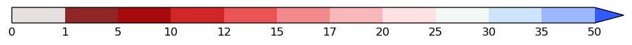

.. raw:: html

   

.. raw:: html

   

.. raw:: html

   

   <h2 class="ek-section-heading">Convective available potential energy</h2>

.. raw:: html

   

<code class="ek-style-name">range-100-4500</code>
<button class="ek-copy-btn" onclick="ekCopy(this, 'range-100-4500')"><svg xmlns="http://www.w3.org/2000/svg" width="14" height="14" viewBox="0 0 24 24" fill="none" stroke="currentColor" stroke-width="2" stroke-linecap="round" stroke-linejoin="round"><path stroke="none" d="M0 0h24v24H0z" fill="none"/><path d="M7 7m0 2.667a2.667 2.667 0 0 1 2.667 -2.667h8.666a2.667 2.667 0 0 1 2.667 2.667v8.666a2.667 2.667 0 0 1 -2.667 2.667h-8.666a2.667 2.667 0 0 1 -2.667 -2.667z" /><path d="M4.012 16.737a2.005 2.005 0 0 1 -1.012 -1.737v-10c0 -1.1 .9 -2 2 -2h10c.75 0 1.158 .385 1.5 1" /></svg> Copy this style name</button>

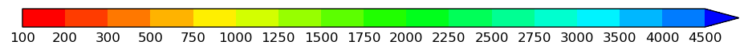

.. raw:: html

   

.. raw:: html

   

<code class="ek-style-name">range-50-9000</code>
<button class="ek-copy-btn" onclick="ekCopy(this, 'range-50-9000')"><svg xmlns="http://www.w3.org/2000/svg" width="14" height="14" viewBox="0 0 24 24" fill="none" stroke="currentColor" stroke-width="2" stroke-linecap="round" stroke-linejoin="round"><path stroke="none" d="M0 0h24v24H0z" fill="none"/><path d="M7 7m0 2.667a2.667 2.667 0 0 1 2.667 -2.667h8.666a2.667 2.667 0 0 1 2.667 2.667v8.666a2.667 2.667 0 0 1 -2.667 2.667h-8.666a2.667 2.667 0 0 1 -2.667 -2.667z" /><path d="M4.012 16.737a2.005 2.005 0 0 1 -1.012 -1.737v-10c0 -1.1 .9 -2 2 -2h10c.75 0 1.158 .385 1.5 1" /></svg> Copy this style name</button>

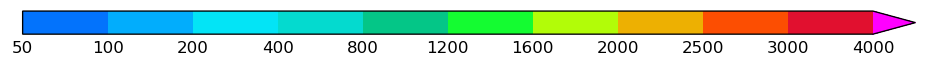

.. raw:: html

   

.. raw:: html

   

<code class="ek-style-name">ct-red-f50t8000</code>
<button class="ek-copy-btn" onclick="ekCopy(this, 'ct-red-f50t8000')"><svg xmlns="http://www.w3.org/2000/svg" width="14" height="14" viewBox="0 0 24 24" fill="none" stroke="currentColor" stroke-width="2" stroke-linecap="round" stroke-linejoin="round"><path stroke="none" d="M0 0h24v24H0z" fill="none"/><path d="M7 7m0 2.667a2.667 2.667 0 0 1 2.667 -2.667h8.666a2.667 2.667 0 0 1 2.667 2.667v8.666a2.667 2.667 0 0 1 -2.667 2.667h-8.666a2.667 2.667 0 0 1 -2.667 -2.667z" /><path d="M4.012 16.737a2.005 2.005 0 0 1 -1.012 -1.737v-10c0 -1.1 .9 -2 2 -2h10c.75 0 1.158 .385 1.5 1" /></svg> Copy this style name</button>

.. raw:: html

   

.. raw:: html

   

<code class="ek-style-name">ct-green-f10t8000</code>
<button class="ek-copy-btn" onclick="ekCopy(this, 'ct-green-f10t8000')"><svg xmlns="http://www.w3.org/2000/svg" width="14" height="14" viewBox="0 0 24 24" fill="none" stroke="currentColor" stroke-width="2" stroke-linecap="round" stroke-linejoin="round"><path stroke="none" d="M0 0h24v24H0z" fill="none"/><path d="M7 7m0 2.667a2.667 2.667 0 0 1 2.667 -2.667h8.666a2.667 2.667 0 0 1 2.667 2.667v8.666a2.667 2.667 0 0 1 -2.667 2.667h-8.666a2.667 2.667 0 0 1 -2.667 -2.667z" /><path d="M4.012 16.737a2.005 2.005 0 0 1 -1.012 -1.737v-10c0 -1.1 .9 -2 2 -2h10c.75 0 1.158 .385 1.5 1" /></svg> Copy this style name</button>

.. raw:: html

   

.. raw:: html

   

<code class="ek-style-name">cape-extra1</code>
<button class="ek-copy-btn" onclick="ekCopy(this, 'cape-extra1')"><svg xmlns="http://www.w3.org/2000/svg" width="14" height="14" viewBox="0 0 24 24" fill="none" stroke="currentColor" stroke-width="2" stroke-linecap="round" stroke-linejoin="round"><path stroke="none" d="M0 0h24v24H0z" fill="none"/><path d="M7 7m0 2.667a2.667 2.667 0 0 1 2.667 -2.667h8.666a2.667 2.667 0 0 1 2.667 2.667v8.666a2.667 2.667 0 0 1 -2.667 2.667h-8.666a2.667 2.667 0 0 1 -2.667 -2.667z" /><path d="M4.012 16.737a2.005 2.005 0 0 1 -1.012 -1.737v-10c0 -1.1 .9 -2 2 -2h10c.75 0 1.158 .385 1.5 1" /></svg> Copy this style name</button>

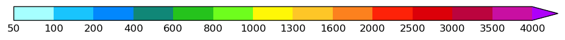

.. raw:: html

   

.. raw:: html

   

.. raw:: html

   

   <h2 class="ek-section-heading">Cloud base height</h2>

.. raw:: html

   

<code class="ek-style-name">sh-cbh-blk-f0t22000</code>
<button class="ek-copy-btn" onclick="ekCopy(this, 'sh-cbh-blk-f0t22000')"><svg xmlns="http://www.w3.org/2000/svg" width="14" height="14" viewBox="0 0 24 24" fill="none" stroke="currentColor" stroke-width="2" stroke-linecap="round" stroke-linejoin="round"><path stroke="none" d="M0 0h24v24H0z" fill="none"/><path d="M7 7m0 2.667a2.667 2.667 0 0 1 2.667 -2.667h8.666a2.667 2.667 0 0 1 2.667 2.667v8.666a2.667 2.667 0 0 1 -2.667 2.667h-8.666a2.667 2.667 0 0 1 -2.667 -2.667z" /><path d="M4.012 16.737a2.005 2.005 0 0 1 -1.012 -1.737v-10c0 -1.1 .9 -2 2 -2h10c.75 0 1.158 .385 1.5 1" /></svg> Copy this style name</button>

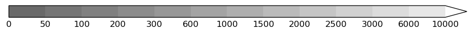

.. raw:: html

   

.. raw:: html

   

<code class="ek-style-name">sh-cbh-f0t22000</code>
<button class="ek-copy-btn" onclick="ekCopy(this, 'sh-cbh-f0t22000')"><svg xmlns="http://www.w3.org/2000/svg" width="14" height="14" viewBox="0 0 24 24" fill="none" stroke="currentColor" stroke-width="2" stroke-linecap="round" stroke-linejoin="round"><path stroke="none" d="M0 0h24v24H0z" fill="none"/><path d="M7 7m0 2.667a2.667 2.667 0 0 1 2.667 -2.667h8.666a2.667 2.667 0 0 1 2.667 2.667v8.666a2.667 2.667 0 0 1 -2.667 2.667h-8.666a2.667 2.667 0 0 1 -2.667 -2.667z" /><path d="M4.012 16.737a2.005 2.005 0 0 1 -1.012 -1.737v-10c0 -1.1 .9 -2 2 -2h10c.75 0 1.158 .385 1.5 1" /></svg> Copy this style name</button>

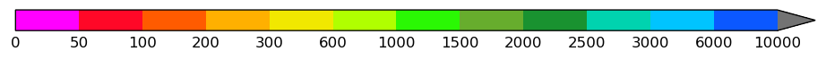

.. raw:: html

   

.. raw:: html

   

.. raw:: html

   

   <h2 class="ek-section-heading">Convective inhibition</h2>

.. raw:: html

   

<code class="ek-style-name">sh-red-f0t900</code>
<button class="ek-copy-btn" onclick="ekCopy(this, 'sh-red-f0t900')"><svg xmlns="http://www.w3.org/2000/svg" width="14" height="14" viewBox="0 0 24 24" fill="none" stroke="currentColor" stroke-width="2" stroke-linecap="round" stroke-linejoin="round"><path stroke="none" d="M0 0h24v24H0z" fill="none"/><path d="M7 7m0 2.667a2.667 2.667 0 0 1 2.667 -2.667h8.666a2.667 2.667 0 0 1 2.667 2.667v8.666a2.667 2.667 0 0 1 -2.667 2.667h-8.666a2.667 2.667 0 0 1 -2.667 -2.667z" /><path d="M4.012 16.737a2.005 2.005 0 0 1 -1.012 -1.737v-10c0 -1.1 .9 -2 2 -2h10c.75 0 1.158 .385 1.5 1" /></svg> Copy this style name</button>

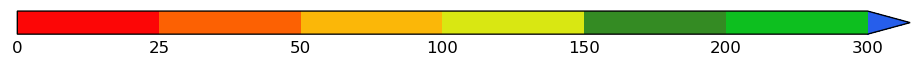

.. raw:: html

   

.. raw:: html

   

<code class="ek-style-name">sh-black-f0t900</code>
<button class="ek-copy-btn" onclick="ekCopy(this, 'sh-black-f0t900')"><svg xmlns="http://www.w3.org/2000/svg" width="14" height="14" viewBox="0 0 24 24" fill="none" stroke="currentColor" stroke-width="2" stroke-linecap="round" stroke-linejoin="round"><path stroke="none" d="M0 0h24v24H0z" fill="none"/><path d="M7 7m0 2.667a2.667 2.667 0 0 1 2.667 -2.667h8.666a2.667 2.667 0 0 1 2.667 2.667v8.666a2.667 2.667 0 0 1 -2.667 2.667h-8.666a2.667 2.667 0 0 1 -2.667 -2.667z" /><path d="M4.012 16.737a2.005 2.005 0 0 1 -1.012 -1.737v-10c0 -1.1 .9 -2 2 -2h10c.75 0 1.158 .385 1.5 1" /></svg> Copy this style name</button>

.. raw:: html

   

.. raw:: html

   

<code class="ek-style-name">sh-grey-min50</code>
<button class="ek-copy-btn" onclick="ekCopy(this, 'sh-grey-min50')"><svg xmlns="http://www.w3.org/2000/svg" width="14" height="14" viewBox="0 0 24 24" fill="none" stroke="currentColor" stroke-width="2" stroke-linecap="round" stroke-linejoin="round"><path stroke="none" d="M0 0h24v24H0z" fill="none"/><path d="M7 7m0 2.667a2.667 2.667 0 0 1 2.667 -2.667h8.666a2.667 2.667 0 0 1 2.667 2.667v8.666a2.667 2.667 0 0 1 -2.667 2.667h-8.666a2.667 2.667 0 0 1 -2.667 -2.667z" /><path d="M4.012 16.737a2.005 2.005 0 0 1 -1.012 -1.737v-10c0 -1.1 .9 -2 2 -2h10c.75 0 1.158 .385 1.5 1" /></svg> Copy this style name</button>

.. raw:: html

   

.. raw:: html

   

<code class="ek-style-name">sh-grey-min100</code>
<button class="ek-copy-btn" onclick="ekCopy(this, 'sh-grey-min100')"><svg xmlns="http://www.w3.org/2000/svg" width="14" height="14" viewBox="0 0 24 24" fill="none" stroke="currentColor" stroke-width="2" stroke-linecap="round" stroke-linejoin="round"><path stroke="none" d="M0 0h24v24H0z" fill="none"/><path d="M7 7m0 2.667a2.667 2.667 0 0 1 2.667 -2.667h8.666a2.667 2.667 0 0 1 2.667 2.667v8.666a2.667 2.667 0 0 1 -2.667 2.667h-8.666a2.667 2.667 0 0 1 -2.667 -2.667z" /><path d="M4.012 16.737a2.005 2.005 0 0 1 -1.012 -1.737v-10c0 -1.1 .9 -2 2 -2h10c.75 0 1.158 .385 1.5 1" /></svg> Copy this style name</button>

.. raw:: html

   

.. raw:: html

   

<code class="ek-style-name">sh-grey-min200</code>
<button class="ek-copy-btn" onclick="ekCopy(this, 'sh-grey-min200')"><svg xmlns="http://www.w3.org/2000/svg" width="14" height="14" viewBox="0 0 24 24" fill="none" stroke="currentColor" stroke-width="2" stroke-linecap="round" stroke-linejoin="round"><path stroke="none" d="M0 0h24v24H0z" fill="none"/><path d="M7 7m0 2.667a2.667 2.667 0 0 1 2.667 -2.667h8.666a2.667 2.667 0 0 1 2.667 2.667v8.666a2.667 2.667 0 0 1 -2.667 2.667h-8.666a2.667 2.667 0 0 1 -2.667 -2.667z" /><path d="M4.012 16.737a2.005 2.005 0 0 1 -1.012 -1.737v-10c0 -1.1 .9 -2 2 -2h10c.75 0 1.158 .385 1.5 1" /></svg> Copy this style name</button>

.. raw:: html

   

.. raw:: html

   

.. raw:: html

   

   <h2 class="ek-section-heading">Total Aerosol Optical Depth at 550nm</h2>

.. raw:: html

   

<code class="ek-style-name">sh-all-aod</code>
<button class="ek-copy-btn" onclick="ekCopy(this, 'sh-all-aod')"><svg xmlns="http://www.w3.org/2000/svg" width="14" height="14" viewBox="0 0 24 24" fill="none" stroke="currentColor" stroke-width="2" stroke-linecap="round" stroke-linejoin="round"><path stroke="none" d="M0 0h24v24H0z" fill="none"/><path d="M7 7m0 2.667a2.667 2.667 0 0 1 2.667 -2.667h8.666a2.667 2.667 0 0 1 2.667 2.667v8.666a2.667 2.667 0 0 1 -2.667 2.667h-8.666a2.667 2.667 0 0 1 -2.667 -2.667z" /><path d="M4.012 16.737a2.005 2.005 0 0 1 -1.012 -1.737v-10c0 -1.1 .9 -2 2 -2h10c.75 0 1.158 .385 1.5 1" /></svg> Copy this style name</button>

.. raw:: html

   

.. raw:: html

   

<code class="ek-style-name">sh-buylrd-aod</code>
<button class="ek-copy-btn" onclick="ekCopy(this, 'sh-buylrd-aod')"><svg xmlns="http://www.w3.org/2000/svg" width="14" height="14" viewBox="0 0 24 24" fill="none" stroke="currentColor" stroke-width="2" stroke-linecap="round" stroke-linejoin="round"><path stroke="none" d="M0 0h24v24H0z" fill="none"/><path d="M7 7m0 2.667a2.667 2.667 0 0 1 2.667 -2.667h8.666a2.667 2.667 0 0 1 2.667 2.667v8.666a2.667 2.667 0 0 1 -2.667 2.667h-8.666a2.667 2.667 0 0 1 -2.667 -2.667z" /><path d="M4.012 16.737a2.005 2.005 0 0 1 -1.012 -1.737v-10c0 -1.1 .9 -2 2 -2h10c.75 0 1.158 .385 1.5 1" /></svg> Copy this style name</button>

.. raw:: html

   

.. raw:: html

   

<code class="ek-style-name">sh-buylrd-aod-lowthreshold</code>
<button class="ek-copy-btn" onclick="ekCopy(this, 'sh-buylrd-aod-lowthreshold')"><svg xmlns="http://www.w3.org/2000/svg" width="14" height="14" viewBox="0 0 24 24" fill="none" stroke="currentColor" stroke-width="2" stroke-linecap="round" stroke-linejoin="round"><path stroke="none" d="M0 0h24v24H0z" fill="none"/><path d="M7 7m0 2.667a2.667 2.667 0 0 1 2.667 -2.667h8.666a2.667 2.667 0 0 1 2.667 2.667v8.666a2.667 2.667 0 0 1 -2.667 2.667h-8.666a2.667 2.667 0 0 1 -2.667 -2.667z" /><path d="M4.012 16.737a2.005 2.005 0 0 1 -1.012 -1.737v-10c0 -1.1 .9 -2 2 -2h10c.75 0 1.158 .385 1.5 1" /></svg> Copy this style name</button>

.. raw:: html

   

.. raw:: html

   

<code class="ek-style-name">sh-oranges-aod</code>
<button class="ek-copy-btn" onclick="ekCopy(this, 'sh-oranges-aod')"><svg xmlns="http://www.w3.org/2000/svg" width="14" height="14" viewBox="0 0 24 24" fill="none" stroke="currentColor" stroke-width="2" stroke-linecap="round" stroke-linejoin="round"><path stroke="none" d="M0 0h24v24H0z" fill="none"/><path d="M7 7m0 2.667a2.667 2.667 0 0 1 2.667 -2.667h8.666a2.667 2.667 0 0 1 2.667 2.667v8.666a2.667 2.667 0 0 1 -2.667 2.667h-8.666a2.667 2.667 0 0 1 -2.667 -2.667z" /><path d="M4.012 16.737a2.005 2.005 0 0 1 -1.012 -1.737v-10c0 -1.1 .9 -2 2 -2h10c.75 0 1.158 .385 1.5 1" /></svg> Copy this style name</button>

.. raw:: html

   

.. raw:: html

   

.. raw:: html

   

   <h2 class="ek-section-heading">Composition Ch4 300</h2>

.. raw:: html

   

<code class="ek-style-name">sh-nipy-spectral-ch4-300hpa</code>
<button class="ek-copy-btn" onclick="ekCopy(this, 'sh-nipy-spectral-ch4-300hpa')"><svg xmlns="http://www.w3.org/2000/svg" width="14" height="14" viewBox="0 0 24 24" fill="none" stroke="currentColor" stroke-width="2" stroke-linecap="round" stroke-linejoin="round"><path stroke="none" d="M0 0h24v24H0z" fill="none"/><path d="M7 7m0 2.667a2.667 2.667 0 0 1 2.667 -2.667h8.666a2.667 2.667 0 0 1 2.667 2.667v8.666a2.667 2.667 0 0 1 -2.667 2.667h-8.666a2.667 2.667 0 0 1 -2.667 -2.667z" /><path d="M4.012 16.737a2.005 2.005 0 0 1 -1.012 -1.737v-10c0 -1.1 .9 -2 2 -2h10c.75 0 1.158 .385 1.5 1" /></svg> Copy this style name</button>

.. raw:: html

   

.. raw:: html

   

<code class="ek-style-name">sh-rdgy-r-ch4-300hpa</code>
<button class="ek-copy-btn" onclick="ekCopy(this, 'sh-rdgy-r-ch4-300hpa')"><svg xmlns="http://www.w3.org/2000/svg" width="14" height="14" viewBox="0 0 24 24" fill="none" stroke="currentColor" stroke-width="2" stroke-linecap="round" stroke-linejoin="round"><path stroke="none" d="M0 0h24v24H0z" fill="none"/><path d="M7 7m0 2.667a2.667 2.667 0 0 1 2.667 -2.667h8.666a2.667 2.667 0 0 1 2.667 2.667v8.666a2.667 2.667 0 0 1 -2.667 2.667h-8.666a2.667 2.667 0 0 1 -2.667 -2.667z" /><path d="M4.012 16.737a2.005 2.005 0 0 1 -1.012 -1.737v-10c0 -1.1 .9 -2 2 -2h10c.75 0 1.158 .385 1.5 1" /></svg> Copy this style name</button>

.. raw:: html

   

.. raw:: html

   

.. raw:: html

   

   <h2 class="ek-section-heading">Composition Ch4 50</h2>

.. raw:: html

   

<code class="ek-style-name">sh-nipy-spectral-ch4-50hpa</code>
<button class="ek-copy-btn" onclick="ekCopy(this, 'sh-nipy-spectral-ch4-50hpa')"><svg xmlns="http://www.w3.org/2000/svg" width="14" height="14" viewBox="0 0 24 24" fill="none" stroke="currentColor" stroke-width="2" stroke-linecap="round" stroke-linejoin="round"><path stroke="none" d="M0 0h24v24H0z" fill="none"/><path d="M7 7m0 2.667a2.667 2.667 0 0 1 2.667 -2.667h8.666a2.667 2.667 0 0 1 2.667 2.667v8.666a2.667 2.667 0 0 1 -2.667 2.667h-8.666a2.667 2.667 0 0 1 -2.667 -2.667z" /><path d="M4.012 16.737a2.005 2.005 0 0 1 -1.012 -1.737v-10c0 -1.1 .9 -2 2 -2h10c.75 0 1.158 .385 1.5 1" /></svg> Copy this style name</button>

.. raw:: html

   

.. raw:: html

   

<code class="ek-style-name">sh-rdgy-r-ch4-50hpa</code>
<button class="ek-copy-btn" onclick="ekCopy(this, 'sh-rdgy-r-ch4-50hpa')"><svg xmlns="http://www.w3.org/2000/svg" width="14" height="14" viewBox="0 0 24 24" fill="none" stroke="currentColor" stroke-width="2" stroke-linecap="round" stroke-linejoin="round"><path stroke="none" d="M0 0h24v24H0z" fill="none"/><path d="M7 7m0 2.667a2.667 2.667 0 0 1 2.667 -2.667h8.666a2.667 2.667 0 0 1 2.667 2.667v8.666a2.667 2.667 0 0 1 -2.667 2.667h-8.666a2.667 2.667 0 0 1 -2.667 -2.667z" /><path d="M4.012 16.737a2.005 2.005 0 0 1 -1.012 -1.737v-10c0 -1.1 .9 -2 2 -2h10c.75 0 1.158 .385 1.5 1" /></svg> Copy this style name</button>

.. raw:: html

   

.. raw:: html

   

.. raw:: html

   

   <h2 class="ek-section-heading">Methane</h2>

.. raw:: html

   

<code class="ek-style-name">sh-nipy-spectral-ch4-500hpa</code>
<button class="ek-copy-btn" onclick="ekCopy(this, 'sh-nipy-spectral-ch4-500hpa')"><svg xmlns="http://www.w3.org/2000/svg" width="14" height="14" viewBox="0 0 24 24" fill="none" stroke="currentColor" stroke-width="2" stroke-linecap="round" stroke-linejoin="round"><path stroke="none" d="M0 0h24v24H0z" fill="none"/><path d="M7 7m0 2.667a2.667 2.667 0 0 1 2.667 -2.667h8.666a2.667 2.667 0 0 1 2.667 2.667v8.666a2.667 2.667 0 0 1 -2.667 2.667h-8.666a2.667 2.667 0 0 1 -2.667 -2.667z" /><path d="M4.012 16.737a2.005 2.005 0 0 1 -1.012 -1.737v-10c0 -1.1 .9 -2 2 -2h10c.75 0 1.158 .385 1.5 1" /></svg> Copy this style name</button>

.. raw:: html

   

.. raw:: html

   

<code class="ek-style-name">sh-rdgy-r-ch4-500hpa</code>
<button class="ek-copy-btn" onclick="ekCopy(this, 'sh-rdgy-r-ch4-500hpa')"><svg xmlns="http://www.w3.org/2000/svg" width="14" height="14" viewBox="0 0 24 24" fill="none" stroke="currentColor" stroke-width="2" stroke-linecap="round" stroke-linejoin="round"><path stroke="none" d="M0 0h24v24H0z" fill="none"/><path d="M7 7m0 2.667a2.667 2.667 0 0 1 2.667 -2.667h8.666a2.667 2.667 0 0 1 2.667 2.667v8.666a2.667 2.667 0 0 1 -2.667 2.667h-8.666a2.667 2.667 0 0 1 -2.667 -2.667z" /><path d="M4.012 16.737a2.005 2.005 0 0 1 -1.012 -1.737v-10c0 -1.1 .9 -2 2 -2h10c.75 0 1.158 .385 1.5 1" /></svg> Copy this style name</button>

.. raw:: html

   

.. raw:: html

   

.. raw:: html

   

   <h2 class="ek-section-heading">Composition Ch4 850</h2>

.. raw:: html

   

<code class="ek-style-name">sh-nipy-spectral-ch4-850hpa</code>
<button class="ek-copy-btn" onclick="ekCopy(this, 'sh-nipy-spectral-ch4-850hpa')"><svg xmlns="http://www.w3.org/2000/svg" width="14" height="14" viewBox="0 0 24 24" fill="none" stroke="currentColor" stroke-width="2" stroke-linecap="round" stroke-linejoin="round"><path stroke="none" d="M0 0h24v24H0z" fill="none"/><path d="M7 7m0 2.667a2.667 2.667 0 0 1 2.667 -2.667h8.666a2.667 2.667 0 0 1 2.667 2.667v8.666a2.667 2.667 0 0 1 -2.667 2.667h-8.666a2.667 2.667 0 0 1 -2.667 -2.667z" /><path d="M4.012 16.737a2.005 2.005 0 0 1 -1.012 -1.737v-10c0 -1.1 .9 -2 2 -2h10c.75 0 1.158 .385 1.5 1" /></svg> Copy this style name</button>

.. raw:: html

   

.. raw:: html

   

<code class="ek-style-name">sh-rdgy-r-ch4-850hpa</code>
<button class="ek-copy-btn" onclick="ekCopy(this, 'sh-rdgy-r-ch4-850hpa')"><svg xmlns="http://www.w3.org/2000/svg" width="14" height="14" viewBox="0 0 24 24" fill="none" stroke="currentColor" stroke-width="2" stroke-linecap="round" stroke-linejoin="round"><path stroke="none" d="M0 0h24v24H0z" fill="none"/><path d="M7 7m0 2.667a2.667 2.667 0 0 1 2.667 -2.667h8.666a2.667 2.667 0 0 1 2.667 2.667v8.666a2.667 2.667 0 0 1 -2.667 2.667h-8.666a2.667 2.667 0 0 1 -2.667 -2.667z" /><path d="M4.012 16.737a2.005 2.005 0 0 1 -1.012 -1.737v-10c0 -1.1 .9 -2 2 -2h10c.75 0 1.158 .385 1.5 1" /></svg> Copy this style name</button>

.. raw:: html

   

.. raw:: html

   

.. raw:: html

   

   <h2 class="ek-section-heading">Composition Ch4 Surface</h2>

.. raw:: html

   

<code class="ek-style-name">sh-nipy-spectral-ch4-surface</code>
<button class="ek-copy-btn" onclick="ekCopy(this, 'sh-nipy-spectral-ch4-surface')"><svg xmlns="http://www.w3.org/2000/svg" width="14" height="14" viewBox="0 0 24 24" fill="none" stroke="currentColor" stroke-width="2" stroke-linecap="round" stroke-linejoin="round"><path stroke="none" d="M0 0h24v24H0z" fill="none"/><path d="M7 7m0 2.667a2.667 2.667 0 0 1 2.667 -2.667h8.666a2.667 2.667 0 0 1 2.667 2.667v8.666a2.667 2.667 0 0 1 -2.667 2.667h-8.666a2.667 2.667 0 0 1 -2.667 -2.667z" /><path d="M4.012 16.737a2.005 2.005 0 0 1 -1.012 -1.737v-10c0 -1.1 .9 -2 2 -2h10c.75 0 1.158 .385 1.5 1" /></svg> Copy this style name</button>

.. raw:: html

   

.. raw:: html

   

<code class="ek-style-name">sh-rdgy-r-ch4-surface</code>
<button class="ek-copy-btn" onclick="ekCopy(this, 'sh-rdgy-r-ch4-surface')"><svg xmlns="http://www.w3.org/2000/svg" width="14" height="14" viewBox="0 0 24 24" fill="none" stroke="currentColor" stroke-width="2" stroke-linecap="round" stroke-linejoin="round"><path stroke="none" d="M0 0h24v24H0z" fill="none"/><path d="M7 7m0 2.667a2.667 2.667 0 0 1 2.667 -2.667h8.666a2.667 2.667 0 0 1 2.667 2.667v8.666a2.667 2.667 0 0 1 -2.667 2.667h-8.666a2.667 2.667 0 0 1 -2.667 -2.667z" /><path d="M4.012 16.737a2.005 2.005 0 0 1 -1.012 -1.737v-10c0 -1.1 .9 -2 2 -2h10c.75 0 1.158 .385 1.5 1" /></svg> Copy this style name</button>

.. raw:: html

   

.. raw:: html

   

.. raw:: html

   

   <h2 class="ek-section-heading">CH4 column-mean molar fraction</h2>

.. raw:: html

   

<code class="ek-style-name">sh-nipy-spectral-ch4-totalcolumn</code>
<button class="ek-copy-btn" onclick="ekCopy(this, 'sh-nipy-spectral-ch4-totalcolumn')"><svg xmlns="http://www.w3.org/2000/svg" width="14" height="14" viewBox="0 0 24 24" fill="none" stroke="currentColor" stroke-width="2" stroke-linecap="round" stroke-linejoin="round"><path stroke="none" d="M0 0h24v24H0z" fill="none"/><path d="M7 7m0 2.667a2.667 2.667 0 0 1 2.667 -2.667h8.666a2.667 2.667 0 0 1 2.667 2.667v8.666a2.667 2.667 0 0 1 -2.667 2.667h-8.666a2.667 2.667 0 0 1 -2.667 -2.667z" /><path d="M4.012 16.737a2.005 2.005 0 0 1 -1.012 -1.737v-10c0 -1.1 .9 -2 2 -2h10c.75 0 1.158 .385 1.5 1" /></svg> Copy this style name</button>

.. raw:: html

   

.. raw:: html

   

<code class="ek-style-name">sh-rdgy-r-ch4-totalcolumn</code>
<button class="ek-copy-btn" onclick="ekCopy(this, 'sh-rdgy-r-ch4-totalcolumn')"><svg xmlns="http://www.w3.org/2000/svg" width="14" height="14" viewBox="0 0 24 24" fill="none" stroke="currentColor" stroke-width="2" stroke-linecap="round" stroke-linejoin="round"><path stroke="none" d="M0 0h24v24H0z" fill="none"/><path d="M7 7m0 2.667a2.667 2.667 0 0 1 2.667 -2.667h8.666a2.667 2.667 0 0 1 2.667 2.667v8.666a2.667 2.667 0 0 1 -2.667 2.667h-8.666a2.667 2.667 0 0 1 -2.667 -2.667z" /><path d="M4.012 16.737a2.005 2.005 0 0 1 -1.012 -1.737v-10c0 -1.1 .9 -2 2 -2h10c.75 0 1.158 .385 1.5 1" /></svg> Copy this style name</button>

.. raw:: html

   

.. raw:: html

   

.. raw:: html

   

   <h2 class="ek-section-heading">CO2 column-mean molar fraction</h2>

.. raw:: html

   

<code class="ek-style-name">sh-nipy-spectral-co2-totalcolumn</code>
<button class="ek-copy-btn" onclick="ekCopy(this, 'sh-nipy-spectral-co2-totalcolumn')"><svg xmlns="http://www.w3.org/2000/svg" width="14" height="14" viewBox="0 0 24 24" fill="none" stroke="currentColor" stroke-width="2" stroke-linecap="round" stroke-linejoin="round"><path stroke="none" d="M0 0h24v24H0z" fill="none"/><path d="M7 7m0 2.667a2.667 2.667 0 0 1 2.667 -2.667h8.666a2.667 2.667 0 0 1 2.667 2.667v8.666a2.667 2.667 0 0 1 -2.667 2.667h-8.666a2.667 2.667 0 0 1 -2.667 -2.667z" /><path d="M4.012 16.737a2.005 2.005 0 0 1 -1.012 -1.737v-10c0 -1.1 .9 -2 2 -2h10c.75 0 1.158 .385 1.5 1" /></svg> Copy this style name</button>

.. raw:: html

   

.. raw:: html

   

<code class="ek-style-name">sh-spectral-r-co2-totalcolumn</code>
<button class="ek-copy-btn" onclick="ekCopy(this, 'sh-spectral-r-co2-totalcolumn')"><svg xmlns="http://www.w3.org/2000/svg" width="14" height="14" viewBox="0 0 24 24" fill="none" stroke="currentColor" stroke-width="2" stroke-linecap="round" stroke-linejoin="round"><path stroke="none" d="M0 0h24v24H0z" fill="none"/><path d="M7 7m0 2.667a2.667 2.667 0 0 1 2.667 -2.667h8.666a2.667 2.667 0 0 1 2.667 2.667v8.666a2.667 2.667 0 0 1 -2.667 2.667h-8.666a2.667 2.667 0 0 1 -2.667 -2.667z" /><path d="M4.012 16.737a2.005 2.005 0 0 1 -1.012 -1.737v-10c0 -1.1 .9 -2 2 -2h10c.75 0 1.158 .385 1.5 1" /></svg> Copy this style name</button>

.. raw:: html

   

.. raw:: html

   

<code class="ek-style-name">sh-rdgy-r-co2-totalcolumn</code>
<button class="ek-copy-btn" onclick="ekCopy(this, 'sh-rdgy-r-co2-totalcolumn')"><svg xmlns="http://www.w3.org/2000/svg" width="14" height="14" viewBox="0 0 24 24" fill="none" stroke="currentColor" stroke-width="2" stroke-linecap="round" stroke-linejoin="round"><path stroke="none" d="M0 0h24v24H0z" fill="none"/><path d="M7 7m0 2.667a2.667 2.667 0 0 1 2.667 -2.667h8.666a2.667 2.667 0 0 1 2.667 2.667v8.666a2.667 2.667 0 0 1 -2.667 2.667h-8.666a2.667 2.667 0 0 1 -2.667 -2.667z" /><path d="M4.012 16.737a2.005 2.005 0 0 1 -1.012 -1.737v-10c0 -1.1 .9 -2 2 -2h10c.75 0 1.158 .385 1.5 1" /></svg> Copy this style name</button>

.. raw:: html

   

.. raw:: html

   

.. raw:: html

   

   <h2 class="ek-section-heading">Carbon monoxide</h2>

.. raw:: html

   

<code class="ek-style-name">sh-all-co-upper</code>
<button class="ek-copy-btn" onclick="ekCopy(this, 'sh-all-co-upper')"><svg xmlns="http://www.w3.org/2000/svg" width="14" height="14" viewBox="0 0 24 24" fill="none" stroke="currentColor" stroke-width="2" stroke-linecap="round" stroke-linejoin="round"><path stroke="none" d="M0 0h24v24H0z" fill="none"/><path d="M7 7m0 2.667a2.667 2.667 0 0 1 2.667 -2.667h8.666a2.667 2.667 0 0 1 2.667 2.667v8.666a2.667 2.667 0 0 1 -2.667 2.667h-8.666a2.667 2.667 0 0 1 -2.667 -2.667z" /><path d="M4.012 16.737a2.005 2.005 0 0 1 -1.012 -1.737v-10c0 -1.1 .9 -2 2 -2h10c.75 0 1.158 .385 1.5 1" /></svg> Copy this style name</button>

.. raw:: html

   

.. raw:: html

   

<code class="ek-style-name">sh-ylgnbu-co-upper</code>
<button class="ek-copy-btn" onclick="ekCopy(this, 'sh-ylgnbu-co-upper')"><svg xmlns="http://www.w3.org/2000/svg" width="14" height="14" viewBox="0 0 24 24" fill="none" stroke="currentColor" stroke-width="2" stroke-linecap="round" stroke-linejoin="round"><path stroke="none" d="M0 0h24v24H0z" fill="none"/><path d="M7 7m0 2.667a2.667 2.667 0 0 1 2.667 -2.667h8.666a2.667 2.667 0 0 1 2.667 2.667v8.666a2.667 2.667 0 0 1 -2.667 2.667h-8.666a2.667 2.667 0 0 1 -2.667 -2.667z" /><path d="M4.012 16.737a2.005 2.005 0 0 1 -1.012 -1.737v-10c0 -1.1 .9 -2 2 -2h10c.75 0 1.158 .385 1.5 1" /></svg> Copy this style name</button>

.. raw:: html

   

.. raw:: html

   

.. raw:: html

   

   <h2 class="ek-section-heading">Carbon monoxide</h2>

.. raw:: html

   

<code class="ek-style-name">sh-all-co-500hpa</code>
<button class="ek-copy-btn" onclick="ekCopy(this, 'sh-all-co-500hpa')"><svg xmlns="http://www.w3.org/2000/svg" width="14" height="14" viewBox="0 0 24 24" fill="none" stroke="currentColor" stroke-width="2" stroke-linecap="round" stroke-linejoin="round"><path stroke="none" d="M0 0h24v24H0z" fill="none"/><path d="M7 7m0 2.667a2.667 2.667 0 0 1 2.667 -2.667h8.666a2.667 2.667 0 0 1 2.667 2.667v8.666a2.667 2.667 0 0 1 -2.667 2.667h-8.666a2.667 2.667 0 0 1 -2.667 -2.667z" /><path d="M4.012 16.737a2.005 2.005 0 0 1 -1.012 -1.737v-10c0 -1.1 .9 -2 2 -2h10c.75 0 1.158 .385 1.5 1" /></svg> Copy this style name</button>

.. raw:: html

   

.. raw:: html

   

<code class="ek-style-name">sh-viridis-co-500hpa</code>
<button class="ek-copy-btn" onclick="ekCopy(this, 'sh-viridis-co-500hpa')"><svg xmlns="http://www.w3.org/2000/svg" width="14" height="14" viewBox="0 0 24 24" fill="none" stroke="currentColor" stroke-width="2" stroke-linecap="round" stroke-linejoin="round"><path stroke="none" d="M0 0h24v24H0z" fill="none"/><path d="M7 7m0 2.667a2.667 2.667 0 0 1 2.667 -2.667h8.666a2.667 2.667 0 0 1 2.667 2.667v8.666a2.667 2.667 0 0 1 -2.667 2.667h-8.666a2.667 2.667 0 0 1 -2.667 -2.667z" /><path d="M4.012 16.737a2.005 2.005 0 0 1 -1.012 -1.737v-10c0 -1.1 .9 -2 2 -2h10c.75 0 1.158 .385 1.5 1" /></svg> Copy this style name</button>

.. raw:: html

   

.. raw:: html

   

.. raw:: html

   

   <h2 class="ek-section-heading">Total column Carbon monoxide</h2>

.. raw:: html

   

<code class="ek-style-name">sh-all-tcco</code>
<button class="ek-copy-btn" onclick="ekCopy(this, 'sh-all-tcco')"><svg xmlns="http://www.w3.org/2000/svg" width="14" height="14" viewBox="0 0 24 24" fill="none" stroke="currentColor" stroke-width="2" stroke-linecap="round" stroke-linejoin="round"><path stroke="none" d="M0 0h24v24H0z" fill="none"/><path d="M7 7m0 2.667a2.667 2.667 0 0 1 2.667 -2.667h8.666a2.667 2.667 0 0 1 2.667 2.667v8.666a2.667 2.667 0 0 1 -2.667 2.667h-8.666a2.667 2.667 0 0 1 -2.667 -2.667z" /><path d="M4.012 16.737a2.005 2.005 0 0 1 -1.012 -1.737v-10c0 -1.1 .9 -2 2 -2h10c.75 0 1.158 .385 1.5 1" /></svg> Copy this style name</button>

.. raw:: html

   

.. raw:: html

   

.. raw:: html

   

   <h2 class="ek-section-heading">Wildfire radiative power</h2>

.. raw:: html

   

<code class="ek-style-name">sh-all-fire</code>
<button class="ek-copy-btn" onclick="ekCopy(this, 'sh-all-fire')"><svg xmlns="http://www.w3.org/2000/svg" width="14" height="14" viewBox="0 0 24 24" fill="none" stroke="currentColor" stroke-width="2" stroke-linecap="round" stroke-linejoin="round"><path stroke="none" d="M0 0h24v24H0z" fill="none"/><path d="M7 7m0 2.667a2.667 2.667 0 0 1 2.667 -2.667h8.666a2.667 2.667 0 0 1 2.667 2.667v8.666a2.667 2.667 0 0 1 -2.667 2.667h-8.666a2.667 2.667 0 0 1 -2.667 -2.667z" /><path d="M4.012 16.737a2.005 2.005 0 0 1 -1.012 -1.737v-10c0 -1.1 .9 -2 2 -2h10c.75 0 1.158 .385 1.5 1" /></svg> Copy this style name</button>

.. raw:: html

   

.. raw:: html

   

<code class="ek-style-name">symb-all-fire</code>
<button class="ek-copy-btn" onclick="ekCopy(this, 'symb-all-fire')"><svg xmlns="http://www.w3.org/2000/svg" width="14" height="14" viewBox="0 0 24 24" fill="none" stroke="currentColor" stroke-width="2" stroke-linecap="round" stroke-linejoin="round"><path stroke="none" d="M0 0h24v24H0z" fill="none"/><path d="M7 7m0 2.667a2.667 2.667 0 0 1 2.667 -2.667h8.666a2.667 2.667 0 0 1 2.667 2.667v8.666a2.667 2.667 0 0 1 -2.667 2.667h-8.666a2.667 2.667 0 0 1 -2.667 -2.667z" /><path d="M4.012 16.737a2.005 2.005 0 0 1 -1.012 -1.737v-10c0 -1.1 .9 -2 2 -2h10c.75 0 1.158 .385 1.5 1" /></svg> Copy this style name</button>

.. image:: _static/styles/symb-all-fire.png
   :alt: contour line sample

.. raw:: html

   

.. raw:: html

   

.. raw:: html

   

   <h2 class="ek-section-heading">Nitrogen dioxide</h2>

.. raw:: html

   

<code class="ek-style-name">sh-all-no2-surface</code>
<button class="ek-copy-btn" onclick="ekCopy(this, 'sh-all-no2-surface')"><svg xmlns="http://www.w3.org/2000/svg" width="14" height="14" viewBox="0 0 24 24" fill="none" stroke="currentColor" stroke-width="2" stroke-linecap="round" stroke-linejoin="round"><path stroke="none" d="M0 0h24v24H0z" fill="none"/><path d="M7 7m0 2.667a2.667 2.667 0 0 1 2.667 -2.667h8.666a2.667 2.667 0 0 1 2.667 2.667v8.666a2.667 2.667 0 0 1 -2.667 2.667h-8.666a2.667 2.667 0 0 1 -2.667 -2.667z" /><path d="M4.012 16.737a2.005 2.005 0 0 1 -1.012 -1.737v-10c0 -1.1 .9 -2 2 -2h10c.75 0 1.158 .385 1.5 1" /></svg> Copy this style name</button>

.. raw:: html

   

.. raw:: html

   

.. raw:: html

   

   <h2 class="ek-section-heading">GEMS Ozone</h2>

.. raw:: html

   

<code class="ek-style-name">sh-all-o3-sfc</code>
<button class="ek-copy-btn" onclick="ekCopy(this, 'sh-all-o3-sfc')"><svg xmlns="http://www.w3.org/2000/svg" width="14" height="14" viewBox="0 0 24 24" fill="none" stroke="currentColor" stroke-width="2" stroke-linecap="round" stroke-linejoin="round"><path stroke="none" d="M0 0h24v24H0z" fill="none"/><path d="M7 7m0 2.667a2.667 2.667 0 0 1 2.667 -2.667h8.666a2.667 2.667 0 0 1 2.667 2.667v8.666a2.667 2.667 0 0 1 -2.667 2.667h-8.666a2.667 2.667 0 0 1 -2.667 -2.667z" /><path d="M4.012 16.737a2.005 2.005 0 0 1 -1.012 -1.737v-10c0 -1.1 .9 -2 2 -2h10c.75 0 1.158 .385 1.5 1" /></svg> Copy this style name</button>

.. raw:: html

   

.. raw:: html

   

<code class="ek-style-name">sh-ylgnbu-o3-sfc</code>
<button class="ek-copy-btn" onclick="ekCopy(this, 'sh-ylgnbu-o3-sfc')"><svg xmlns="http://www.w3.org/2000/svg" width="14" height="14" viewBox="0 0 24 24" fill="none" stroke="currentColor" stroke-width="2" stroke-linecap="round" stroke-linejoin="round"><path stroke="none" d="M0 0h24v24H0z" fill="none"/><path d="M7 7m0 2.667a2.667 2.667 0 0 1 2.667 -2.667h8.666a2.667 2.667 0 0 1 2.667 2.667v8.666a2.667 2.667 0 0 1 -2.667 2.667h-8.666a2.667 2.667 0 0 1 -2.667 -2.667z" /><path d="M4.012 16.737a2.005 2.005 0 0 1 -1.012 -1.737v-10c0 -1.1 .9 -2 2 -2h10c.75 0 1.158 .385 1.5 1" /></svg> Copy this style name</button>

.. raw:: html

   

.. raw:: html

   

.. raw:: html

   

   <h2 class="ek-section-heading">GEMS Total column ozone</h2>

.. raw:: html

   

<code class="ek-style-name">sh-all-tco3</code>
<button class="ek-copy-btn" onclick="ekCopy(this, 'sh-all-tco3')"><svg xmlns="http://www.w3.org/2000/svg" width="14" height="14" viewBox="0 0 24 24" fill="none" stroke="currentColor" stroke-width="2" stroke-linecap="round" stroke-linejoin="round"><path stroke="none" d="M0 0h24v24H0z" fill="none"/><path d="M7 7m0 2.667a2.667 2.667 0 0 1 2.667 -2.667h8.666a2.667 2.667 0 0 1 2.667 2.667v8.666a2.667 2.667 0 0 1 -2.667 2.667h-8.666a2.667 2.667 0 0 1 -2.667 -2.667z" /><path d="M4.012 16.737a2.005 2.005 0 0 1 -1.012 -1.737v-10c0 -1.1 .9 -2 2 -2h10c.75 0 1.158 .385 1.5 1" /></svg> Copy this style name</button>

.. raw:: html

   

.. raw:: html

   

.. raw:: html

   

   <h2 class="ek-section-heading">Particulate matter d < 10 um</h2>

.. raw:: html

   

<code class="ek-style-name">sh-all-pm10-defra-daqi</code>
<button class="ek-copy-btn" onclick="ekCopy(this, 'sh-all-pm10-defra-daqi')"><svg xmlns="http://www.w3.org/2000/svg" width="14" height="14" viewBox="0 0 24 24" fill="none" stroke="currentColor" stroke-width="2" stroke-linecap="round" stroke-linejoin="round"><path stroke="none" d="M0 0h24v24H0z" fill="none"/><path d="M7 7m0 2.667a2.667 2.667 0 0 1 2.667 -2.667h8.666a2.667 2.667 0 0 1 2.667 2.667v8.666a2.667 2.667 0 0 1 -2.667 2.667h-8.666a2.667 2.667 0 0 1 -2.667 -2.667z" /><path d="M4.012 16.737a2.005 2.005 0 0 1 -1.012 -1.737v-10c0 -1.1 .9 -2 2 -2h10c.75 0 1.158 .385 1.5 1" /></svg> Copy this style name</button>

.. raw:: html

   

.. raw:: html

   

<code class="ek-style-name">sh-all-pmx-ncl-precip-11lev</code>
<button class="ek-copy-btn" onclick="ekCopy(this, 'sh-all-pmx-ncl-precip-11lev')"><svg xmlns="http://www.w3.org/2000/svg" width="14" height="14" viewBox="0 0 24 24" fill="none" stroke="currentColor" stroke-width="2" stroke-linecap="round" stroke-linejoin="round"><path stroke="none" d="M0 0h24v24H0z" fill="none"/><path d="M7 7m0 2.667a2.667 2.667 0 0 1 2.667 -2.667h8.666a2.667 2.667 0 0 1 2.667 2.667v8.666a2.667 2.667 0 0 1 -2.667 2.667h-8.666a2.667 2.667 0 0 1 -2.667 -2.667z" /><path d="M4.012 16.737a2.005 2.005 0 0 1 -1.012 -1.737v-10c0 -1.1 .9 -2 2 -2h10c.75 0 1.158 .385 1.5 1" /></svg> Copy this style name</button>

.. raw:: html

   

.. raw:: html

   

.. raw:: html

   

   <h2 class="ek-section-heading">Particulate matter d < 2.5 um</h2>

.. raw:: html

   

<code class="ek-style-name">sh-all-pm2p5-defra-daqi</code>
<button class="ek-copy-btn" onclick="ekCopy(this, 'sh-all-pm2p5-defra-daqi')"><svg xmlns="http://www.w3.org/2000/svg" width="14" height="14" viewBox="0 0 24 24" fill="none" stroke="currentColor" stroke-width="2" stroke-linecap="round" stroke-linejoin="round"><path stroke="none" d="M0 0h24v24H0z" fill="none"/><path d="M7 7m0 2.667a2.667 2.667 0 0 1 2.667 -2.667h8.666a2.667 2.667 0 0 1 2.667 2.667v8.666a2.667 2.667 0 0 1 -2.667 2.667h-8.666a2.667 2.667 0 0 1 -2.667 -2.667z" /><path d="M4.012 16.737a2.005 2.005 0 0 1 -1.012 -1.737v-10c0 -1.1 .9 -2 2 -2h10c.75 0 1.158 .385 1.5 1" /></svg> Copy this style name</button>

.. raw:: html

   

.. raw:: html

   

<code class="ek-style-name">sh-all-pmx-regional</code>
<button class="ek-copy-btn" onclick="ekCopy(this, 'sh-all-pmx-regional')"><svg xmlns="http://www.w3.org/2000/svg" width="14" height="14" viewBox="0 0 24 24" fill="none" stroke="currentColor" stroke-width="2" stroke-linecap="round" stroke-linejoin="round"><path stroke="none" d="M0 0h24v24H0z" fill="none"/><path d="M7 7m0 2.667a2.667 2.667 0 0 1 2.667 -2.667h8.666a2.667 2.667 0 0 1 2.667 2.667v8.666a2.667 2.667 0 0 1 -2.667 2.667h-8.666a2.667 2.667 0 0 1 -2.667 -2.667z" /><path d="M4.012 16.737a2.005 2.005 0 0 1 -1.012 -1.737v-10c0 -1.1 .9 -2 2 -2h10c.75 0 1.158 .385 1.5 1" /></svg> Copy this style name</button>

.. raw:: html

   

.. raw:: html

   

.. raw:: html

   

   <h2 class="ek-section-heading">Total column Sulphur dioxide</h2>

.. raw:: html

   

<code class="ek-style-name">sh-all-tcso2</code>
<button class="ek-copy-btn" onclick="ekCopy(this, 'sh-all-tcso2')"><svg xmlns="http://www.w3.org/2000/svg" width="14" height="14" viewBox="0 0 24 24" fill="none" stroke="currentColor" stroke-width="2" stroke-linecap="round" stroke-linejoin="round"><path stroke="none" d="M0 0h24v24H0z" fill="none"/><path d="M7 7m0 2.667a2.667 2.667 0 0 1 2.667 -2.667h8.666a2.667 2.667 0 0 1 2.667 2.667v8.666a2.667 2.667 0 0 1 -2.667 2.667h-8.666a2.667 2.667 0 0 1 -2.667 -2.667z" /><path d="M4.012 16.737a2.005 2.005 0 0 1 -1.012 -1.737v-10c0 -1.1 .9 -2 2 -2h10c.75 0 1.158 .385 1.5 1" /></svg> Copy this style name</button>

.. raw:: html

   

.. raw:: html

   

.. raw:: html

   

   <h2 class="ek-section-heading"> UV biologically effective dose</h2>

.. raw:: html

   

<code class="ek-style-name">sh-all-uvindex</code>
<button class="ek-copy-btn" onclick="ekCopy(this, 'sh-all-uvindex')"><svg xmlns="http://www.w3.org/2000/svg" width="14" height="14" viewBox="0 0 24 24" fill="none" stroke="currentColor" stroke-width="2" stroke-linecap="round" stroke-linejoin="round"><path stroke="none" d="M0 0h24v24H0z" fill="none"/><path d="M7 7m0 2.667a2.667 2.667 0 0 1 2.667 -2.667h8.666a2.667 2.667 0 0 1 2.667 2.667v8.666a2.667 2.667 0 0 1 -2.667 2.667h-8.666a2.667 2.667 0 0 1 -2.667 -2.667z" /><path d="M4.012 16.737a2.005 2.005 0 0 1 -1.012 -1.737v-10c0 -1.1 .9 -2 2 -2h10c.75 0 1.158 .385 1.5 1" /></svg> Copy this style name</button>

.. raw:: html

   

.. raw:: html

   

.. raw:: html

   

   <h2 class="ek-section-heading">2 metre temperature index</h2>

.. raw:: html

   

<code class="ek-style-name">sh-blured-fm1t1lst</code>
<button class="ek-copy-btn" onclick="ekCopy(this, 'sh-blured-fm1t1lst')"><svg xmlns="http://www.w3.org/2000/svg" width="14" height="14" viewBox="0 0 24 24" fill="none" stroke="currentColor" stroke-width="2" stroke-linecap="round" stroke-linejoin="round"><path stroke="none" d="M0 0h24v24H0z" fill="none"/><path d="M7 7m0 2.667a2.667 2.667 0 0 1 2.667 -2.667h8.666a2.667 2.667 0 0 1 2.667 2.667v8.666a2.667 2.667 0 0 1 -2.667 2.667h-8.666a2.667 2.667 0 0 1 -2.667 -2.667z" /><path d="M4.012 16.737a2.005 2.005 0 0 1 -1.012 -1.737v-10c0 -1.1 .9 -2 2 -2h10c.75 0 1.158 .385 1.5 1" /></svg> Copy this style name</button>

.. raw:: html

   

.. raw:: html

   

<code class="ek-style-name">sh-efi2t-fm1t1lst</code>
<button class="ek-copy-btn" onclick="ekCopy(this, 'sh-efi2t-fm1t1lst')"><svg xmlns="http://www.w3.org/2000/svg" width="14" height="14" viewBox="0 0 24 24" fill="none" stroke="currentColor" stroke-width="2" stroke-linecap="round" stroke-linejoin="round"><path stroke="none" d="M0 0h24v24H0z" fill="none"/><path d="M7 7m0 2.667a2.667 2.667 0 0 1 2.667 -2.667h8.666a2.667 2.667 0 0 1 2.667 2.667v8.666a2.667 2.667 0 0 1 -2.667 2.667h-8.666a2.667 2.667 0 0 1 -2.667 -2.667z" /><path d="M4.012 16.737a2.005 2.005 0 0 1 -1.012 -1.737v-10c0 -1.1 .9 -2 2 -2h10c.75 0 1.158 .385 1.5 1" /></svg> Copy this style name</button>

.. raw:: html

   

.. raw:: html

   

<code class="ek-style-name">sh-efi2t-fm1t1lst-nc</code>
<button class="ek-copy-btn" onclick="ekCopy(this, 'sh-efi2t-fm1t1lst-nc')"><svg xmlns="http://www.w3.org/2000/svg" width="14" height="14" viewBox="0 0 24 24" fill="none" stroke="currentColor" stroke-width="2" stroke-linecap="round" stroke-linejoin="round"><path stroke="none" d="M0 0h24v24H0z" fill="none"/><path d="M7 7m0 2.667a2.667 2.667 0 0 1 2.667 -2.667h8.666a2.667 2.667 0 0 1 2.667 2.667v8.666a2.667 2.667 0 0 1 -2.667 2.667h-8.666a2.667 2.667 0 0 1 -2.667 -2.667z" /><path d="M4.012 16.737a2.005 2.005 0 0 1 -1.012 -1.737v-10c0 -1.1 .9 -2 2 -2h10c.75 0 1.158 .385 1.5 1" /></svg> Copy this style name</button>

.. raw:: html

   

.. raw:: html

   

.. raw:: html

   

   <h2 class="ek-section-heading">Convective available potential energy shear index</h2>

.. raw:: html

   

<code class="ek-style-name">sh-red-f05t1i01</code>
<button class="ek-copy-btn" onclick="ekCopy(this, 'sh-red-f05t1i01')"><svg xmlns="http://www.w3.org/2000/svg" width="14" height="14" viewBox="0 0 24 24" fill="none" stroke="currentColor" stroke-width="2" stroke-linecap="round" stroke-linejoin="round"><path stroke="none" d="M0 0h24v24H0z" fill="none"/><path d="M7 7m0 2.667a2.667 2.667 0 0 1 2.667 -2.667h8.666a2.667 2.667 0 0 1 2.667 2.667v8.666a2.667 2.667 0 0 1 -2.667 2.667h-8.666a2.667 2.667 0 0 1 -2.667 -2.667z" /><path d="M4.012 16.737a2.005 2.005 0 0 1 -1.012 -1.737v-10c0 -1.1 .9 -2 2 -2h10c.75 0 1.158 .385 1.5 1" /></svg> Copy this style name</button>

.. raw:: html

   

.. raw:: html

   

<code class="ek-style-name">mrk-efi-capes-f06t1</code>
<button class="ek-copy-btn" onclick="ekCopy(this, 'mrk-efi-capes-f06t1')"><svg xmlns="http://www.w3.org/2000/svg" width="14" height="14" viewBox="0 0 24 24" fill="none" stroke="currentColor" stroke-width="2" stroke-linecap="round" stroke-linejoin="round"><path stroke="none" d="M0 0h24v24H0z" fill="none"/><path d="M7 7m0 2.667a2.667 2.667 0 0 1 2.667 -2.667h8.666a2.667 2.667 0 0 1 2.667 2.667v8.666a2.667 2.667 0 0 1 -2.667 2.667h-8.666a2.667 2.667 0 0 1 -2.667 -2.667z" /><path d="M4.012 16.737a2.005 2.005 0 0 1 -1.012 -1.737v-10c0 -1.1 .9 -2 2 -2h10c.75 0 1.158 .385 1.5 1" /></svg> Copy this style name</button>

.. image:: _static/styles/mrk-efi-capes-f06t1.png
   :alt: contour line sample

.. raw:: html

   

.. raw:: html

   

<code class="ek-style-name">sh-efi-f05t1-nc</code>
<button class="ek-copy-btn" onclick="ekCopy(this, 'sh-efi-f05t1-nc')"><svg xmlns="http://www.w3.org/2000/svg" width="14" height="14" viewBox="0 0 24 24" fill="none" stroke="currentColor" stroke-width="2" stroke-linecap="round" stroke-linejoin="round"><path stroke="none" d="M0 0h24v24H0z" fill="none"/><path d="M7 7m0 2.667a2.667 2.667 0 0 1 2.667 -2.667h8.666a2.667 2.667 0 0 1 2.667 2.667v8.666a2.667 2.667 0 0 1 -2.667 2.667h-8.666a2.667 2.667 0 0 1 -2.667 -2.667z" /><path d="M4.012 16.737a2.005 2.005 0 0 1 -1.012 -1.737v-10c0 -1.1 .9 -2 2 -2h10c.75 0 1.158 .385 1.5 1" /></svg> Copy this style name</button>

.. raw:: html

   

.. raw:: html

   

.. raw:: html

   

   <h2 class="ek-section-heading">Snowfall index</h2>

.. raw:: html

   

<code class="ek-style-name">mrk-efi-tp-f06t1</code>
<button class="ek-copy-btn" onclick="ekCopy(this, 'mrk-efi-tp-f06t1')"><svg xmlns="http://www.w3.org/2000/svg" width="14" height="14" viewBox="0 0 24 24" fill="none" stroke="currentColor" stroke-width="2" stroke-linecap="round" stroke-linejoin="round"><path stroke="none" d="M0 0h24v24H0z" fill="none"/><path d="M7 7m0 2.667a2.667 2.667 0 0 1 2.667 -2.667h8.666a2.667 2.667 0 0 1 2.667 2.667v8.666a2.667 2.667 0 0 1 -2.667 2.667h-8.666a2.667 2.667 0 0 1 -2.667 -2.667z" /><path d="M4.012 16.737a2.005 2.005 0 0 1 -1.012 -1.737v-10c0 -1.1 .9 -2 2 -2h10c.75 0 1.158 .385 1.5 1" /></svg> Copy this style name</button>

.. image:: _static/styles/mrk-efi-tp-f06t1.png
   :alt: contour line sample

.. raw:: html

   

.. raw:: html

   

<code class="ek-style-name">mrk-efi-sf-f06t1</code>
<button class="ek-copy-btn" onclick="ekCopy(this, 'mrk-efi-sf-f06t1')"><svg xmlns="http://www.w3.org/2000/svg" width="14" height="14" viewBox="0 0 24 24" fill="none" stroke="currentColor" stroke-width="2" stroke-linecap="round" stroke-linejoin="round"><path stroke="none" d="M0 0h24v24H0z" fill="none"/><path d="M7 7m0 2.667a2.667 2.667 0 0 1 2.667 -2.667h8.666a2.667 2.667 0 0 1 2.667 2.667v8.666a2.667 2.667 0 0 1 -2.667 2.667h-8.666a2.667 2.667 0 0 1 -2.667 -2.667z" /><path d="M4.012 16.737a2.005 2.005 0 0 1 -1.012 -1.737v-10c0 -1.1 .9 -2 2 -2h10c.75 0 1.158 .385 1.5 1" /></svg> Copy this style name</button>

.. image:: _static/styles/mrk-efi-sf-f06t1.png
   :alt: contour line sample

.. raw:: html

   

.. raw:: html

   

.. raw:: html

   

   <h2 class="ek-section-heading">10 metre wind gust index</h2>

.. raw:: html

   

<code class="ek-style-name">mrk-efi-wg-f06t1</code>
<button class="ek-copy-btn" onclick="ekCopy(this, 'mrk-efi-wg-f06t1')"><svg xmlns="http://www.w3.org/2000/svg" width="14" height="14" viewBox="0 0 24 24" fill="none" stroke="currentColor" stroke-width="2" stroke-linecap="round" stroke-linejoin="round"><path stroke="none" d="M0 0h24v24H0z" fill="none"/><path d="M7 7m0 2.667a2.667 2.667 0 0 1 2.667 -2.667h8.666a2.667 2.667 0 0 1 2.667 2.667v8.666a2.667 2.667 0 0 1 -2.667 2.667h-8.666a2.667 2.667 0 0 1 -2.667 -2.667z" /><path d="M4.012 16.737a2.005 2.005 0 0 1 -1.012 -1.737v-10c0 -1.1 .9 -2 2 -2h10c.75 0 1.158 .385 1.5 1" /></svg> Copy this style name</button>

.. raw:: html

   

.. raw:: html

   

.. raw:: html

   

   <h2 class="ek-section-heading">Accumulated freezing rain</h2>

.. raw:: html

   

<code class="ek-style-name">sh-all-f05t100</code>
<button class="ek-copy-btn" onclick="ekCopy(this, 'sh-all-f05t100')"><svg xmlns="http://www.w3.org/2000/svg" width="14" height="14" viewBox="0 0 24 24" fill="none" stroke="currentColor" stroke-width="2" stroke-linecap="round" stroke-linejoin="round"><path stroke="none" d="M0 0h24v24H0z" fill="none"/><path d="M7 7m0 2.667a2.667 2.667 0 0 1 2.667 -2.667h8.666a2.667 2.667 0 0 1 2.667 2.667v8.666a2.667 2.667 0 0 1 -2.667 2.667h-8.666a2.667 2.667 0 0 1 -2.667 -2.667z" /><path d="M4.012 16.737a2.005 2.005 0 0 1 -1.012 -1.737v-10c0 -1.1 .9 -2 2 -2h10c.75 0 1.158 .385 1.5 1" /></svg> Copy this style name</button>

.. raw:: html

   

.. raw:: html

   

<code class="ek-style-name">sh-red-f001t10</code>
<button class="ek-copy-btn" onclick="ekCopy(this, 'sh-red-f001t10')"><svg xmlns="http://www.w3.org/2000/svg" width="14" height="14" viewBox="0 0 24 24" fill="none" stroke="currentColor" stroke-width="2" stroke-linecap="round" stroke-linejoin="round"><path stroke="none" d="M0 0h24v24H0z" fill="none"/><path d="M7 7m0 2.667a2.667 2.667 0 0 1 2.667 -2.667h8.666a2.667 2.667 0 0 1 2.667 2.667v8.666a2.667 2.667 0 0 1 -2.667 2.667h-8.666a2.667 2.667 0 0 1 -2.667 -2.667z" /><path d="M4.012 16.737a2.005 2.005 0 0 1 -1.012 -1.737v-10c0 -1.1 .9 -2 2 -2h10c.75 0 1.158 .385 1.5 1" /></svg> Copy this style name</button>

.. raw:: html

   

.. raw:: html

   

<code class="ek-style-name">ct-blk-f005t25</code>
<button class="ek-copy-btn" onclick="ekCopy(this, 'ct-blk-f005t25')"><svg xmlns="http://www.w3.org/2000/svg" width="14" height="14" viewBox="0 0 24 24" fill="none" stroke="currentColor" stroke-width="2" stroke-linecap="round" stroke-linejoin="round"><path stroke="none" d="M0 0h24v24H0z" fill="none"/><path d="M7 7m0 2.667a2.667 2.667 0 0 1 2.667 -2.667h8.666a2.667 2.667 0 0 1 2.667 2.667v8.666a2.667 2.667 0 0 1 -2.667 2.667h-8.666a2.667 2.667 0 0 1 -2.667 -2.667z" /><path d="M4.012 16.737a2.005 2.005 0 0 1 -1.012 -1.737v-10c0 -1.1 .9 -2 2 -2h10c.75 0 1.158 .385 1.5 1" /></svg> Copy this style name</button>

.. raw:: html

   

.. raw:: html

   

.. raw:: html

   

   <h2 class="ek-section-heading">Probability of a hurricane</h2>

.. raw:: html

   

<code class="ek-style-name">genesis-prob</code>
<button class="ek-copy-btn" onclick="ekCopy(this, 'genesis-prob')"><svg xmlns="http://www.w3.org/2000/svg" width="14" height="14" viewBox="0 0 24 24" fill="none" stroke="currentColor" stroke-width="2" stroke-linecap="round" stroke-linejoin="round"><path stroke="none" d="M0 0h24v24H0z" fill="none"/><path d="M7 7m0 2.667a2.667 2.667 0 0 1 2.667 -2.667h8.666a2.667 2.667 0 0 1 2.667 2.667v8.666a2.667 2.667 0 0 1 -2.667 2.667h-8.666a2.667 2.667 0 0 1 -2.667 -2.667z" /><path d="M4.012 16.737a2.005 2.005 0 0 1 -1.012 -1.737v-10c0 -1.1 .9 -2 2 -2h10c.75 0 1.158 .385 1.5 1" /></svg> Copy this style name</button>

.. raw:: html

   

.. raw:: html

   

<code class="ek-style-name">genesis-prob-light</code>
<button class="ek-copy-btn" onclick="ekCopy(this, 'genesis-prob-light')"><svg xmlns="http://www.w3.org/2000/svg" width="14" height="14" viewBox="0 0 24 24" fill="none" stroke="currentColor" stroke-width="2" stroke-linecap="round" stroke-linejoin="round"><path stroke="none" d="M0 0h24v24H0z" fill="none"/><path d="M7 7m0 2.667a2.667 2.667 0 0 1 2.667 -2.667h8.666a2.667 2.667 0 0 1 2.667 2.667v8.666a2.667 2.667 0 0 1 -2.667 2.667h-8.666a2.667 2.667 0 0 1 -2.667 -2.667z" /><path d="M4.012 16.737a2.005 2.005 0 0 1 -1.012 -1.737v-10c0 -1.1 .9 -2 2 -2h10c.75 0 1.158 .385 1.5 1" /></svg> Copy this style name</button>

.. raw:: html

   

.. raw:: html

   

<code class="ek-style-name">genesis-prob-dark</code>
<button class="ek-copy-btn" onclick="ekCopy(this, 'genesis-prob-dark')"><svg xmlns="http://www.w3.org/2000/svg" width="14" height="14" viewBox="0 0 24 24" fill="none" stroke="currentColor" stroke-width="2" stroke-linecap="round" stroke-linejoin="round"><path stroke="none" d="M0 0h24v24H0z" fill="none"/><path d="M7 7m0 2.667a2.667 2.667 0 0 1 2.667 -2.667h8.666a2.667 2.667 0 0 1 2.667 2.667v8.666a2.667 2.667 0 0 1 -2.667 2.667h-8.666a2.667 2.667 0 0 1 -2.667 -2.667z" /><path d="M4.012 16.737a2.005 2.005 0 0 1 -1.012 -1.737v-10c0 -1.1 .9 -2 2 -2h10c.75 0 1.158 .385 1.5 1" /></svg> Copy this style name</button>

.. raw:: html

   

.. raw:: html

   

<code class="ek-style-name">prob-red2blue</code>
<button class="ek-copy-btn" onclick="ekCopy(this, 'prob-red2blue')"><svg xmlns="http://www.w3.org/2000/svg" width="14" height="14" viewBox="0 0 24 24" fill="none" stroke="currentColor" stroke-width="2" stroke-linecap="round" stroke-linejoin="round"><path stroke="none" d="M0 0h24v24H0z" fill="none"/><path d="M7 7m0 2.667a2.667 2.667 0 0 1 2.667 -2.667h8.666a2.667 2.667 0 0 1 2.667 2.667v8.666a2.667 2.667 0 0 1 -2.667 2.667h-8.666a2.667 2.667 0 0 1 -2.667 -2.667z" /><path d="M4.012 16.737a2.005 2.005 0 0 1 -1.012 -1.737v-10c0 -1.1 .9 -2 2 -2h10c.75 0 1.158 .385 1.5 1" /></svg> Copy this style name</button>

.. raw:: html

   

.. raw:: html

   

<code class="ek-style-name">prob-blue2yellow</code>
<button class="ek-copy-btn" onclick="ekCopy(this, 'prob-blue2yellow')"><svg xmlns="http://www.w3.org/2000/svg" width="14" height="14" viewBox="0 0 24 24" fill="none" stroke="currentColor" stroke-width="2" stroke-linecap="round" stroke-linejoin="round"><path stroke="none" d="M0 0h24v24H0z" fill="none"/><path d="M7 7m0 2.667a2.667 2.667 0 0 1 2.667 -2.667h8.666a2.667 2.667 0 0 1 2.667 2.667v8.666a2.667 2.667 0 0 1 -2.667 2.667h-8.666a2.667 2.667 0 0 1 -2.667 -2.667z" /><path d="M4.012 16.737a2.005 2.005 0 0 1 -1.012 -1.737v-10c0 -1.1 .9 -2 2 -2h10c.75 0 1.158 .385 1.5 1" /></svg> Copy this style name</button>

.. raw:: html

   

.. raw:: html

   

<code class="ek-style-name">prob-green2yellow</code>
<button class="ek-copy-btn" onclick="ekCopy(this, 'prob-green2yellow')"><svg xmlns="http://www.w3.org/2000/svg" width="14" height="14" viewBox="0 0 24 24" fill="none" stroke="currentColor" stroke-width="2" stroke-linecap="round" stroke-linejoin="round"><path stroke="none" d="M0 0h24v24H0z" fill="none"/><path d="M7 7m0 2.667a2.667 2.667 0 0 1 2.667 -2.667h8.666a2.667 2.667 0 0 1 2.667 2.667v8.666a2.667 2.667 0 0 1 -2.667 2.667h-8.666a2.667 2.667 0 0 1 -2.667 -2.667z" /><path d="M4.012 16.737a2.005 2.005 0 0 1 -1.012 -1.737v-10c0 -1.1 .9 -2 2 -2h10c.75 0 1.158 .385 1.5 1" /></svg> Copy this style name</button>

.. raw:: html

   

.. raw:: html

   

.. raw:: html

   

   <h2 class="ek-section-heading">High cloud cover</h2>

.. raw:: html

   

<code class="ek-style-name">transparency-white</code>
<button class="ek-copy-btn" onclick="ekCopy(this, 'transparency-white')"><svg xmlns="http://www.w3.org/2000/svg" width="14" height="14" viewBox="0 0 24 24" fill="none" stroke="currentColor" stroke-width="2" stroke-linecap="round" stroke-linejoin="round"><path stroke="none" d="M0 0h24v24H0z" fill="none"/><path d="M7 7m0 2.667a2.667 2.667 0 0 1 2.667 -2.667h8.666a2.667 2.667 0 0 1 2.667 2.667v8.666a2.667 2.667 0 0 1 -2.667 2.667h-8.666a2.667 2.667 0 0 1 -2.667 -2.667z" /><path d="M4.012 16.737a2.005 2.005 0 0 1 -1.012 -1.737v-10c0 -1.1 .9 -2 2 -2h10c.75 0 1.158 .385 1.5 1" /></svg> Copy this style name</button>

.. raw:: html

   

.. raw:: html

   

<code class="ek-style-name">sh-whi-f0t1lst</code>
<button class="ek-copy-btn" onclick="ekCopy(this, 'sh-whi-f0t1lst')"><svg xmlns="http://www.w3.org/2000/svg" width="14" height="14" viewBox="0 0 24 24" fill="none" stroke="currentColor" stroke-width="2" stroke-linecap="round" stroke-linejoin="round"><path stroke="none" d="M0 0h24v24H0z" fill="none"/><path d="M7 7m0 2.667a2.667 2.667 0 0 1 2.667 -2.667h8.666a2.667 2.667 0 0 1 2.667 2.667v8.666a2.667 2.667 0 0 1 -2.667 2.667h-8.666a2.667 2.667 0 0 1 -2.667 -2.667z" /><path d="M4.012 16.737a2.005 2.005 0 0 1 -1.012 -1.737v-10c0 -1.1 .9 -2 2 -2h10c.75 0 1.158 .385 1.5 1" /></svg> Copy this style name</button>

.. raw:: html

   

.. raw:: html

   

<code class="ek-style-name">sh-blugry-f0t1lst</code>
<button class="ek-copy-btn" onclick="ekCopy(this, 'sh-blugry-f0t1lst')"><svg xmlns="http://www.w3.org/2000/svg" width="14" height="14" viewBox="0 0 24 24" fill="none" stroke="currentColor" stroke-width="2" stroke-linecap="round" stroke-linejoin="round"><path stroke="none" d="M0 0h24v24H0z" fill="none"/><path d="M7 7m0 2.667a2.667 2.667 0 0 1 2.667 -2.667h8.666a2.667 2.667 0 0 1 2.667 2.667v8.666a2.667 2.667 0 0 1 -2.667 2.667h-8.666a2.667 2.667 0 0 1 -2.667 -2.667z" /><path d="M4.012 16.737a2.005 2.005 0 0 1 -1.012 -1.737v-10c0 -1.1 .9 -2 2 -2h10c.75 0 1.158 .385 1.5 1" /></svg> Copy this style name</button>

.. raw:: html

   

.. raw:: html

   

<code class="ek-style-name">tran-whi-f03t1lst</code>
<button class="ek-copy-btn" onclick="ekCopy(this, 'tran-whi-f03t1lst')"><svg xmlns="http://www.w3.org/2000/svg" width="14" height="14" viewBox="0 0 24 24" fill="none" stroke="currentColor" stroke-width="2" stroke-linecap="round" stroke-linejoin="round"><path stroke="none" d="M0 0h24v24H0z" fill="none"/><path d="M7 7m0 2.667a2.667 2.667 0 0 1 2.667 -2.667h8.666a2.667 2.667 0 0 1 2.667 2.667v8.666a2.667 2.667 0 0 1 -2.667 2.667h-8.666a2.667 2.667 0 0 1 -2.667 -2.667z" /><path d="M4.012 16.737a2.005 2.005 0 0 1 -1.012 -1.737v-10c0 -1.1 .9 -2 2 -2h10c.75 0 1.158 .385 1.5 1" /></svg> Copy this style name</button>

.. raw:: html

   

.. raw:: html

   

.. raw:: html

   

   <h2 class="ek-section-heading">Height of convective cloud top</h2>

.. raw:: html

   

<code class="ek-style-name">sh-hcct-blk-f0t22000</code>
<button class="ek-copy-btn" onclick="ekCopy(this, 'sh-hcct-blk-f0t22000')"><svg xmlns="http://www.w3.org/2000/svg" width="14" height="14" viewBox="0 0 24 24" fill="none" stroke="currentColor" stroke-width="2" stroke-linecap="round" stroke-linejoin="round"><path stroke="none" d="M0 0h24v24H0z" fill="none"/><path d="M7 7m0 2.667a2.667 2.667 0 0 1 2.667 -2.667h8.666a2.667 2.667 0 0 1 2.667 2.667v8.666a2.667 2.667 0 0 1 -2.667 2.667h-8.666a2.667 2.667 0 0 1 -2.667 -2.667z" /><path d="M4.012 16.737a2.005 2.005 0 0 1 -1.012 -1.737v-10c0 -1.1 .9 -2 2 -2h10c.75 0 1.158 .385 1.5 1" /></svg> Copy this style name</button>

.. raw:: html

   

.. raw:: html

   

<code class="ek-style-name">sh-hcct-f0t22000</code>
<button class="ek-copy-btn" onclick="ekCopy(this, 'sh-hcct-f0t22000')"><svg xmlns="http://www.w3.org/2000/svg" width="14" height="14" viewBox="0 0 24 24" fill="none" stroke="currentColor" stroke-width="2" stroke-linecap="round" stroke-linejoin="round"><path stroke="none" d="M0 0h24v24H0z" fill="none"/><path d="M7 7m0 2.667a2.667 2.667 0 0 1 2.667 -2.667h8.666a2.667 2.667 0 0 1 2.667 2.667v8.666a2.667 2.667 0 0 1 -2.667 2.667h-8.666a2.667 2.667 0 0 1 -2.667 -2.667z" /><path d="M4.012 16.737a2.005 2.005 0 0 1 -1.012 -1.737v-10c0 -1.1 .9 -2 2 -2h10c.75 0 1.158 .385 1.5 1" /></svg> Copy this style name</button>

.. raw:: html

   

.. raw:: html

   

.. raw:: html

   

   <h2 class="ek-section-heading">K index</h2>

.. raw:: html

   

<code class="ek-style-name">sh-red-f15t60</code>
<button class="ek-copy-btn" onclick="ekCopy(this, 'sh-red-f15t60')"><svg xmlns="http://www.w3.org/2000/svg" width="14" height="14" viewBox="0 0 24 24" fill="none" stroke="currentColor" stroke-width="2" stroke-linecap="round" stroke-linejoin="round"><path stroke="none" d="M0 0h24v24H0z" fill="none"/><path d="M7 7m0 2.667a2.667 2.667 0 0 1 2.667 -2.667h8.666a2.667 2.667 0 0 1 2.667 2.667v8.666a2.667 2.667 0 0 1 -2.667 2.667h-8.666a2.667 2.667 0 0 1 -2.667 -2.667z" /><path d="M4.012 16.737a2.005 2.005 0 0 1 -1.012 -1.737v-10c0 -1.1 .9 -2 2 -2h10c.75 0 1.158 .385 1.5 1" /></svg> Copy this style name</button>

.. raw:: html

   

.. raw:: html

   

<code class="ek-style-name">sh-green-f15t60</code>
<button class="ek-copy-btn" onclick="ekCopy(this, 'sh-green-f15t60')"><svg xmlns="http://www.w3.org/2000/svg" width="14" height="14" viewBox="0 0 24 24" fill="none" stroke="currentColor" stroke-width="2" stroke-linecap="round" stroke-linejoin="round"><path stroke="none" d="M0 0h24v24H0z" fill="none"/><path d="M7 7m0 2.667a2.667 2.667 0 0 1 2.667 -2.667h8.666a2.667 2.667 0 0 1 2.667 2.667v8.666a2.667 2.667 0 0 1 -2.667 2.667h-8.666a2.667 2.667 0 0 1 -2.667 -2.667z" /><path d="M4.012 16.737a2.005 2.005 0 0 1 -1.012 -1.737v-10c0 -1.1 .9 -2 2 -2h10c.75 0 1.158 .385 1.5 1" /></svg> Copy this style name</button>

.. raw:: html

   

.. raw:: html

   

<code class="ek-style-name">ct-blk-f10-i10-t2</code>
<button class="ek-copy-btn" onclick="ekCopy(this, 'ct-blk-f10-i10-t2')"><svg xmlns="http://www.w3.org/2000/svg" width="14" height="14" viewBox="0 0 24 24" fill="none" stroke="currentColor" stroke-width="2" stroke-linecap="round" stroke-linejoin="round"><path stroke="none" d="M0 0h24v24H0z" fill="none"/><path d="M7 7m0 2.667a2.667 2.667 0 0 1 2.667 -2.667h8.666a2.667 2.667 0 0 1 2.667 2.667v8.666a2.667 2.667 0 0 1 -2.667 2.667h-8.666a2.667 2.667 0 0 1 -2.667 -2.667z" /><path d="M4.012 16.737a2.005 2.005 0 0 1 -1.012 -1.737v-10c0 -1.1 .9 -2 2 -2h10c.75 0 1.158 .385 1.5 1" /></svg> Copy this style name</button>

*(Levels are determined from data at plot time)*

.. raw:: html

   

.. raw:: html

   

.. raw:: html

   

   <h2 class="ek-section-heading">Low cloud cover</h2>

.. raw:: html

   

<code class="ek-style-name">transparency-grey</code>
<button class="ek-copy-btn" onclick="ekCopy(this, 'transparency-grey')"><svg xmlns="http://www.w3.org/2000/svg" width="14" height="14" viewBox="0 0 24 24" fill="none" stroke="currentColor" stroke-width="2" stroke-linecap="round" stroke-linejoin="round"><path stroke="none" d="M0 0h24v24H0z" fill="none"/><path d="M7 7m0 2.667a2.667 2.667 0 0 1 2.667 -2.667h8.666a2.667 2.667 0 0 1 2.667 2.667v8.666a2.667 2.667 0 0 1 -2.667 2.667h-8.666a2.667 2.667 0 0 1 -2.667 -2.667z" /><path d="M4.012 16.737a2.005 2.005 0 0 1 -1.012 -1.737v-10c0 -1.1 .9 -2 2 -2h10c.75 0 1.158 .385 1.5 1" /></svg> Copy this style name</button>

.. raw:: html

   

.. raw:: html

   

<code class="ek-style-name">sh-gry-f0t1lst</code>
<button class="ek-copy-btn" onclick="ekCopy(this, 'sh-gry-f0t1lst')"><svg xmlns="http://www.w3.org/2000/svg" width="14" height="14" viewBox="0 0 24 24" fill="none" stroke="currentColor" stroke-width="2" stroke-linecap="round" stroke-linejoin="round"><path stroke="none" d="M0 0h24v24H0z" fill="none"/><path d="M7 7m0 2.667a2.667 2.667 0 0 1 2.667 -2.667h8.666a2.667 2.667 0 0 1 2.667 2.667v8.666a2.667 2.667 0 0 1 -2.667 2.667h-8.666a2.667 2.667 0 0 1 -2.667 -2.667z" /><path d="M4.012 16.737a2.005 2.005 0 0 1 -1.012 -1.737v-10c0 -1.1 .9 -2 2 -2h10c.75 0 1.158 .385 1.5 1" /></svg> Copy this style name</button>

.. raw:: html

   

.. raw:: html

   

<code class="ek-style-name">sh-redgry-f0t1lst</code>
<button class="ek-copy-btn" onclick="ekCopy(this, 'sh-redgry-f0t1lst')"><svg xmlns="http://www.w3.org/2000/svg" width="14" height="14" viewBox="0 0 24 24" fill="none" stroke="currentColor" stroke-width="2" stroke-linecap="round" stroke-linejoin="round"><path stroke="none" d="M0 0h24v24H0z" fill="none"/><path d="M7 7m0 2.667a2.667 2.667 0 0 1 2.667 -2.667h8.666a2.667 2.667 0 0 1 2.667 2.667v8.666a2.667 2.667 0 0 1 -2.667 2.667h-8.666a2.667 2.667 0 0 1 -2.667 -2.667z" /><path d="M4.012 16.737a2.005 2.005 0 0 1 -1.012 -1.737v-10c0 -1.1 .9 -2 2 -2h10c.75 0 1.158 .385 1.5 1" /></svg> Copy this style name</button>

.. raw:: html

   

.. raw:: html

   

<code class="ek-style-name">tran-gry-f03t1lst</code>
<button class="ek-copy-btn" onclick="ekCopy(this, 'tran-gry-f03t1lst')"><svg xmlns="http://www.w3.org/2000/svg" width="14" height="14" viewBox="0 0 24 24" fill="none" stroke="currentColor" stroke-width="2" stroke-linecap="round" stroke-linejoin="round"><path stroke="none" d="M0 0h24v24H0z" fill="none"/><path d="M7 7m0 2.667a2.667 2.667 0 0 1 2.667 -2.667h8.666a2.667 2.667 0 0 1 2.667 2.667v8.666a2.667 2.667 0 0 1 -2.667 2.667h-8.666a2.667 2.667 0 0 1 -2.667 -2.667z" /><path d="M4.012 16.737a2.005 2.005 0 0 1 -1.012 -1.737v-10c0 -1.1 .9 -2 2 -2h10c.75 0 1.158 .385 1.5 1" /></svg> Copy this style name</button>

.. raw:: html

   

.. raw:: html

   

.. raw:: html

   

   <h2 class="ek-section-heading">Mc 10Fg</h2>

.. raw:: html

   

<code class="ek-style-name">sh-mc-wind-f0t80</code>
<button class="ek-copy-btn" onclick="ekCopy(this, 'sh-mc-wind-f0t80')"><svg xmlns="http://www.w3.org/2000/svg" width="14" height="14" viewBox="0 0 24 24" fill="none" stroke="currentColor" stroke-width="2" stroke-linecap="round" stroke-linejoin="round"><path stroke="none" d="M0 0h24v24H0z" fill="none"/><path d="M7 7m0 2.667a2.667 2.667 0 0 1 2.667 -2.667h8.666a2.667 2.667 0 0 1 2.667 2.667v8.666a2.667 2.667 0 0 1 -2.667 2.667h-8.666a2.667 2.667 0 0 1 -2.667 -2.667z" /><path d="M4.012 16.737a2.005 2.005 0 0 1 -1.012 -1.737v-10c0 -1.1 .9 -2 2 -2h10c.75 0 1.158 .385 1.5 1" /></svg> Copy this style name</button>

.. raw:: html

   

.. raw:: html

   

<code class="ek-style-name">ct-mc-wind-f0t80-black</code>
<button class="ek-copy-btn" onclick="ekCopy(this, 'ct-mc-wind-f0t80-black')"><svg xmlns="http://www.w3.org/2000/svg" width="14" height="14" viewBox="0 0 24 24" fill="none" stroke="currentColor" stroke-width="2" stroke-linecap="round" stroke-linejoin="round"><path stroke="none" d="M0 0h24v24H0z" fill="none"/><path d="M7 7m0 2.667a2.667 2.667 0 0 1 2.667 -2.667h8.666a2.667 2.667 0 0 1 2.667 2.667v8.666a2.667 2.667 0 0 1 -2.667 2.667h-8.666a2.667 2.667 0 0 1 -2.667 -2.667z" /><path d="M4.012 16.737a2.005 2.005 0 0 1 -1.012 -1.737v-10c0 -1.1 .9 -2 2 -2h10c.75 0 1.158 .385 1.5 1" /></svg> Copy this style name</button>

.. image:: _static/styles/ct-mc-wind-f0t80-black.png
   :alt: contour line sample

.. raw:: html

   

.. raw:: html

   

<code class="ek-style-name">ct-mc-wind-f0t80-blue</code>
<button class="ek-copy-btn" onclick="ekCopy(this, 'ct-mc-wind-f0t80-blue')"><svg xmlns="http://www.w3.org/2000/svg" width="14" height="14" viewBox="0 0 24 24" fill="none" stroke="currentColor" stroke-width="2" stroke-linecap="round" stroke-linejoin="round"><path stroke="none" d="M0 0h24v24H0z" fill="none"/><path d="M7 7m0 2.667a2.667 2.667 0 0 1 2.667 -2.667h8.666a2.667 2.667 0 0 1 2.667 2.667v8.666a2.667 2.667 0 0 1 -2.667 2.667h-8.666a2.667 2.667 0 0 1 -2.667 -2.667z" /><path d="M4.012 16.737a2.005 2.005 0 0 1 -1.012 -1.737v-10c0 -1.1 .9 -2 2 -2h10c.75 0 1.158 .385 1.5 1" /></svg> Copy this style name</button>

.. raw:: html

   

.. raw:: html

   

.. raw:: html

   

   <h2 class="ek-section-heading">Mc 2Tmean</h2>

.. raw:: html

   

<code class="ek-style-name">sh-mc-t-fm80t60</code>
<button class="ek-copy-btn" onclick="ekCopy(this, 'sh-mc-t-fm80t60')"><svg xmlns="http://www.w3.org/2000/svg" width="14" height="14" viewBox="0 0 24 24" fill="none" stroke="currentColor" stroke-width="2" stroke-linecap="round" stroke-linejoin="round"><path stroke="none" d="M0 0h24v24H0z" fill="none"/><path d="M7 7m0 2.667a2.667 2.667 0 0 1 2.667 -2.667h8.666a2.667 2.667 0 0 1 2.667 2.667v8.666a2.667 2.667 0 0 1 -2.667 2.667h-8.666a2.667 2.667 0 0 1 -2.667 -2.667z" /><path d="M4.012 16.737a2.005 2.005 0 0 1 -1.012 -1.737v-10c0 -1.1 .9 -2 2 -2h10c.75 0 1.158 .385 1.5 1" /></svg> Copy this style name</button>

.. raw:: html

   

.. raw:: html

   

<code class="ek-style-name">ct-mc-t-fm80t60-black</code>
<button class="ek-copy-btn" onclick="ekCopy(this, 'ct-mc-t-fm80t60-black')"><svg xmlns="http://www.w3.org/2000/svg" width="14" height="14" viewBox="0 0 24 24" fill="none" stroke="currentColor" stroke-width="2" stroke-linecap="round" stroke-linejoin="round"><path stroke="none" d="M0 0h24v24H0z" fill="none"/><path d="M7 7m0 2.667a2.667 2.667 0 0 1 2.667 -2.667h8.666a2.667 2.667 0 0 1 2.667 2.667v8.666a2.667 2.667 0 0 1 -2.667 2.667h-8.666a2.667 2.667 0 0 1 -2.667 -2.667z" /><path d="M4.012 16.737a2.005 2.005 0 0 1 -1.012 -1.737v-10c0 -1.1 .9 -2 2 -2h10c.75 0 1.158 .385 1.5 1" /></svg> Copy this style name</button>

.. raw:: html

   

.. raw:: html

   

<code class="ek-style-name">ct-mc-t-fm80t60-blue</code>
<button class="ek-copy-btn" onclick="ekCopy(this, 'ct-mc-t-fm80t60-blue')"><svg xmlns="http://www.w3.org/2000/svg" width="14" height="14" viewBox="0 0 24 24" fill="none" stroke="currentColor" stroke-width="2" stroke-linecap="round" stroke-linejoin="round"><path stroke="none" d="M0 0h24v24H0z" fill="none"/><path d="M7 7m0 2.667a2.667 2.667 0 0 1 2.667 -2.667h8.666a2.667 2.667 0 0 1 2.667 2.667v8.666a2.667 2.667 0 0 1 -2.667 2.667h-8.666a2.667 2.667 0 0 1 -2.667 -2.667z" /><path d="M4.012 16.737a2.005 2.005 0 0 1 -1.012 -1.737v-10c0 -1.1 .9 -2 2 -2h10c.75 0 1.158 .385 1.5 1" /></svg> Copy this style name</button>

.. raw:: html

   

.. raw:: html

   

.. raw:: html

   

   <h2 class="ek-section-heading">Convective available potential energy</h2>

.. raw:: html

   

<code class="ek-style-name">sh-mc-cape-f10t13000</code>
<button class="ek-copy-btn" onclick="ekCopy(this, 'sh-mc-cape-f10t13000')"><svg xmlns="http://www.w3.org/2000/svg" width="14" height="14" viewBox="0 0 24 24" fill="none" stroke="currentColor" stroke-width="2" stroke-linecap="round" stroke-linejoin="round"><path stroke="none" d="M0 0h24v24H0z" fill="none"/><path d="M7 7m0 2.667a2.667 2.667 0 0 1 2.667 -2.667h8.666a2.667 2.667 0 0 1 2.667 2.667v8.666a2.667 2.667 0 0 1 -2.667 2.667h-8.666a2.667 2.667 0 0 1 -2.667 -2.667z" /><path d="M4.012 16.737a2.005 2.005 0 0 1 -1.012 -1.737v-10c0 -1.1 .9 -2 2 -2h10c.75 0 1.158 .385 1.5 1" /></svg> Copy this style name</button>

.. raw:: html

   

.. raw:: html

   

<code class="ek-style-name">ct-mc-cape-f10t13000-black</code>
<button class="ek-copy-btn" onclick="ekCopy(this, 'ct-mc-cape-f10t13000-black')"><svg xmlns="http://www.w3.org/2000/svg" width="14" height="14" viewBox="0 0 24 24" fill="none" stroke="currentColor" stroke-width="2" stroke-linecap="round" stroke-linejoin="round"><path stroke="none" d="M0 0h24v24H0z" fill="none"/><path d="M7 7m0 2.667a2.667 2.667 0 0 1 2.667 -2.667h8.666a2.667 2.667 0 0 1 2.667 2.667v8.666a2.667 2.667 0 0 1 -2.667 2.667h-8.666a2.667 2.667 0 0 1 -2.667 -2.667z" /><path d="M4.012 16.737a2.005 2.005 0 0 1 -1.012 -1.737v-10c0 -1.1 .9 -2 2 -2h10c.75 0 1.158 .385 1.5 1" /></svg> Copy this style name</button>

.. image:: _static/styles/ct-mc-cape-f10t13000-black.png
   :alt: contour line sample

.. raw:: html

   

.. raw:: html

   

<code class="ek-style-name">ct-mc-cape-f10t13000-blue</code>
<button class="ek-copy-btn" onclick="ekCopy(this, 'ct-mc-cape-f10t13000-blue')"><svg xmlns="http://www.w3.org/2000/svg" width="14" height="14" viewBox="0 0 24 24" fill="none" stroke="currentColor" stroke-width="2" stroke-linecap="round" stroke-linejoin="round"><path stroke="none" d="M0 0h24v24H0z" fill="none"/><path d="M7 7m0 2.667a2.667 2.667 0 0 1 2.667 -2.667h8.666a2.667 2.667 0 0 1 2.667 2.667v8.666a2.667 2.667 0 0 1 -2.667 2.667h-8.666a2.667 2.667 0 0 1 -2.667 -2.667z" /><path d="M4.012 16.737a2.005 2.005 0 0 1 -1.012 -1.737v-10c0 -1.1 .9 -2 2 -2h10c.75 0 1.158 .385 1.5 1" /></svg> Copy this style name</button>

.. image:: _static/styles/ct-mc-cape-f10t13000-blue.png
   :alt: contour line sample

.. raw:: html

   

.. raw:: html

   

.. raw:: html

   

   <h2 class="ek-section-heading">Convective available potential energy shear</h2>

.. raw:: html

   

<code class="ek-style-name">sh-mc-capes-f10t4000</code>
<button class="ek-copy-btn" onclick="ekCopy(this, 'sh-mc-capes-f10t4000')"><svg xmlns="http://www.w3.org/2000/svg" width="14" height="14" viewBox="0 0 24 24" fill="none" stroke="currentColor" stroke-width="2" stroke-linecap="round" stroke-linejoin="round"><path stroke="none" d="M0 0h24v24H0z" fill="none"/><path d="M7 7m0 2.667a2.667 2.667 0 0 1 2.667 -2.667h8.666a2.667 2.667 0 0 1 2.667 2.667v8.666a2.667 2.667 0 0 1 -2.667 2.667h-8.666a2.667 2.667 0 0 1 -2.667 -2.667z" /><path d="M4.012 16.737a2.005 2.005 0 0 1 -1.012 -1.737v-10c0 -1.1 .9 -2 2 -2h10c.75 0 1.158 .385 1.5 1" /></svg> Copy this style name</button>

.. raw:: html

   

.. raw:: html

   

<code class="ek-style-name">ct-mc-capes-f10t4000-black</code>
<button class="ek-copy-btn" onclick="ekCopy(this, 'ct-mc-capes-f10t4000-black')"><svg xmlns="http://www.w3.org/2000/svg" width="14" height="14" viewBox="0 0 24 24" fill="none" stroke="currentColor" stroke-width="2" stroke-linecap="round" stroke-linejoin="round"><path stroke="none" d="M0 0h24v24H0z" fill="none"/><path d="M7 7m0 2.667a2.667 2.667 0 0 1 2.667 -2.667h8.666a2.667 2.667 0 0 1 2.667 2.667v8.666a2.667 2.667 0 0 1 -2.667 2.667h-8.666a2.667 2.667 0 0 1 -2.667 -2.667z" /><path d="M4.012 16.737a2.005 2.005 0 0 1 -1.012 -1.737v-10c0 -1.1 .9 -2 2 -2h10c.75 0 1.158 .385 1.5 1" /></svg> Copy this style name</button>

.. image:: _static/styles/ct-mc-capes-f10t4000-black.png
   :alt: contour line sample

.. raw:: html

   

.. raw:: html

   

<code class="ek-style-name">ct-mc-capes-f10t4000-blue</code>
<button class="ek-copy-btn" onclick="ekCopy(this, 'ct-mc-capes-f10t4000-blue')"><svg xmlns="http://www.w3.org/2000/svg" width="14" height="14" viewBox="0 0 24 24" fill="none" stroke="currentColor" stroke-width="2" stroke-linecap="round" stroke-linejoin="round"><path stroke="none" d="M0 0h24v24H0z" fill="none"/><path d="M7 7m0 2.667a2.667 2.667 0 0 1 2.667 -2.667h8.666a2.667 2.667 0 0 1 2.667 2.667v8.666a2.667 2.667 0 0 1 -2.667 2.667h-8.666a2.667 2.667 0 0 1 -2.667 -2.667z" /><path d="M4.012 16.737a2.005 2.005 0 0 1 -1.012 -1.737v-10c0 -1.1 .9 -2 2 -2h10c.75 0 1.158 .385 1.5 1" /></svg> Copy this style name</button>

.. image:: _static/styles/ct-mc-capes-f10t4000-blue.png
   :alt: contour line sample

.. raw:: html

   

.. raw:: html

   

.. raw:: html

   

   <h2 class="ek-section-heading">Snowfall</h2>

.. raw:: html

   

<code class="ek-style-name">sh-mc-sf-f01t100</code>
<button class="ek-copy-btn" onclick="ekCopy(this, 'sh-mc-sf-f01t100')"><svg xmlns="http://www.w3.org/2000/svg" width="14" height="14" viewBox="0 0 24 24" fill="none" stroke="currentColor" stroke-width="2" stroke-linecap="round" stroke-linejoin="round"><path stroke="none" d="M0 0h24v24H0z" fill="none"/><path d="M7 7m0 2.667a2.667 2.667 0 0 1 2.667 -2.667h8.666a2.667 2.667 0 0 1 2.667 2.667v8.666a2.667 2.667 0 0 1 -2.667 2.667h-8.666a2.667 2.667 0 0 1 -2.667 -2.667z" /><path d="M4.012 16.737a2.005 2.005 0 0 1 -1.012 -1.737v-10c0 -1.1 .9 -2 2 -2h10c.75 0 1.158 .385 1.5 1" /></svg> Copy this style name</button>

.. raw:: html

   

.. raw:: html

   

<code class="ek-style-name">ct-mc-sf-f01t100-black</code>
<button class="ek-copy-btn" onclick="ekCopy(this, 'ct-mc-sf-f01t100-black')"><svg xmlns="http://www.w3.org/2000/svg" width="14" height="14" viewBox="0 0 24 24" fill="none" stroke="currentColor" stroke-width="2" stroke-linecap="round" stroke-linejoin="round"><path stroke="none" d="M0 0h24v24H0z" fill="none"/><path d="M7 7m0 2.667a2.667 2.667 0 0 1 2.667 -2.667h8.666a2.667 2.667 0 0 1 2.667 2.667v8.666a2.667 2.667 0 0 1 -2.667 2.667h-8.666a2.667 2.667 0 0 1 -2.667 -2.667z" /><path d="M4.012 16.737a2.005 2.005 0 0 1 -1.012 -1.737v-10c0 -1.1 .9 -2 2 -2h10c.75 0 1.158 .385 1.5 1" /></svg> Copy this style name</button>

.. raw:: html

   

.. raw:: html

   

<code class="ek-style-name">ct-mc-sf-f01t100-blue</code>
<button class="ek-copy-btn" onclick="ekCopy(this, 'ct-mc-sf-f01t100-blue')"><svg xmlns="http://www.w3.org/2000/svg" width="14" height="14" viewBox="0 0 24 24" fill="none" stroke="currentColor" stroke-width="2" stroke-linecap="round" stroke-linejoin="round"><path stroke="none" d="M0 0h24v24H0z" fill="none"/><path d="M7 7m0 2.667a2.667 2.667 0 0 1 2.667 -2.667h8.666a2.667 2.667 0 0 1 2.667 2.667v8.666a2.667 2.667 0 0 1 -2.667 2.667h-8.666a2.667 2.667 0 0 1 -2.667 -2.667z" /><path d="M4.012 16.737a2.005 2.005 0 0 1 -1.012 -1.737v-10c0 -1.1 .9 -2 2 -2h10c.75 0 1.158 .385 1.5 1" /></svg> Copy this style name</button>

.. raw:: html

   

.. raw:: html

   

.. raw:: html

   

   <h2 class="ek-section-heading">Maximum of significant wave height</h2>

.. raw:: html

   

<code class="ek-style-name">sh-mc-swh-f0t20</code>
<button class="ek-copy-btn" onclick="ekCopy(this, 'sh-mc-swh-f0t20')"><svg xmlns="http://www.w3.org/2000/svg" width="14" height="14" viewBox="0 0 24 24" fill="none" stroke="currentColor" stroke-width="2" stroke-linecap="round" stroke-linejoin="round"><path stroke="none" d="M0 0h24v24H0z" fill="none"/><path d="M7 7m0 2.667a2.667 2.667 0 0 1 2.667 -2.667h8.666a2.667 2.667 0 0 1 2.667 2.667v8.666a2.667 2.667 0 0 1 -2.667 2.667h-8.666a2.667 2.667 0 0 1 -2.667 -2.667z" /><path d="M4.012 16.737a2.005 2.005 0 0 1 -1.012 -1.737v-10c0 -1.1 .9 -2 2 -2h10c.75 0 1.158 .385 1.5 1" /></svg> Copy this style name</button>

.. raw:: html

   

.. raw:: html

   

<code class="ek-style-name">ct-mc-swh-f0t20-black</code>
<button class="ek-copy-btn" onclick="ekCopy(this, 'ct-mc-swh-f0t20-black')"><svg xmlns="http://www.w3.org/2000/svg" width="14" height="14" viewBox="0 0 24 24" fill="none" stroke="currentColor" stroke-width="2" stroke-linecap="round" stroke-linejoin="round"><path stroke="none" d="M0 0h24v24H0z" fill="none"/><path d="M7 7m0 2.667a2.667 2.667 0 0 1 2.667 -2.667h8.666a2.667 2.667 0 0 1 2.667 2.667v8.666a2.667 2.667 0 0 1 -2.667 2.667h-8.666a2.667 2.667 0 0 1 -2.667 -2.667z" /><path d="M4.012 16.737a2.005 2.005 0 0 1 -1.012 -1.737v-10c0 -1.1 .9 -2 2 -2h10c.75 0 1.158 .385 1.5 1" /></svg> Copy this style name</button>

.. image:: _static/styles/ct-mc-swh-f0t20-black.png
   :alt: contour line sample

.. raw:: html

   

.. raw:: html

   

<code class="ek-style-name">ct-mc-swh-f0t20-blue</code>
<button class="ek-copy-btn" onclick="ekCopy(this, 'ct-mc-swh-f0t20-blue')"><svg xmlns="http://www.w3.org/2000/svg" width="14" height="14" viewBox="0 0 24 24" fill="none" stroke="currentColor" stroke-width="2" stroke-linecap="round" stroke-linejoin="round"><path stroke="none" d="M0 0h24v24H0z" fill="none"/><path d="M7 7m0 2.667a2.667 2.667 0 0 1 2.667 -2.667h8.666a2.667 2.667 0 0 1 2.667 2.667v8.666a2.667 2.667 0 0 1 -2.667 2.667h-8.666a2.667 2.667 0 0 1 -2.667 -2.667z" /><path d="M4.012 16.737a2.005 2.005 0 0 1 -1.012 -1.737v-10c0 -1.1 .9 -2 2 -2h10c.75 0 1.158 .385 1.5 1" /></svg> Copy this style name</button>

.. image:: _static/styles/ct-mc-swh-f0t20-blue.png
   :alt: contour line sample

.. raw:: html

   

.. raw:: html

   

.. raw:: html

   

   <h2 class="ek-section-heading">Total precipitation</h2>

.. raw:: html

   

<code class="ek-style-name">sh-mc-tp-f01t1000</code>
<button class="ek-copy-btn" onclick="ekCopy(this, 'sh-mc-tp-f01t1000')"><svg xmlns="http://www.w3.org/2000/svg" width="14" height="14" viewBox="0 0 24 24" fill="none" stroke="currentColor" stroke-width="2" stroke-linecap="round" stroke-linejoin="round"><path stroke="none" d="M0 0h24v24H0z" fill="none"/><path d="M7 7m0 2.667a2.667 2.667 0 0 1 2.667 -2.667h8.666a2.667 2.667 0 0 1 2.667 2.667v8.666a2.667 2.667 0 0 1 -2.667 2.667h-8.666a2.667 2.667 0 0 1 -2.667 -2.667z" /><path d="M4.012 16.737a2.005 2.005 0 0 1 -1.012 -1.737v-10c0 -1.1 .9 -2 2 -2h10c.75 0 1.158 .385 1.5 1" /></svg> Copy this style name</button>

.. raw:: html

   

.. raw:: html

   

<code class="ek-style-name">ct-mc-tp-f01t1000-black</code>
<button class="ek-copy-btn" onclick="ekCopy(this, 'ct-mc-tp-f01t1000-black')"><svg xmlns="http://www.w3.org/2000/svg" width="14" height="14" viewBox="0 0 24 24" fill="none" stroke="currentColor" stroke-width="2" stroke-linecap="round" stroke-linejoin="round"><path stroke="none" d="M0 0h24v24H0z" fill="none"/><path d="M7 7m0 2.667a2.667 2.667 0 0 1 2.667 -2.667h8.666a2.667 2.667 0 0 1 2.667 2.667v8.666a2.667 2.667 0 0 1 -2.667 2.667h-8.666a2.667 2.667 0 0 1 -2.667 -2.667z" /><path d="M4.012 16.737a2.005 2.005 0 0 1 -1.012 -1.737v-10c0 -1.1 .9 -2 2 -2h10c.75 0 1.158 .385 1.5 1" /></svg> Copy this style name</button>

.. image:: _static/styles/ct-mc-tp-f01t1000-black.png
   :alt: contour line sample

.. raw:: html

   

.. raw:: html

   

<code class="ek-style-name">ct-mc-tp-f01t1000-blue</code>
<button class="ek-copy-btn" onclick="ekCopy(this, 'ct-mc-tp-f01t1000-blue')"><svg xmlns="http://www.w3.org/2000/svg" width="14" height="14" viewBox="0 0 24 24" fill="none" stroke="currentColor" stroke-width="2" stroke-linecap="round" stroke-linejoin="round"><path stroke="none" d="M0 0h24v24H0z" fill="none"/><path d="M7 7m0 2.667a2.667 2.667 0 0 1 2.667 -2.667h8.666a2.667 2.667 0 0 1 2.667 2.667v8.666a2.667 2.667 0 0 1 -2.667 2.667h-8.666a2.667 2.667 0 0 1 -2.667 -2.667z" /><path d="M4.012 16.737a2.005 2.005 0 0 1 -1.012 -1.737v-10c0 -1.1 .9 -2 2 -2h10c.75 0 1.158 .385 1.5 1" /></svg> Copy this style name</button>

.. image:: _static/styles/ct-mc-tp-f01t1000-blue.png
   :alt: contour line sample

.. raw:: html

   

.. raw:: html

   

.. raw:: html

   

   <h2 class="ek-section-heading">Mcc</h2>

.. raw:: html

   

<code class="ek-style-name">transparency-lightgrey-100</code>
<button class="ek-copy-btn" onclick="ekCopy(this, 'transparency-lightgrey-100')"><svg xmlns="http://www.w3.org/2000/svg" width="14" height="14" viewBox="0 0 24 24" fill="none" stroke="currentColor" stroke-width="2" stroke-linecap="round" stroke-linejoin="round"><path stroke="none" d="M0 0h24v24H0z" fill="none"/><path d="M7 7m0 2.667a2.667 2.667 0 0 1 2.667 -2.667h8.666a2.667 2.667 0 0 1 2.667 2.667v8.666a2.667 2.667 0 0 1 -2.667 2.667h-8.666a2.667 2.667 0 0 1 -2.667 -2.667z" /><path d="M4.012 16.737a2.005 2.005 0 0 1 -1.012 -1.737v-10c0 -1.1 .9 -2 2 -2h10c.75 0 1.158 .385 1.5 1" /></svg> Copy this style name</button>

.. raw:: html

   

.. raw:: html

   

.. raw:: html

   

   <h2 class="ek-section-heading">Mean sea level pressure</h2>

.. raw:: html

   

<code class="ek-style-name">mslp-contour-pa</code>
<button class="ek-copy-btn" onclick="ekCopy(this, 'mslp-contour-pa')"><svg xmlns="http://www.w3.org/2000/svg" width="14" height="14" viewBox="0 0 24 24" fill="none" stroke="currentColor" stroke-width="2" stroke-linecap="round" stroke-linejoin="round"><path stroke="none" d="M0 0h24v24H0z" fill="none"/><path d="M7 7m0 2.667a2.667 2.667 0 0 1 2.667 -2.667h8.666a2.667 2.667 0 0 1 2.667 2.667v8.666a2.667 2.667 0 0 1 -2.667 2.667h-8.666a2.667 2.667 0 0 1 -2.667 -2.667z" /><path d="M4.012 16.737a2.005 2.005 0 0 1 -1.012 -1.737v-10c0 -1.1 .9 -2 2 -2h10c.75 0 1.158 .385 1.5 1" /></svg> Copy this style name</button>

*(Levels are determined from data at plot time)*

.. raw:: html

   

.. raw:: html

   

<code class="ek-style-name">mslp-contour-hpa</code>
<button class="ek-copy-btn" onclick="ekCopy(this, 'mslp-contour-hpa')"><svg xmlns="http://www.w3.org/2000/svg" width="14" height="14" viewBox="0 0 24 24" fill="none" stroke="currentColor" stroke-width="2" stroke-linecap="round" stroke-linejoin="round"><path stroke="none" d="M0 0h24v24H0z" fill="none"/><path d="M7 7m0 2.667a2.667 2.667 0 0 1 2.667 -2.667h8.666a2.667 2.667 0 0 1 2.667 2.667v8.666a2.667 2.667 0 0 1 -2.667 2.667h-8.666a2.667 2.667 0 0 1 -2.667 -2.667z" /><path d="M4.012 16.737a2.005 2.005 0 0 1 -1.012 -1.737v-10c0 -1.1 .9 -2 2 -2h10c.75 0 1.158 .385 1.5 1" /></svg> Copy this style name</button>

*(Levels are determined from data at plot time)*

.. raw:: html

   

.. raw:: html

   

.. raw:: html

   

   <h2 class="ek-section-heading">Temperature anomaly</h2>

.. raw:: html

   

<code class="ek-style-name">t-upper-anomaly</code>
<button class="ek-copy-btn" onclick="ekCopy(this, 't-upper-anomaly')"><svg xmlns="http://www.w3.org/2000/svg" width="14" height="14" viewBox="0 0 24 24" fill="none" stroke="currentColor" stroke-width="2" stroke-linecap="round" stroke-linejoin="round"><path stroke="none" d="M0 0h24v24H0z" fill="none"/><path d="M7 7m0 2.667a2.667 2.667 0 0 1 2.667 -2.667h8.666a2.667 2.667 0 0 1 2.667 2.667v8.666a2.667 2.667 0 0 1 -2.667 2.667h-8.666a2.667 2.667 0 0 1 -2.667 -2.667z" /><path d="M4.012 16.737a2.005 2.005 0 0 1 -1.012 -1.737v-10c0 -1.1 .9 -2 2 -2h10c.75 0 1.158 .385 1.5 1" /></svg> Copy this style name</button>

.. raw:: html

   

.. raw:: html

   

<code class="ek-style-name">sh-anomaly-rb-m20t20</code>
<button class="ek-copy-btn" onclick="ekCopy(this, 'sh-anomaly-rb-m20t20')"><svg xmlns="http://www.w3.org/2000/svg" width="14" height="14" viewBox="0 0 24 24" fill="none" stroke="currentColor" stroke-width="2" stroke-linecap="round" stroke-linejoin="round"><path stroke="none" d="M0 0h24v24H0z" fill="none"/><path d="M7 7m0 2.667a2.667 2.667 0 0 1 2.667 -2.667h8.666a2.667 2.667 0 0 1 2.667 2.667v8.666a2.667 2.667 0 0 1 -2.667 2.667h-8.666a2.667 2.667 0 0 1 -2.667 -2.667z" /><path d="M4.012 16.737a2.005 2.005 0 0 1 -1.012 -1.737v-10c0 -1.1 .9 -2 2 -2h10c.75 0 1.158 .385 1.5 1" /></svg> Copy this style name</button>

.. raw:: html

   

.. raw:: html

   

.. raw:: html

   

   <h2 class="ek-section-heading">2 metre temperature probability</h2>

.. raw:: html

   

<code class="ek-style-name">sh-mf-pdist</code>
<button class="ek-copy-btn" onclick="ekCopy(this, 'sh-mf-pdist')"><svg xmlns="http://www.w3.org/2000/svg" width="14" height="14" viewBox="0 0 24 24" fill="none" stroke="currentColor" stroke-width="2" stroke-linecap="round" stroke-linejoin="round"><path stroke="none" d="M0 0h24v24H0z" fill="none"/><path d="M7 7m0 2.667a2.667 2.667 0 0 1 2.667 -2.667h8.666a2.667 2.667 0 0 1 2.667 2.667v8.666a2.667 2.667 0 0 1 -2.667 2.667h-8.666a2.667 2.667 0 0 1 -2.667 -2.667z" /><path d="M4.012 16.737a2.005 2.005 0 0 1 -1.012 -1.737v-10c0 -1.1 .9 -2 2 -2h10c.75 0 1.158 .385 1.5 1" /></svg> Copy this style name</button>

.. raw:: html

   

.. raw:: html

   

<code class="ek-style-name">sh-mf-pdist-2</code>
<button class="ek-copy-btn" onclick="ekCopy(this, 'sh-mf-pdist-2')"><svg xmlns="http://www.w3.org/2000/svg" width="14" height="14" viewBox="0 0 24 24" fill="none" stroke="currentColor" stroke-width="2" stroke-linecap="round" stroke-linejoin="round"><path stroke="none" d="M0 0h24v24H0z" fill="none"/><path d="M7 7m0 2.667a2.667 2.667 0 0 1 2.667 -2.667h8.666a2.667 2.667 0 0 1 2.667 2.667v8.666a2.667 2.667 0 0 1 -2.667 2.667h-8.666a2.667 2.667 0 0 1 -2.667 -2.667z" /><path d="M4.012 16.737a2.005 2.005 0 0 1 -1.012 -1.737v-10c0 -1.1 .9 -2 2 -2h10c.75 0 1.158 .385 1.5 1" /></svg> Copy this style name</button>

.. raw:: html

   

.. raw:: html

   

<code class="ek-style-name">sh-mf-2t-tercile</code>
<button class="ek-copy-btn" onclick="ekCopy(this, 'sh-mf-2t-tercile')"><svg xmlns="http://www.w3.org/2000/svg" width="14" height="14" viewBox="0 0 24 24" fill="none" stroke="currentColor" stroke-width="2" stroke-linecap="round" stroke-linejoin="round"><path stroke="none" d="M0 0h24v24H0z" fill="none"/><path d="M7 7m0 2.667a2.667 2.667 0 0 1 2.667 -2.667h8.666a2.667 2.667 0 0 1 2.667 2.667v8.666a2.667 2.667 0 0 1 -2.667 2.667h-8.666a2.667 2.667 0 0 1 -2.667 -2.667z" /><path d="M4.012 16.737a2.005 2.005 0 0 1 -1.012 -1.737v-10c0 -1.1 .9 -2 2 -2h10c.75 0 1.158 .385 1.5 1" /></svg> Copy this style name</button>

.. raw:: html

   

.. raw:: html

   

<code class="ek-style-name">sh-mf-pdist-quintile</code>
<button class="ek-copy-btn" onclick="ekCopy(this, 'sh-mf-pdist-quintile')"><svg xmlns="http://www.w3.org/2000/svg" width="14" height="14" viewBox="0 0 24 24" fill="none" stroke="currentColor" stroke-width="2" stroke-linecap="round" stroke-linejoin="round"><path stroke="none" d="M0 0h24v24H0z" fill="none"/><path d="M7 7m0 2.667a2.667 2.667 0 0 1 2.667 -2.667h8.666a2.667 2.667 0 0 1 2.667 2.667v8.666a2.667 2.667 0 0 1 -2.667 2.667h-8.666a2.667 2.667 0 0 1 -2.667 -2.667z" /><path d="M4.012 16.737a2.005 2.005 0 0 1 -1.012 -1.737v-10c0 -1.1 .9 -2 2 -2h10c.75 0 1.158 .385 1.5 1" /></svg> Copy this style name</button>

.. raw:: html

   

.. raw:: html

   

<code class="ek-style-name">sh-mf-pdist-decile</code>
<button class="ek-copy-btn" onclick="ekCopy(this, 'sh-mf-pdist-decile')"><svg xmlns="http://www.w3.org/2000/svg" width="14" height="14" viewBox="0 0 24 24" fill="none" stroke="currentColor" stroke-width="2" stroke-linecap="round" stroke-linejoin="round"><path stroke="none" d="M0 0h24v24H0z" fill="none"/><path d="M7 7m0 2.667a2.667 2.667 0 0 1 2.667 -2.667h8.666a2.667 2.667 0 0 1 2.667 2.667v8.666a2.667 2.667 0 0 1 -2.667 2.667h-8.666a2.667 2.667 0 0 1 -2.667 -2.667z" /><path d="M4.012 16.737a2.005 2.005 0 0 1 -1.012 -1.737v-10c0 -1.1 .9 -2 2 -2h10c.75 0 1.158 .385 1.5 1" /></svg> Copy this style name</button>

.. raw:: html

   

.. raw:: html

   

.. raw:: html

   

   <h2 class="ek-section-heading">Sunshine duration anomalous rate of accumulation</h2>

.. raw:: html

   

<code class="ek-style-name">sh-rb-fm100t100</code>
<button class="ek-copy-btn" onclick="ekCopy(this, 'sh-rb-fm100t100')"><svg xmlns="http://www.w3.org/2000/svg" width="14" height="14" viewBox="0 0 24 24" fill="none" stroke="currentColor" stroke-width="2" stroke-linecap="round" stroke-linejoin="round"><path stroke="none" d="M0 0h24v24H0z" fill="none"/><path d="M7 7m0 2.667a2.667 2.667 0 0 1 2.667 -2.667h8.666a2.667 2.667 0 0 1 2.667 2.667v8.666a2.667 2.667 0 0 1 -2.667 2.667h-8.666a2.667 2.667 0 0 1 -2.667 -2.667z" /><path d="M4.012 16.737a2.005 2.005 0 0 1 -1.012 -1.737v-10c0 -1.1 .9 -2 2 -2h10c.75 0 1.158 .385 1.5 1" /></svg> Copy this style name</button>

.. raw:: html

   

.. raw:: html

   

<code class="ek-style-name">ct-blk-i4-t2-sduration</code>
<button class="ek-copy-btn" onclick="ekCopy(this, 'ct-blk-i4-t2-sduration')"><svg xmlns="http://www.w3.org/2000/svg" width="14" height="14" viewBox="0 0 24 24" fill="none" stroke="currentColor" stroke-width="2" stroke-linecap="round" stroke-linejoin="round"><path stroke="none" d="M0 0h24v24H0z" fill="none"/><path d="M7 7m0 2.667a2.667 2.667 0 0 1 2.667 -2.667h8.666a2.667 2.667 0 0 1 2.667 2.667v8.666a2.667 2.667 0 0 1 -2.667 2.667h-8.666a2.667 2.667 0 0 1 -2.667 -2.667z" /><path d="M4.012 16.737a2.005 2.005 0 0 1 -1.012 -1.737v-10c0 -1.1 .9 -2 2 -2h10c.75 0 1.158 .385 1.5 1" /></svg> Copy this style name</button>

.. image:: _static/styles/ct-blk-i4-t2-sduration.png
   :alt: contour line sample

.. raw:: html

   

.. raw:: html

   

<code class="ek-style-name">ct-blk-i4-t2-dashed-sduration</code>
<button class="ek-copy-btn" onclick="ekCopy(this, 'ct-blk-i4-t2-dashed-sduration')"><svg xmlns="http://www.w3.org/2000/svg" width="14" height="14" viewBox="0 0 24 24" fill="none" stroke="currentColor" stroke-width="2" stroke-linecap="round" stroke-linejoin="round"><path stroke="none" d="M0 0h24v24H0z" fill="none"/><path d="M7 7m0 2.667a2.667 2.667 0 0 1 2.667 -2.667h8.666a2.667 2.667 0 0 1 2.667 2.667v8.666a2.667 2.667 0 0 1 -2.667 2.667h-8.666a2.667 2.667 0 0 1 -2.667 -2.667z" /><path d="M4.012 16.737a2.005 2.005 0 0 1 -1.012 -1.737v-10c0 -1.1 .9 -2 2 -2h10c.75 0 1.158 .385 1.5 1" /></svg> Copy this style name</button>

.. raw:: html

   

.. raw:: html

   

.. raw:: html

   

   <h2 class="ek-section-heading">Geopotential anomaly</h2>

.. raw:: html

   

<code class="ek-style-name">sh-range-fm40t40</code>
<button class="ek-copy-btn" onclick="ekCopy(this, 'sh-range-fm40t40')"><svg xmlns="http://www.w3.org/2000/svg" width="14" height="14" viewBox="0 0 24 24" fill="none" stroke="currentColor" stroke-width="2" stroke-linecap="round" stroke-linejoin="round"><path stroke="none" d="M0 0h24v24H0z" fill="none"/><path d="M7 7m0 2.667a2.667 2.667 0 0 1 2.667 -2.667h8.666a2.667 2.667 0 0 1 2.667 2.667v8.666a2.667 2.667 0 0 1 -2.667 2.667h-8.666a2.667 2.667 0 0 1 -2.667 -2.667z" /><path d="M4.012 16.737a2.005 2.005 0 0 1 -1.012 -1.737v-10c0 -1.1 .9 -2 2 -2h10c.75 0 1.158 .385 1.5 1" /></svg> Copy this style name</button>

.. raw:: html

   

.. raw:: html

   

.. raw:: html

   

   <h2 class="ek-section-heading">Geopotential</h2>

.. raw:: html

   

<code class="ek-style-name">ct-blk-i6-t2</code>
<button class="ek-copy-btn" onclick="ekCopy(this, 'ct-blk-i6-t2')"><svg xmlns="http://www.w3.org/2000/svg" width="14" height="14" viewBox="0 0 24 24" fill="none" stroke="currentColor" stroke-width="2" stroke-linecap="round" stroke-linejoin="round"><path stroke="none" d="M0 0h24v24H0z" fill="none"/><path d="M7 7m0 2.667a2.667 2.667 0 0 1 2.667 -2.667h8.666a2.667 2.667 0 0 1 2.667 2.667v8.666a2.667 2.667 0 0 1 -2.667 2.667h-8.666a2.667 2.667 0 0 1 -2.667 -2.667z" /><path d="M4.012 16.737a2.005 2.005 0 0 1 -1.012 -1.737v-10c0 -1.1 .9 -2 2 -2h10c.75 0 1.158 .385 1.5 1" /></svg> Copy this style name</button>

.. image:: _static/styles/ct-blk-i6-t2.png
   :alt: contour line sample

*(Levels are determined from data at plot time)*

.. raw:: html

   

.. raw:: html

   

<code class="ek-style-name">ct-red-i5-t2</code>
<button class="ek-copy-btn" onclick="ekCopy(this, 'ct-red-i5-t2')"><svg xmlns="http://www.w3.org/2000/svg" width="14" height="14" viewBox="0 0 24 24" fill="none" stroke="currentColor" stroke-width="2" stroke-linecap="round" stroke-linejoin="round"><path stroke="none" d="M0 0h24v24H0z" fill="none"/><path d="M7 7m0 2.667a2.667 2.667 0 0 1 2.667 -2.667h8.666a2.667 2.667 0 0 1 2.667 2.667v8.666a2.667 2.667 0 0 1 -2.667 2.667h-8.666a2.667 2.667 0 0 1 -2.667 -2.667z" /><path d="M4.012 16.737a2.005 2.005 0 0 1 -1.012 -1.737v-10c0 -1.1 .9 -2 2 -2h10c.75 0 1.158 .385 1.5 1" /></svg> Copy this style name</button>

*(Levels are determined from data at plot time)*

.. raw:: html

   

.. raw:: html

   

<code class="ek-style-name">ct-green-i5-t2</code>
<button class="ek-copy-btn" onclick="ekCopy(this, 'ct-green-i5-t2')"><svg xmlns="http://www.w3.org/2000/svg" width="14" height="14" viewBox="0 0 24 24" fill="none" stroke="currentColor" stroke-width="2" stroke-linecap="round" stroke-linejoin="round"><path stroke="none" d="M0 0h24v24H0z" fill="none"/><path d="M7 7m0 2.667a2.667 2.667 0 0 1 2.667 -2.667h8.666a2.667 2.667 0 0 1 2.667 2.667v8.666a2.667 2.667 0 0 1 -2.667 2.667h-8.666a2.667 2.667 0 0 1 -2.667 -2.667z" /><path d="M4.012 16.737a2.005 2.005 0 0 1 -1.012 -1.737v-10c0 -1.1 .9 -2 2 -2h10c.75 0 1.158 .385 1.5 1" /></svg> Copy this style name</button>

*(Levels are determined from data at plot time)*

.. raw:: html

   

.. raw:: html

   

<code class="ek-style-name">ct-brn-i4-t2</code>
<button class="ek-copy-btn" onclick="ekCopy(this, 'ct-brn-i4-t2')"><svg xmlns="http://www.w3.org/2000/svg" width="14" height="14" viewBox="0 0 24 24" fill="none" stroke="currentColor" stroke-width="2" stroke-linecap="round" stroke-linejoin="round"><path stroke="none" d="M0 0h24v24H0z" fill="none"/><path d="M7 7m0 2.667a2.667 2.667 0 0 1 2.667 -2.667h8.666a2.667 2.667 0 0 1 2.667 2.667v8.666a2.667 2.667 0 0 1 -2.667 2.667h-8.666a2.667 2.667 0 0 1 -2.667 -2.667z" /><path d="M4.012 16.737a2.005 2.005 0 0 1 -1.012 -1.737v-10c0 -1.1 .9 -2 2 -2h10c.75 0 1.158 .385 1.5 1" /></svg> Copy this style name</button>

*(Levels are determined from data at plot time)*

.. raw:: html

   

.. raw:: html

   

<code class="ek-style-name">ct-blk-i2-t4</code>
<button class="ek-copy-btn" onclick="ekCopy(this, 'ct-blk-i2-t4')"><svg xmlns="http://www.w3.org/2000/svg" width="14" height="14" viewBox="0 0 24 24" fill="none" stroke="currentColor" stroke-width="2" stroke-linecap="round" stroke-linejoin="round"><path stroke="none" d="M0 0h24v24H0z" fill="none"/><path d="M7 7m0 2.667a2.667 2.667 0 0 1 2.667 -2.667h8.666a2.667 2.667 0 0 1 2.667 2.667v8.666a2.667 2.667 0 0 1 -2.667 2.667h-8.666a2.667 2.667 0 0 1 -2.667 -2.667z" /><path d="M4.012 16.737a2.005 2.005 0 0 1 -1.012 -1.737v-10c0 -1.1 .9 -2 2 -2h10c.75 0 1.158 .385 1.5 1" /></svg> Copy this style name</button>

*(Levels are determined from data at plot time)*

.. raw:: html

   

.. raw:: html

   

<code class="ek-style-name">ct-green-i2-t4</code>
<button class="ek-copy-btn" onclick="ekCopy(this, 'ct-green-i2-t4')"><svg xmlns="http://www.w3.org/2000/svg" width="14" height="14" viewBox="0 0 24 24" fill="none" stroke="currentColor" stroke-width="2" stroke-linecap="round" stroke-linejoin="round"><path stroke="none" d="M0 0h24v24H0z" fill="none"/><path d="M7 7m0 2.667a2.667 2.667 0 0 1 2.667 -2.667h8.666a2.667 2.667 0 0 1 2.667 2.667v8.666a2.667 2.667 0 0 1 -2.667 2.667h-8.666a2.667 2.667 0 0 1 -2.667 -2.667z" /><path d="M4.012 16.737a2.005 2.005 0 0 1 -1.012 -1.737v-10c0 -1.1 .9 -2 2 -2h10c.75 0 1.158 .385 1.5 1" /></svg> Copy this style name</button>

*(Levels are determined from data at plot time)*

.. raw:: html

   

.. raw:: html

   

.. raw:: html

   

   <h2 class="ek-section-heading">Mean sea level pressure</h2>

.. raw:: html

   

<code class="ek-style-name">ct-blk-i5-t1-hilo</code>
<button class="ek-copy-btn" onclick="ekCopy(this, 'ct-blk-i5-t1-hilo')"><svg xmlns="http://www.w3.org/2000/svg" width="14" height="14" viewBox="0 0 24 24" fill="none" stroke="currentColor" stroke-width="2" stroke-linecap="round" stroke-linejoin="round"><path stroke="none" d="M0 0h24v24H0z" fill="none"/><path d="M7 7m0 2.667a2.667 2.667 0 0 1 2.667 -2.667h8.666a2.667 2.667 0 0 1 2.667 2.667v8.666a2.667 2.667 0 0 1 -2.667 2.667h-8.666a2.667 2.667 0 0 1 -2.667 -2.667z" /><path d="M4.012 16.737a2.005 2.005 0 0 1 -1.012 -1.737v-10c0 -1.1 .9 -2 2 -2h10c.75 0 1.158 .385 1.5 1" /></svg> Copy this style name</button>

.. image:: _static/styles/ct-blk-i5-t1-hilo.png
   :alt: contour line sample

*(Levels are determined from data at plot time)*

.. raw:: html

   

.. raw:: html

   

<code class="ek-style-name">ct-blk-i5-t1-hilo-label</code>
<button class="ek-copy-btn" onclick="ekCopy(this, 'ct-blk-i5-t1-hilo-label')"><svg xmlns="http://www.w3.org/2000/svg" width="14" height="14" viewBox="0 0 24 24" fill="none" stroke="currentColor" stroke-width="2" stroke-linecap="round" stroke-linejoin="round"><path stroke="none" d="M0 0h24v24H0z" fill="none"/><path d="M7 7m0 2.667a2.667 2.667 0 0 1 2.667 -2.667h8.666a2.667 2.667 0 0 1 2.667 2.667v8.666a2.667 2.667 0 0 1 -2.667 2.667h-8.666a2.667 2.667 0 0 1 -2.667 -2.667z" /><path d="M4.012 16.737a2.005 2.005 0 0 1 -1.012 -1.737v-10c0 -1.1 .9 -2 2 -2h10c.75 0 1.158 .385 1.5 1" /></svg> Copy this style name</button>

.. image:: _static/styles/ct-blk-i5-t1-hilo-label.png
   :alt: contour line sample

*(Levels are determined from data at plot time)*

.. raw:: html

   

.. raw:: html

   

<code class="ek-style-name">ct-blk-i1-t1</code>
<button class="ek-copy-btn" onclick="ekCopy(this, 'ct-blk-i1-t1')"><svg xmlns="http://www.w3.org/2000/svg" width="14" height="14" viewBox="0 0 24 24" fill="none" stroke="currentColor" stroke-width="2" stroke-linecap="round" stroke-linejoin="round"><path stroke="none" d="M0 0h24v24H0z" fill="none"/><path d="M7 7m0 2.667a2.667 2.667 0 0 1 2.667 -2.667h8.666a2.667 2.667 0 0 1 2.667 2.667v8.666a2.667 2.667 0 0 1 -2.667 2.667h-8.666a2.667 2.667 0 0 1 -2.667 -2.667z" /><path d="M4.012 16.737a2.005 2.005 0 0 1 -1.012 -1.737v-10c0 -1.1 .9 -2 2 -2h10c.75 0 1.158 .385 1.5 1" /></svg> Copy this style name</button>

*(Levels are determined from data at plot time)*

.. raw:: html

   

.. raw:: html

   

<code class="ek-style-name">ct-blk-i1-t2</code>
<button class="ek-copy-btn" onclick="ekCopy(this, 'ct-blk-i1-t2')"><svg xmlns="http://www.w3.org/2000/svg" width="14" height="14" viewBox="0 0 24 24" fill="none" stroke="currentColor" stroke-width="2" stroke-linecap="round" stroke-linejoin="round"><path stroke="none" d="M0 0h24v24H0z" fill="none"/><path d="M7 7m0 2.667a2.667 2.667 0 0 1 2.667 -2.667h8.666a2.667 2.667 0 0 1 2.667 2.667v8.666a2.667 2.667 0 0 1 -2.667 2.667h-8.666a2.667 2.667 0 0 1 -2.667 -2.667z" /><path d="M4.012 16.737a2.005 2.005 0 0 1 -1.012 -1.737v-10c0 -1.1 .9 -2 2 -2h10c.75 0 1.158 .385 1.5 1" /></svg> Copy this style name</button>

*(Levels are determined from data at plot time)*

.. raw:: html

   

.. raw:: html

   

<code class="ek-style-name">ct-red-i5-t4</code>
<button class="ek-copy-btn" onclick="ekCopy(this, 'ct-red-i5-t4')"><svg xmlns="http://www.w3.org/2000/svg" width="14" height="14" viewBox="0 0 24 24" fill="none" stroke="currentColor" stroke-width="2" stroke-linecap="round" stroke-linejoin="round"><path stroke="none" d="M0 0h24v24H0z" fill="none"/><path d="M7 7m0 2.667a2.667 2.667 0 0 1 2.667 -2.667h8.666a2.667 2.667 0 0 1 2.667 2.667v8.666a2.667 2.667 0 0 1 -2.667 2.667h-8.666a2.667 2.667 0 0 1 -2.667 -2.667z" /><path d="M4.012 16.737a2.005 2.005 0 0 1 -1.012 -1.737v-10c0 -1.1 .9 -2 2 -2h10c.75 0 1.158 .385 1.5 1" /></svg> Copy this style name</button>

*(Levels are determined from data at plot time)*

.. raw:: html

   

.. raw:: html

   

.. raw:: html

   

   <h2 class="ek-section-heading">Msl Spread</h2>

.. raw:: html

   

<code class="ek-style-name">sh-blu-f02t50</code>
<button class="ek-copy-btn" onclick="ekCopy(this, 'sh-blu-f02t50')"><svg xmlns="http://www.w3.org/2000/svg" width="14" height="14" viewBox="0 0 24 24" fill="none" stroke="currentColor" stroke-width="2" stroke-linecap="round" stroke-linejoin="round"><path stroke="none" d="M0 0h24v24H0z" fill="none"/><path d="M7 7m0 2.667a2.667 2.667 0 0 1 2.667 -2.667h8.666a2.667 2.667 0 0 1 2.667 2.667v8.666a2.667 2.667 0 0 1 -2.667 2.667h-8.666a2.667 2.667 0 0 1 -2.667 -2.667z" /><path d="M4.012 16.737a2.005 2.005 0 0 1 -1.012 -1.737v-10c0 -1.1 .9 -2 2 -2h10c.75 0 1.158 .385 1.5 1" /></svg> Copy this style name</button>

.. raw:: html

   

.. raw:: html

   

<code class="ek-style-name">sh-range-f02t50</code>
<button class="ek-copy-btn" onclick="ekCopy(this, 'sh-range-f02t50')"><svg xmlns="http://www.w3.org/2000/svg" width="14" height="14" viewBox="0 0 24 24" fill="none" stroke="currentColor" stroke-width="2" stroke-linecap="round" stroke-linejoin="round"><path stroke="none" d="M0 0h24v24H0z" fill="none"/><path d="M7 7m0 2.667a2.667 2.667 0 0 1 2.667 -2.667h8.666a2.667 2.667 0 0 1 2.667 2.667v8.666a2.667 2.667 0 0 1 -2.667 2.667h-8.666a2.667 2.667 0 0 1 -2.667 -2.667z" /><path d="M4.012 16.737a2.005 2.005 0 0 1 -1.012 -1.737v-10c0 -1.1 .9 -2 2 -2h10c.75 0 1.158 .385 1.5 1" /></svg> Copy this style name</button>

.. raw:: html

   

.. raw:: html

   

.. raw:: html

   

   <h2 class="ek-section-heading">Nc Gh100</h2>

.. raw:: html

   

<code class="ek-style-name">ct-blk-i8-t2</code>
<button class="ek-copy-btn" onclick="ekCopy(this, 'ct-blk-i8-t2')"><svg xmlns="http://www.w3.org/2000/svg" width="14" height="14" viewBox="0 0 24 24" fill="none" stroke="currentColor" stroke-width="2" stroke-linecap="round" stroke-linejoin="round"><path stroke="none" d="M0 0h24v24H0z" fill="none"/><path d="M7 7m0 2.667a2.667 2.667 0 0 1 2.667 -2.667h8.666a2.667 2.667 0 0 1 2.667 2.667v8.666a2.667 2.667 0 0 1 -2.667 2.667h-8.666a2.667 2.667 0 0 1 -2.667 -2.667z" /><path d="M4.012 16.737a2.005 2.005 0 0 1 -1.012 -1.737v-10c0 -1.1 .9 -2 2 -2h10c.75 0 1.158 .385 1.5 1" /></svg> Copy this style name</button>

*(Levels are determined from data at plot time)*

.. raw:: html

   

.. raw:: html

   

<code class="ek-style-name">ct-blk-i10-t2</code>
<button class="ek-copy-btn" onclick="ekCopy(this, 'ct-blk-i10-t2')"><svg xmlns="http://www.w3.org/2000/svg" width="14" height="14" viewBox="0 0 24 24" fill="none" stroke="currentColor" stroke-width="2" stroke-linecap="round" stroke-linejoin="round"><path stroke="none" d="M0 0h24v24H0z" fill="none"/><path d="M7 7m0 2.667a2.667 2.667 0 0 1 2.667 -2.667h8.666a2.667 2.667 0 0 1 2.667 2.667v8.666a2.667 2.667 0 0 1 -2.667 2.667h-8.666a2.667 2.667 0 0 1 -2.667 -2.667z" /><path d="M4.012 16.737a2.005 2.005 0 0 1 -1.012 -1.737v-10c0 -1.1 .9 -2 2 -2h10c.75 0 1.158 .385 1.5 1" /></svg> Copy this style name</button>

.. image:: _static/styles/ct-blk-i10-t2.png
   :alt: contour line sample

*(Levels are determined from data at plot time)*

.. raw:: html

   

.. raw:: html

   

.. raw:: html

   

   <h2 class="ek-section-heading">Nc Sd</h2>

.. raw:: html

   

<code class="ek-style-name">snow-1to10000</code>
<button class="ek-copy-btn" onclick="ekCopy(this, 'snow-1to10000')"><svg xmlns="http://www.w3.org/2000/svg" width="14" height="14" viewBox="0 0 24 24" fill="none" stroke="currentColor" stroke-width="2" stroke-linecap="round" stroke-linejoin="round"><path stroke="none" d="M0 0h24v24H0z" fill="none"/><path d="M7 7m0 2.667a2.667 2.667 0 0 1 2.667 -2.667h8.666a2.667 2.667 0 0 1 2.667 2.667v8.666a2.667 2.667 0 0 1 -2.667 2.667h-8.666a2.667 2.667 0 0 1 -2.667 -2.667z" /><path d="M4.012 16.737a2.005 2.005 0 0 1 -1.012 -1.737v-10c0 -1.1 .9 -2 2 -2h10c.75 0 1.158 .385 1.5 1" /></svg> Copy this style name</button>

.. raw:: html

   

.. raw:: html

   

<code class="ek-style-name">snow-1to1000-whi</code>
<button class="ek-copy-btn" onclick="ekCopy(this, 'snow-1to1000-whi')"><svg xmlns="http://www.w3.org/2000/svg" width="14" height="14" viewBox="0 0 24 24" fill="none" stroke="currentColor" stroke-width="2" stroke-linecap="round" stroke-linejoin="round"><path stroke="none" d="M0 0h24v24H0z" fill="none"/><path d="M7 7m0 2.667a2.667 2.667 0 0 1 2.667 -2.667h8.666a2.667 2.667 0 0 1 2.667 2.667v8.666a2.667 2.667 0 0 1 -2.667 2.667h-8.666a2.667 2.667 0 0 1 -2.667 -2.667z" /><path d="M4.012 16.737a2.005 2.005 0 0 1 -1.012 -1.737v-10c0 -1.1 .9 -2 2 -2h10c.75 0 1.158 .385 1.5 1" /></svg> Copy this style name</button>

.. raw:: html

   

.. raw:: html

   

.. raw:: html

   

   <h2 class="ek-section-heading">Nc Tp Interval</h2>

.. raw:: html

   

<code class="ek-style-name">sh-blured-f05t300lst</code>
<button class="ek-copy-btn" onclick="ekCopy(this, 'sh-blured-f05t300lst')"><svg xmlns="http://www.w3.org/2000/svg" width="14" height="14" viewBox="0 0 24 24" fill="none" stroke="currentColor" stroke-width="2" stroke-linecap="round" stroke-linejoin="round"><path stroke="none" d="M0 0h24v24H0z" fill="none"/><path d="M7 7m0 2.667a2.667 2.667 0 0 1 2.667 -2.667h8.666a2.667 2.667 0 0 1 2.667 2.667v8.666a2.667 2.667 0 0 1 -2.667 2.667h-8.666a2.667 2.667 0 0 1 -2.667 -2.667z" /><path d="M4.012 16.737a2.005 2.005 0 0 1 -1.012 -1.737v-10c0 -1.1 .9 -2 2 -2h10c.75 0 1.158 .385 1.5 1" /></svg> Copy this style name</button>

.. raw:: html

   

.. raw:: html

   

<code class="ek-style-name">sh-blured-f1t100lst</code>
<button class="ek-copy-btn" onclick="ekCopy(this, 'sh-blured-f1t100lst')"><svg xmlns="http://www.w3.org/2000/svg" width="14" height="14" viewBox="0 0 24 24" fill="none" stroke="currentColor" stroke-width="2" stroke-linecap="round" stroke-linejoin="round"><path stroke="none" d="M0 0h24v24H0z" fill="none"/><path d="M7 7m0 2.667a2.667 2.667 0 0 1 2.667 -2.667h8.666a2.667 2.667 0 0 1 2.667 2.667v8.666a2.667 2.667 0 0 1 -2.667 2.667h-8.666a2.667 2.667 0 0 1 -2.667 -2.667z" /><path d="M4.012 16.737a2.005 2.005 0 0 1 -1.012 -1.737v-10c0 -1.1 .9 -2 2 -2h10c.75 0 1.158 .385 1.5 1" /></svg> Copy this style name</button>

.. raw:: html

   

.. raw:: html

   

<code class="ek-style-name">sh-blured-f1t100lst-dark</code>
<button class="ek-copy-btn" onclick="ekCopy(this, 'sh-blured-f1t100lst-dark')"><svg xmlns="http://www.w3.org/2000/svg" width="14" height="14" viewBox="0 0 24 24" fill="none" stroke="currentColor" stroke-width="2" stroke-linecap="round" stroke-linejoin="round"><path stroke="none" d="M0 0h24v24H0z" fill="none"/><path d="M7 7m0 2.667a2.667 2.667 0 0 1 2.667 -2.667h8.666a2.667 2.667 0 0 1 2.667 2.667v8.666a2.667 2.667 0 0 1 -2.667 2.667h-8.666a2.667 2.667 0 0 1 -2.667 -2.667z" /><path d="M4.012 16.737a2.005 2.005 0 0 1 -1.012 -1.737v-10c0 -1.1 .9 -2 2 -2h10c.75 0 1.158 .385 1.5 1" /></svg> Copy this style name</button>

.. raw:: html

   

.. raw:: html

   

<code class="ek-style-name">sh-grnvio-f1t100lst</code>
<button class="ek-copy-btn" onclick="ekCopy(this, 'sh-grnvio-f1t100lst')"><svg xmlns="http://www.w3.org/2000/svg" width="14" height="14" viewBox="0 0 24 24" fill="none" stroke="currentColor" stroke-width="2" stroke-linecap="round" stroke-linejoin="round"><path stroke="none" d="M0 0h24v24H0z" fill="none"/><path d="M7 7m0 2.667a2.667 2.667 0 0 1 2.667 -2.667h8.666a2.667 2.667 0 0 1 2.667 2.667v8.666a2.667 2.667 0 0 1 -2.667 2.667h-8.666a2.667 2.667 0 0 1 -2.667 -2.667z" /><path d="M4.012 16.737a2.005 2.005 0 0 1 -1.012 -1.737v-10c0 -1.1 .9 -2 2 -2h10c.75 0 1.158 .385 1.5 1" /></svg> Copy this style name</button>

.. raw:: html

   

.. raw:: html

   

<code class="ek-style-name">sh-all-f05t300lst</code>
<button class="ek-copy-btn" onclick="ekCopy(this, 'sh-all-f05t300lst')"><svg xmlns="http://www.w3.org/2000/svg" width="14" height="14" viewBox="0 0 24 24" fill="none" stroke="currentColor" stroke-width="2" stroke-linecap="round" stroke-linejoin="round"><path stroke="none" d="M0 0h24v24H0z" fill="none"/><path d="M7 7m0 2.667a2.667 2.667 0 0 1 2.667 -2.667h8.666a2.667 2.667 0 0 1 2.667 2.667v8.666a2.667 2.667 0 0 1 -2.667 2.667h-8.666a2.667 2.667 0 0 1 -2.667 -2.667z" /><path d="M4.012 16.737a2.005 2.005 0 0 1 -1.012 -1.737v-10c0 -1.1 .9 -2 2 -2h10c.75 0 1.158 .385 1.5 1" /></svg> Copy this style name</button>

.. raw:: html

   

.. raw:: html

   

<code class="ek-style-name">sh-blured-f01t500lst</code>
<button class="ek-copy-btn" onclick="ekCopy(this, 'sh-blured-f01t500lst')"><svg xmlns="http://www.w3.org/2000/svg" width="14" height="14" viewBox="0 0 24 24" fill="none" stroke="currentColor" stroke-width="2" stroke-linecap="round" stroke-linejoin="round"><path stroke="none" d="M0 0h24v24H0z" fill="none"/><path d="M7 7m0 2.667a2.667 2.667 0 0 1 2.667 -2.667h8.666a2.667 2.667 0 0 1 2.667 2.667v8.666a2.667 2.667 0 0 1 -2.667 2.667h-8.666a2.667 2.667 0 0 1 -2.667 -2.667z" /><path d="M4.012 16.737a2.005 2.005 0 0 1 -1.012 -1.737v-10c0 -1.1 .9 -2 2 -2h10c.75 0 1.158 .385 1.5 1" /></svg> Copy this style name</button>

.. raw:: html

   

.. raw:: html

   

<code class="ek-style-name">sh-blured-f0t300</code>
<button class="ek-copy-btn" onclick="ekCopy(this, 'sh-blured-f0t300')"><svg xmlns="http://www.w3.org/2000/svg" width="14" height="14" viewBox="0 0 24 24" fill="none" stroke="currentColor" stroke-width="2" stroke-linecap="round" stroke-linejoin="round"><path stroke="none" d="M0 0h24v24H0z" fill="none"/><path d="M7 7m0 2.667a2.667 2.667 0 0 1 2.667 -2.667h8.666a2.667 2.667 0 0 1 2.667 2.667v8.666a2.667 2.667 0 0 1 -2.667 2.667h-8.666a2.667 2.667 0 0 1 -2.667 -2.667z" /><path d="M4.012 16.737a2.005 2.005 0 0 1 -1.012 -1.737v-10c0 -1.1 .9 -2 2 -2h10c.75 0 1.158 .385 1.5 1" /></svg> Copy this style name</button>

.. raw:: html

   

.. raw:: html

   

<code class="ek-style-name">ct-blumag-lst</code>
<button class="ek-copy-btn" onclick="ekCopy(this, 'ct-blumag-lst')"><svg xmlns="http://www.w3.org/2000/svg" width="14" height="14" viewBox="0 0 24 24" fill="none" stroke="currentColor" stroke-width="2" stroke-linecap="round" stroke-linejoin="round"><path stroke="none" d="M0 0h24v24H0z" fill="none"/><path d="M7 7m0 2.667a2.667 2.667 0 0 1 2.667 -2.667h8.666a2.667 2.667 0 0 1 2.667 2.667v8.666a2.667 2.667 0 0 1 -2.667 2.667h-8.666a2.667 2.667 0 0 1 -2.667 -2.667z" /><path d="M4.012 16.737a2.005 2.005 0 0 1 -1.012 -1.737v-10c0 -1.1 .9 -2 2 -2h10c.75 0 1.158 .385 1.5 1" /></svg> Copy this style name</button>

.. raw:: html

   

.. raw:: html

   

.. raw:: html

   

   <h2 class="ek-section-heading">Specific humidity</h2>

.. raw:: html

   

<code class="ek-style-name">sh-spechum-option1</code>
<button class="ek-copy-btn" onclick="ekCopy(this, 'sh-spechum-option1')"><svg xmlns="http://www.w3.org/2000/svg" width="14" height="14" viewBox="0 0 24 24" fill="none" stroke="currentColor" stroke-width="2" stroke-linecap="round" stroke-linejoin="round"><path stroke="none" d="M0 0h24v24H0z" fill="none"/><path d="M7 7m0 2.667a2.667 2.667 0 0 1 2.667 -2.667h8.666a2.667 2.667 0 0 1 2.667 2.667v8.666a2.667 2.667 0 0 1 -2.667 2.667h-8.666a2.667 2.667 0 0 1 -2.667 -2.667z" /><path d="M4.012 16.737a2.005 2.005 0 0 1 -1.012 -1.737v-10c0 -1.1 .9 -2 2 -2h10c.75 0 1.158 .385 1.5 1" /></svg> Copy this style name</button>

.. raw:: html

   

.. raw:: html

   

<code class="ek-style-name">sh-spechum-option2</code>
<button class="ek-copy-btn" onclick="ekCopy(this, 'sh-spechum-option2')"><svg xmlns="http://www.w3.org/2000/svg" width="14" height="14" viewBox="0 0 24 24" fill="none" stroke="currentColor" stroke-width="2" stroke-linecap="round" stroke-linejoin="round"><path stroke="none" d="M0 0h24v24H0z" fill="none"/><path d="M7 7m0 2.667a2.667 2.667 0 0 1 2.667 -2.667h8.666a2.667 2.667 0 0 1 2.667 2.667v8.666a2.667 2.667 0 0 1 -2.667 2.667h-8.666a2.667 2.667 0 0 1 -2.667 -2.667z" /><path d="M4.012 16.737a2.005 2.005 0 0 1 -1.012 -1.737v-10c0 -1.1 .9 -2 2 -2h10c.75 0 1.158 .385 1.5 1" /></svg> Copy this style name</button>

.. raw:: html

   

.. raw:: html

   

<code class="ek-style-name">sh-spechum-option3</code>
<button class="ek-copy-btn" onclick="ekCopy(this, 'sh-spechum-option3')"><svg xmlns="http://www.w3.org/2000/svg" width="14" height="14" viewBox="0 0 24 24" fill="none" stroke="currentColor" stroke-width="2" stroke-linecap="round" stroke-linejoin="round"><path stroke="none" d="M0 0h24v24H0z" fill="none"/><path d="M7 7m0 2.667a2.667 2.667 0 0 1 2.667 -2.667h8.666a2.667 2.667 0 0 1 2.667 2.667v8.666a2.667 2.667 0 0 1 -2.667 2.667h-8.666a2.667 2.667 0 0 1 -2.667 -2.667z" /><path d="M4.012 16.737a2.005 2.005 0 0 1 -1.012 -1.737v-10c0 -1.1 .9 -2 2 -2h10c.75 0 1.158 .385 1.5 1" /></svg> Copy this style name</button>

.. raw:: html

   

.. raw:: html

   

<code class="ek-style-name">ct-blk-i2-t2</code>
<button class="ek-copy-btn" onclick="ekCopy(this, 'ct-blk-i2-t2')"><svg xmlns="http://www.w3.org/2000/svg" width="14" height="14" viewBox="0 0 24 24" fill="none" stroke="currentColor" stroke-width="2" stroke-linecap="round" stroke-linejoin="round"><path stroke="none" d="M0 0h24v24H0z" fill="none"/><path d="M7 7m0 2.667a2.667 2.667 0 0 1 2.667 -2.667h8.666a2.667 2.667 0 0 1 2.667 2.667v8.666a2.667 2.667 0 0 1 -2.667 2.667h-8.666a2.667 2.667 0 0 1 -2.667 -2.667z" /><path d="M4.012 16.737a2.005 2.005 0 0 1 -1.012 -1.737v-10c0 -1.1 .9 -2 2 -2h10c.75 0 1.158 .385 1.5 1" /></svg> Copy this style name</button>

*(Levels are determined from data at plot time)*

.. raw:: html

   

.. raw:: html

   

<code class="ek-style-name">spechum-extra1</code>
<button class="ek-copy-btn" onclick="ekCopy(this, 'spechum-extra1')"><svg xmlns="http://www.w3.org/2000/svg" width="14" height="14" viewBox="0 0 24 24" fill="none" stroke="currentColor" stroke-width="2" stroke-linecap="round" stroke-linejoin="round"><path stroke="none" d="M0 0h24v24H0z" fill="none"/><path d="M7 7m0 2.667a2.667 2.667 0 0 1 2.667 -2.667h8.666a2.667 2.667 0 0 1 2.667 2.667v8.666a2.667 2.667 0 0 1 -2.667 2.667h-8.666a2.667 2.667 0 0 1 -2.667 -2.667z" /><path d="M4.012 16.737a2.005 2.005 0 0 1 -1.012 -1.737v-10c0 -1.1 .9 -2 2 -2h10c.75 0 1.158 .385 1.5 1" /></svg> Copy this style name</button>

.. raw:: html

   

.. raw:: html

   

.. raw:: html

   

   <h2 class="ek-section-heading">Relative humidity</h2>

.. raw:: html

   

<code class="ek-style-name">sh-grnblu-f65t100i15</code>
<button class="ek-copy-btn" onclick="ekCopy(this, 'sh-grnblu-f65t100i15')"><svg xmlns="http://www.w3.org/2000/svg" width="14" height="14" viewBox="0 0 24 24" fill="none" stroke="currentColor" stroke-width="2" stroke-linecap="round" stroke-linejoin="round"><path stroke="none" d="M0 0h24v24H0z" fill="none"/><path d="M7 7m0 2.667a2.667 2.667 0 0 1 2.667 -2.667h8.666a2.667 2.667 0 0 1 2.667 2.667v8.666a2.667 2.667 0 0 1 -2.667 2.667h-8.666a2.667 2.667 0 0 1 -2.667 -2.667z" /><path d="M4.012 16.737a2.005 2.005 0 0 1 -1.012 -1.737v-10c0 -1.1 .9 -2 2 -2h10c.75 0 1.158 .385 1.5 1" /></svg> Copy this style name</button>

.. raw:: html

   

.. raw:: html

   

<code class="ek-style-name">sh-grnblu-f65t100i15-light</code>
<button class="ek-copy-btn" onclick="ekCopy(this, 'sh-grnblu-f65t100i15-light')"><svg xmlns="http://www.w3.org/2000/svg" width="14" height="14" viewBox="0 0 24 24" fill="none" stroke="currentColor" stroke-width="2" stroke-linecap="round" stroke-linejoin="round"><path stroke="none" d="M0 0h24v24H0z" fill="none"/><path d="M7 7m0 2.667a2.667 2.667 0 0 1 2.667 -2.667h8.666a2.667 2.667 0 0 1 2.667 2.667v8.666a2.667 2.667 0 0 1 -2.667 2.667h-8.666a2.667 2.667 0 0 1 -2.667 -2.667z" /><path d="M4.012 16.737a2.005 2.005 0 0 1 -1.012 -1.737v-10c0 -1.1 .9 -2 2 -2h10c.75 0 1.158 .385 1.5 1" /></svg> Copy this style name</button>

.. raw:: html

   

.. raw:: html

   

<code class="ek-style-name">ct-grnblu-f65t100i15</code>
<button class="ek-copy-btn" onclick="ekCopy(this, 'ct-grnblu-f65t100i15')"><svg xmlns="http://www.w3.org/2000/svg" width="14" height="14" viewBox="0 0 24 24" fill="none" stroke="currentColor" stroke-width="2" stroke-linecap="round" stroke-linejoin="round"><path stroke="none" d="M0 0h24v24H0z" fill="none"/><path d="M7 7m0 2.667a2.667 2.667 0 0 1 2.667 -2.667h8.666a2.667 2.667 0 0 1 2.667 2.667v8.666a2.667 2.667 0 0 1 -2.667 2.667h-8.666a2.667 2.667 0 0 1 -2.667 -2.667z" /><path d="M4.012 16.737a2.005 2.005 0 0 1 -1.012 -1.737v-10c0 -1.1 .9 -2 2 -2h10c.75 0 1.158 .385 1.5 1" /></svg> Copy this style name</button>

.. raw:: html

   

.. raw:: html

   

.. raw:: html

   

   <h2 class="ek-section-heading">Mean discharge in the last 6 hours</h2>

.. raw:: html

   

<code class="ek-style-name">river-discharge-blues-europe</code>
<button class="ek-copy-btn" onclick="ekCopy(this, 'river-discharge-blues-europe')"><svg xmlns="http://www.w3.org/2000/svg" width="14" height="14" viewBox="0 0 24 24" fill="none" stroke="currentColor" stroke-width="2" stroke-linecap="round" stroke-linejoin="round"><path stroke="none" d="M0 0h24v24H0z" fill="none"/><path d="M7 7m0 2.667a2.667 2.667 0 0 1 2.667 -2.667h8.666a2.667 2.667 0 0 1 2.667 2.667v8.666a2.667 2.667 0 0 1 -2.667 2.667h-8.666a2.667 2.667 0 0 1 -2.667 -2.667z" /><path d="M4.012 16.737a2.005 2.005 0 0 1 -1.012 -1.737v-10c0 -1.1 .9 -2 2 -2h10c.75 0 1.158 .385 1.5 1" /></svg> Copy this style name</button>

.. raw:: html

   

.. raw:: html

   

<code class="ek-style-name">river-discharge-blues-global</code>
<button class="ek-copy-btn" onclick="ekCopy(this, 'river-discharge-blues-global')"><svg xmlns="http://www.w3.org/2000/svg" width="14" height="14" viewBox="0 0 24 24" fill="none" stroke="currentColor" stroke-width="2" stroke-linecap="round" stroke-linejoin="round"><path stroke="none" d="M0 0h24v24H0z" fill="none"/><path d="M7 7m0 2.667a2.667 2.667 0 0 1 2.667 -2.667h8.666a2.667 2.667 0 0 1 2.667 2.667v8.666a2.667 2.667 0 0 1 -2.667 2.667h-8.666a2.667 2.667 0 0 1 -2.667 -2.667z" /><path d="M4.012 16.737a2.005 2.005 0 0 1 -1.012 -1.737v-10c0 -1.1 .9 -2 2 -2h10c.75 0 1.158 .385 1.5 1" /></svg> Copy this style name</button>

.. raw:: html

   

.. raw:: html

   

.. raw:: html

   

   <h2 class="ek-section-heading">sea surface temperature</h2>

.. raw:: html

   

<code class="ek-style-name">sst-spectral-celsius</code>
<button class="ek-copy-btn" onclick="ekCopy(this, 'sst-spectral-celsius')"><svg xmlns="http://www.w3.org/2000/svg" width="14" height="14" viewBox="0 0 24 24" fill="none" stroke="currentColor" stroke-width="2" stroke-linecap="round" stroke-linejoin="round"><path stroke="none" d="M0 0h24v24H0z" fill="none"/><path d="M7 7m0 2.667a2.667 2.667 0 0 1 2.667 -2.667h8.666a2.667 2.667 0 0 1 2.667 2.667v8.666a2.667 2.667 0 0 1 -2.667 2.667h-8.666a2.667 2.667 0 0 1 -2.667 -2.667z" /><path d="M4.012 16.737a2.005 2.005 0 0 1 -1.012 -1.737v-10c0 -1.1 .9 -2 2 -2h10c.75 0 1.158 .385 1.5 1" /></svg> Copy this style name</button>

.. image:: _static/styles/sst-spectral-celsius.png
   :alt: contour line sample

.. raw:: html

   

.. raw:: html

   

<code class="ek-style-name">sst-spectral-kelvin</code>
<button class="ek-copy-btn" onclick="ekCopy(this, 'sst-spectral-kelvin')"><svg xmlns="http://www.w3.org/2000/svg" width="14" height="14" viewBox="0 0 24 24" fill="none" stroke="currentColor" stroke-width="2" stroke-linecap="round" stroke-linejoin="round"><path stroke="none" d="M0 0h24v24H0z" fill="none"/><path d="M7 7m0 2.667a2.667 2.667 0 0 1 2.667 -2.667h8.666a2.667 2.667 0 0 1 2.667 2.667v8.666a2.667 2.667 0 0 1 -2.667 2.667h-8.666a2.667 2.667 0 0 1 -2.667 -2.667z" /><path d="M4.012 16.737a2.005 2.005 0 0 1 -1.012 -1.737v-10c0 -1.1 .9 -2 2 -2h10c.75 0 1.158 .385 1.5 1" /></svg> Copy this style name</button>

.. raw:: html

   

.. raw:: html

   

.. raw:: html

   

   <h2 class="ek-section-heading">Sea-ice cover</h2>

.. raw:: html

   

<code class="ek-style-name">sic-grey</code>
<button class="ek-copy-btn" onclick="ekCopy(this, 'sic-grey')"><svg xmlns="http://www.w3.org/2000/svg" width="14" height="14" viewBox="0 0 24 24" fill="none" stroke="currentColor" stroke-width="2" stroke-linecap="round" stroke-linejoin="round"><path stroke="none" d="M0 0h24v24H0z" fill="none"/><path d="M7 7m0 2.667a2.667 2.667 0 0 1 2.667 -2.667h8.666a2.667 2.667 0 0 1 2.667 2.667v8.666a2.667 2.667 0 0 1 -2.667 2.667h-8.666a2.667 2.667 0 0 1 -2.667 -2.667z" /><path d="M4.012 16.737a2.005 2.005 0 0 1 -1.012 -1.737v-10c0 -1.1 .9 -2 2 -2h10c.75 0 1.158 .385 1.5 1" /></svg> Copy this style name</button>

.. raw:: html

   

.. raw:: html

   

<code class="ek-style-name">sic-25to100</code>
<button class="ek-copy-btn" onclick="ekCopy(this, 'sic-25to100')"><svg xmlns="http://www.w3.org/2000/svg" width="14" height="14" viewBox="0 0 24 24" fill="none" stroke="currentColor" stroke-width="2" stroke-linecap="round" stroke-linejoin="round"><path stroke="none" d="M0 0h24v24H0z" fill="none"/><path d="M7 7m0 2.667a2.667 2.667 0 0 1 2.667 -2.667h8.666a2.667 2.667 0 0 1 2.667 2.667v8.666a2.667 2.667 0 0 1 -2.667 2.667h-8.666a2.667 2.667 0 0 1 -2.667 -2.667z" /><path d="M4.012 16.737a2.005 2.005 0 0 1 -1.012 -1.737v-10c0 -1.1 .9 -2 2 -2h10c.75 0 1.158 .385 1.5 1" /></svg> Copy this style name</button>

.. raw:: html

   

.. raw:: html

   

<code class="ek-style-name">transparent-ice</code>
<button class="ek-copy-btn" onclick="ekCopy(this, 'transparent-ice')"><svg xmlns="http://www.w3.org/2000/svg" width="14" height="14" viewBox="0 0 24 24" fill="none" stroke="currentColor" stroke-width="2" stroke-linecap="round" stroke-linejoin="round"><path stroke="none" d="M0 0h24v24H0z" fill="none"/><path d="M7 7m0 2.667a2.667 2.667 0 0 1 2.667 -2.667h8.666a2.667 2.667 0 0 1 2.667 2.667v8.666a2.667 2.667 0 0 1 -2.667 2.667h-8.666a2.667 2.667 0 0 1 -2.667 -2.667z" /><path d="M4.012 16.737a2.005 2.005 0 0 1 -1.012 -1.737v-10c0 -1.1 .9 -2 2 -2h10c.75 0 1.158 .385 1.5 1" /></svg> Copy this style name</button>

.. raw:: html

   

.. raw:: html

   

<code class="ek-style-name">sic-10to100</code>
<button class="ek-copy-btn" onclick="ekCopy(this, 'sic-10to100')"><svg xmlns="http://www.w3.org/2000/svg" width="14" height="14" viewBox="0 0 24 24" fill="none" stroke="currentColor" stroke-width="2" stroke-linecap="round" stroke-linejoin="round"><path stroke="none" d="M0 0h24v24H0z" fill="none"/><path d="M7 7m0 2.667a2.667 2.667 0 0 1 2.667 -2.667h8.666a2.667 2.667 0 0 1 2.667 2.667v8.666a2.667 2.667 0 0 1 -2.667 2.667h-8.666a2.667 2.667 0 0 1 -2.667 -2.667z" /><path d="M4.012 16.737a2.005 2.005 0 0 1 -1.012 -1.737v-10c0 -1.1 .9 -2 2 -2h10c.75 0 1.158 .385 1.5 1" /></svg> Copy this style name</button>

.. raw:: html

   

.. raw:: html

   

.. raw:: html

   

   <h2 class="ek-section-heading">Cloudy brightness temperature</h2>

.. raw:: html

   

<code class="ek-style-name">sim-image-ir-fixed-range</code>
<button class="ek-copy-btn" onclick="ekCopy(this, 'sim-image-ir-fixed-range')"><svg xmlns="http://www.w3.org/2000/svg" width="14" height="14" viewBox="0 0 24 24" fill="none" stroke="currentColor" stroke-width="2" stroke-linecap="round" stroke-linejoin="round"><path stroke="none" d="M0 0h24v24H0z" fill="none"/><path d="M7 7m0 2.667a2.667 2.667 0 0 1 2.667 -2.667h8.666a2.667 2.667 0 0 1 2.667 2.667v8.666a2.667 2.667 0 0 1 -2.667 2.667h-8.666a2.667 2.667 0 0 1 -2.667 -2.667z" /><path d="M4.012 16.737a2.005 2.005 0 0 1 -1.012 -1.737v-10c0 -1.1 .9 -2 2 -2h10c.75 0 1.158 .385 1.5 1" /></svg> Copy this style name</button>

.. raw:: html

   

.. raw:: html

   

.. raw:: html

   

   <h2 class="ek-section-heading">Cloudy brightness temperature</h2>

.. raw:: html

   

<code class="ek-style-name">sim-image-wv-fixed-range</code>
<button class="ek-copy-btn" onclick="ekCopy(this, 'sim-image-wv-fixed-range')"><svg xmlns="http://www.w3.org/2000/svg" width="14" height="14" viewBox="0 0 24 24" fill="none" stroke="currentColor" stroke-width="2" stroke-linecap="round" stroke-linejoin="round"><path stroke="none" d="M0 0h24v24H0z" fill="none"/><path d="M7 7m0 2.667a2.667 2.667 0 0 1 2.667 -2.667h8.666a2.667 2.667 0 0 1 2.667 2.667v8.666a2.667 2.667 0 0 1 -2.667 2.667h-8.666a2.667 2.667 0 0 1 -2.667 -2.667z" /><path d="M4.012 16.737a2.005 2.005 0 0 1 -1.012 -1.737v-10c0 -1.1 .9 -2 2 -2h10c.75 0 1.158 .385 1.5 1" /></svg> Copy this style name</button>

.. raw:: html

   

.. raw:: html

   

.. raw:: html

   

   <h2 class="ek-section-heading">Sim Image Wv Ch6</h2>

.. raw:: html

   

<code class="ek-style-name">sim-image-wv-500</code>
<button class="ek-copy-btn" onclick="ekCopy(this, 'sim-image-wv-500')"><svg xmlns="http://www.w3.org/2000/svg" width="14" height="14" viewBox="0 0 24 24" fill="none" stroke="currentColor" stroke-width="2" stroke-linecap="round" stroke-linejoin="round"><path stroke="none" d="M0 0h24v24H0z" fill="none"/><path d="M7 7m0 2.667a2.667 2.667 0 0 1 2.667 -2.667h8.666a2.667 2.667 0 0 1 2.667 2.667v8.666a2.667 2.667 0 0 1 -2.667 2.667h-8.666a2.667 2.667 0 0 1 -2.667 -2.667z" /><path d="M4.012 16.737a2.005 2.005 0 0 1 -1.012 -1.737v-10c0 -1.1 .9 -2 2 -2h10c.75 0 1.158 .385 1.5 1" /></svg> Copy this style name</button>

.. raw:: html

   

.. raw:: html

   

.. raw:: html

   

   <h2 class="ek-section-heading">Snow Water Equivalent</h2>

.. raw:: html

   

<code class="ek-style-name">snow-water-equivalent-kg-m2</code>
<button class="ek-copy-btn" onclick="ekCopy(this, 'snow-water-equivalent-kg-m2')"><svg xmlns="http://www.w3.org/2000/svg" width="14" height="14" viewBox="0 0 24 24" fill="none" stroke="currentColor" stroke-width="2" stroke-linecap="round" stroke-linejoin="round"><path stroke="none" d="M0 0h24v24H0z" fill="none"/><path d="M7 7m0 2.667a2.667 2.667 0 0 1 2.667 -2.667h8.666a2.667 2.667 0 0 1 2.667 2.667v8.666a2.667 2.667 0 0 1 -2.667 2.667h-8.666a2.667 2.667 0 0 1 -2.667 -2.667z" /><path d="M4.012 16.737a2.005 2.005 0 0 1 -1.012 -1.737v-10c0 -1.1 .9 -2 2 -2h10c.75 0 1.158 .385 1.5 1" /></svg> Copy this style name</button>

.. raw:: html

   

.. raw:: html

   

.. raw:: html

   

   <h2 class="ek-section-heading">Soil Wetness Index</h2>

.. raw:: html

   

<code class="ek-style-name">soil-wetness-greens</code>
<button class="ek-copy-btn" onclick="ekCopy(this, 'soil-wetness-greens')"><svg xmlns="http://www.w3.org/2000/svg" width="14" height="14" viewBox="0 0 24 24" fill="none" stroke="currentColor" stroke-width="2" stroke-linecap="round" stroke-linejoin="round"><path stroke="none" d="M0 0h24v24H0z" fill="none"/><path d="M7 7m0 2.667a2.667 2.667 0 0 1 2.667 -2.667h8.666a2.667 2.667 0 0 1 2.667 2.667v8.666a2.667 2.667 0 0 1 -2.667 2.667h-8.666a2.667 2.667 0 0 1 -2.667 -2.667z" /><path d="M4.012 16.737a2.005 2.005 0 0 1 -1.012 -1.737v-10c0 -1.1 .9 -2 2 -2h10c.75 0 1.158 .385 1.5 1" /></svg> Copy this style name</button>

.. raw:: html

   

.. raw:: html

   

.. raw:: html

   

   <h2 class="ek-section-heading">Sot Tp N90</h2>

.. raw:: html

   

<code class="ek-style-name">ct-sot-black-f0t8t1</code>
<button class="ek-copy-btn" onclick="ekCopy(this, 'ct-sot-black-f0t8t1')"><svg xmlns="http://www.w3.org/2000/svg" width="14" height="14" viewBox="0 0 24 24" fill="none" stroke="currentColor" stroke-width="2" stroke-linecap="round" stroke-linejoin="round"><path stroke="none" d="M0 0h24v24H0z" fill="none"/><path d="M7 7m0 2.667a2.667 2.667 0 0 1 2.667 -2.667h8.666a2.667 2.667 0 0 1 2.667 2.667v8.666a2.667 2.667 0 0 1 -2.667 2.667h-8.666a2.667 2.667 0 0 1 -2.667 -2.667z" /><path d="M4.012 16.737a2.005 2.005 0 0 1 -1.012 -1.737v-10c0 -1.1 .9 -2 2 -2h10c.75 0 1.158 .385 1.5 1" /></svg> Copy this style name</button>

.. raw:: html

   

.. raw:: html

   

<code class="ek-style-name">ct-sot-blue-f0t8t1</code>
<button class="ek-copy-btn" onclick="ekCopy(this, 'ct-sot-blue-f0t8t1')"><svg xmlns="http://www.w3.org/2000/svg" width="14" height="14" viewBox="0 0 24 24" fill="none" stroke="currentColor" stroke-width="2" stroke-linecap="round" stroke-linejoin="round"><path stroke="none" d="M0 0h24v24H0z" fill="none"/><path d="M7 7m0 2.667a2.667 2.667 0 0 1 2.667 -2.667h8.666a2.667 2.667 0 0 1 2.667 2.667v8.666a2.667 2.667 0 0 1 -2.667 2.667h-8.666a2.667 2.667 0 0 1 -2.667 -2.667z" /><path d="M4.012 16.737a2.005 2.005 0 0 1 -1.012 -1.737v-10c0 -1.1 .9 -2 2 -2h10c.75 0 1.158 .385 1.5 1" /></svg> Copy this style name</button>

.. raw:: html

   

.. raw:: html

   

.. raw:: html

   

   <h2 class="ek-section-heading">Sea surface temperature</h2>

.. raw:: html

   

<code class="ek-style-name">sh-sst-fm2t36i2</code>
<button class="ek-copy-btn" onclick="ekCopy(this, 'sh-sst-fm2t36i2')"><svg xmlns="http://www.w3.org/2000/svg" width="14" height="14" viewBox="0 0 24 24" fill="none" stroke="currentColor" stroke-width="2" stroke-linecap="round" stroke-linejoin="round"><path stroke="none" d="M0 0h24v24H0z" fill="none"/><path d="M7 7m0 2.667a2.667 2.667 0 0 1 2.667 -2.667h8.666a2.667 2.667 0 0 1 2.667 2.667v8.666a2.667 2.667 0 0 1 -2.667 2.667h-8.666a2.667 2.667 0 0 1 -2.667 -2.667z" /><path d="M4.012 16.737a2.005 2.005 0 0 1 -1.012 -1.737v-10c0 -1.1 .9 -2 2 -2h10c.75 0 1.158 .385 1.5 1" /></svg> Copy this style name</button>

.. raw:: html

   

.. raw:: html

   

<code class="ek-style-name">sh-sst-fm5t45</code>
<button class="ek-copy-btn" onclick="ekCopy(this, 'sh-sst-fm5t45')"><svg xmlns="http://www.w3.org/2000/svg" width="14" height="14" viewBox="0 0 24 24" fill="none" stroke="currentColor" stroke-width="2" stroke-linecap="round" stroke-linejoin="round"><path stroke="none" d="M0 0h24v24H0z" fill="none"/><path d="M7 7m0 2.667a2.667 2.667 0 0 1 2.667 -2.667h8.666a2.667 2.667 0 0 1 2.667 2.667v8.666a2.667 2.667 0 0 1 -2.667 2.667h-8.666a2.667 2.667 0 0 1 -2.667 -2.667z" /><path d="M4.012 16.737a2.005 2.005 0 0 1 -1.012 -1.737v-10c0 -1.1 .9 -2 2 -2h10c.75 0 1.158 .385 1.5 1" /></svg> Copy this style name</button>

.. raw:: html

   

.. raw:: html

   

<code class="ek-style-name">ct-sst-blk-fm2t36i2-i4</code>
<button class="ek-copy-btn" onclick="ekCopy(this, 'ct-sst-blk-fm2t36i2-i4')"><svg xmlns="http://www.w3.org/2000/svg" width="14" height="14" viewBox="0 0 24 24" fill="none" stroke="currentColor" stroke-width="2" stroke-linecap="round" stroke-linejoin="round"><path stroke="none" d="M0 0h24v24H0z" fill="none"/><path d="M7 7m0 2.667a2.667 2.667 0 0 1 2.667 -2.667h8.666a2.667 2.667 0 0 1 2.667 2.667v8.666a2.667 2.667 0 0 1 -2.667 2.667h-8.666a2.667 2.667 0 0 1 -2.667 -2.667z" /><path d="M4.012 16.737a2.005 2.005 0 0 1 -1.012 -1.737v-10c0 -1.1 .9 -2 2 -2h10c.75 0 1.158 .385 1.5 1" /></svg> Copy this style name</button>

.. raw:: html

   

.. raw:: html

   

<code class="ek-style-name">ct-sst-blue-fm2t36i2-i4</code>
<button class="ek-copy-btn" onclick="ekCopy(this, 'ct-sst-blue-fm2t36i2-i4')"><svg xmlns="http://www.w3.org/2000/svg" width="14" height="14" viewBox="0 0 24 24" fill="none" stroke="currentColor" stroke-width="2" stroke-linecap="round" stroke-linejoin="round"><path stroke="none" d="M0 0h24v24H0z" fill="none"/><path d="M7 7m0 2.667a2.667 2.667 0 0 1 2.667 -2.667h8.666a2.667 2.667 0 0 1 2.667 2.667v8.666a2.667 2.667 0 0 1 -2.667 2.667h-8.666a2.667 2.667 0 0 1 -2.667 -2.667z" /><path d="M4.012 16.737a2.005 2.005 0 0 1 -1.012 -1.737v-10c0 -1.1 .9 -2 2 -2h10c.75 0 1.158 .385 1.5 1" /></svg> Copy this style name</button>

.. raw:: html

   

.. raw:: html

   

<code class="ek-style-name">ct-sst-multicolour</code>
<button class="ek-copy-btn" onclick="ekCopy(this, 'ct-sst-multicolour')"><svg xmlns="http://www.w3.org/2000/svg" width="14" height="14" viewBox="0 0 24 24" fill="none" stroke="currentColor" stroke-width="2" stroke-linecap="round" stroke-linejoin="round"><path stroke="none" d="M0 0h24v24H0z" fill="none"/><path d="M7 7m0 2.667a2.667 2.667 0 0 1 2.667 -2.667h8.666a2.667 2.667 0 0 1 2.667 2.667v8.666a2.667 2.667 0 0 1 -2.667 2.667h-8.666a2.667 2.667 0 0 1 -2.667 -2.667z" /><path d="M4.012 16.737a2.005 2.005 0 0 1 -1.012 -1.737v-10c0 -1.1 .9 -2 2 -2h10c.75 0 1.158 .385 1.5 1" /></svg> Copy this style name</button>

.. raw:: html

   

.. raw:: html

   

.. raw:: html

   

   <h2 class="ek-section-heading">2m temperature anomaly of at least +2K</h2>

.. raw:: html

   

<code class="ek-style-name">sh-blup-f0t100lst</code>
<button class="ek-copy-btn" onclick="ekCopy(this, 'sh-blup-f0t100lst')"><svg xmlns="http://www.w3.org/2000/svg" width="14" height="14" viewBox="0 0 24 24" fill="none" stroke="currentColor" stroke-width="2" stroke-linecap="round" stroke-linejoin="round"><path stroke="none" d="M0 0h24v24H0z" fill="none"/><path d="M7 7m0 2.667a2.667 2.667 0 0 1 2.667 -2.667h8.666a2.667 2.667 0 0 1 2.667 2.667v8.666a2.667 2.667 0 0 1 -2.667 2.667h-8.666a2.667 2.667 0 0 1 -2.667 -2.667z" /><path d="M4.012 16.737a2.005 2.005 0 0 1 -1.012 -1.737v-10c0 -1.1 .9 -2 2 -2h10c.75 0 1.158 .385 1.5 1" /></svg> Copy this style name</button>

.. raw:: html

   

.. raw:: html

   

<code class="ek-style-name">sh-blup-f0t100lst-light</code>
<button class="ek-copy-btn" onclick="ekCopy(this, 'sh-blup-f0t100lst-light')"><svg xmlns="http://www.w3.org/2000/svg" width="14" height="14" viewBox="0 0 24 24" fill="none" stroke="currentColor" stroke-width="2" stroke-linecap="round" stroke-linejoin="round"><path stroke="none" d="M0 0h24v24H0z" fill="none"/><path d="M7 7m0 2.667a2.667 2.667 0 0 1 2.667 -2.667h8.666a2.667 2.667 0 0 1 2.667 2.667v8.666a2.667 2.667 0 0 1 -2.667 2.667h-8.666a2.667 2.667 0 0 1 -2.667 -2.667z" /><path d="M4.012 16.737a2.005 2.005 0 0 1 -1.012 -1.737v-10c0 -1.1 .9 -2 2 -2h10c.75 0 1.158 .385 1.5 1" /></svg> Copy this style name</button>

.. raw:: html

   

.. raw:: html

   

<code class="ek-style-name">sh-rgb-f5t100</code>
<button class="ek-copy-btn" onclick="ekCopy(this, 'sh-rgb-f5t100')"><svg xmlns="http://www.w3.org/2000/svg" width="14" height="14" viewBox="0 0 24 24" fill="none" stroke="currentColor" stroke-width="2" stroke-linecap="round" stroke-linejoin="round"><path stroke="none" d="M0 0h24v24H0z" fill="none"/><path d="M7 7m0 2.667a2.667 2.667 0 0 1 2.667 -2.667h8.666a2.667 2.667 0 0 1 2.667 2.667v8.666a2.667 2.667 0 0 1 -2.667 2.667h-8.666a2.667 2.667 0 0 1 -2.667 -2.667z" /><path d="M4.012 16.737a2.005 2.005 0 0 1 -1.012 -1.737v-10c0 -1.1 .9 -2 2 -2h10c.75 0 1.158 .385 1.5 1" /></svg> Copy this style name</button>

.. raw:: html

   

.. raw:: html

   

<code class="ek-style-name">sh-rgb-transparent-f5t100</code>
<button class="ek-copy-btn" onclick="ekCopy(this, 'sh-rgb-transparent-f5t100')"><svg xmlns="http://www.w3.org/2000/svg" width="14" height="14" viewBox="0 0 24 24" fill="none" stroke="currentColor" stroke-width="2" stroke-linecap="round" stroke-linejoin="round"><path stroke="none" d="M0 0h24v24H0z" fill="none"/><path d="M7 7m0 2.667a2.667 2.667 0 0 1 2.667 -2.667h8.666a2.667 2.667 0 0 1 2.667 2.667v8.666a2.667 2.667 0 0 1 -2.667 2.667h-8.666a2.667 2.667 0 0 1 -2.667 -2.667z" /><path d="M4.012 16.737a2.005 2.005 0 0 1 -1.012 -1.737v-10c0 -1.1 .9 -2 2 -2h10c.75 0 1.158 .385 1.5 1" /></svg> Copy this style name</button>

.. raw:: html

   

.. raw:: html

   

<code class="ek-style-name">sh-rgb-transparent25-f5t100</code>
<button class="ek-copy-btn" onclick="ekCopy(this, 'sh-rgb-transparent25-f5t100')"><svg xmlns="http://www.w3.org/2000/svg" width="14" height="14" viewBox="0 0 24 24" fill="none" stroke="currentColor" stroke-width="2" stroke-linecap="round" stroke-linejoin="round"><path stroke="none" d="M0 0h24v24H0z" fill="none"/><path d="M7 7m0 2.667a2.667 2.667 0 0 1 2.667 -2.667h8.666a2.667 2.667 0 0 1 2.667 2.667v8.666a2.667 2.667 0 0 1 -2.667 2.667h-8.666a2.667 2.667 0 0 1 -2.667 -2.667z" /><path d="M4.012 16.737a2.005 2.005 0 0 1 -1.012 -1.737v-10c0 -1.1 .9 -2 2 -2h10c.75 0 1.158 .385 1.5 1" /></svg> Copy this style name</button>

.. raw:: html

   

.. raw:: html

   

<code class="ek-style-name">sh-grn-f0t100lst</code>
<button class="ek-copy-btn" onclick="ekCopy(this, 'sh-grn-f0t100lst')"><svg xmlns="http://www.w3.org/2000/svg" width="14" height="14" viewBox="0 0 24 24" fill="none" stroke="currentColor" stroke-width="2" stroke-linecap="round" stroke-linejoin="round"><path stroke="none" d="M0 0h24v24H0z" fill="none"/><path d="M7 7m0 2.667a2.667 2.667 0 0 1 2.667 -2.667h8.666a2.667 2.667 0 0 1 2.667 2.667v8.666a2.667 2.667 0 0 1 -2.667 2.667h-8.666a2.667 2.667 0 0 1 -2.667 -2.667z" /><path d="M4.012 16.737a2.005 2.005 0 0 1 -1.012 -1.737v-10c0 -1.1 .9 -2 2 -2h10c.75 0 1.158 .385 1.5 1" /></svg> Copy this style name</button>

.. raw:: html

   

.. raw:: html

   

<code class="ek-style-name">sh-grn-f0t100lst-light</code>
<button class="ek-copy-btn" onclick="ekCopy(this, 'sh-grn-f0t100lst-light')"><svg xmlns="http://www.w3.org/2000/svg" width="14" height="14" viewBox="0 0 24 24" fill="none" stroke="currentColor" stroke-width="2" stroke-linecap="round" stroke-linejoin="round"><path stroke="none" d="M0 0h24v24H0z" fill="none"/><path d="M7 7m0 2.667a2.667 2.667 0 0 1 2.667 -2.667h8.666a2.667 2.667 0 0 1 2.667 2.667v8.666a2.667 2.667 0 0 1 -2.667 2.667h-8.666a2.667 2.667 0 0 1 -2.667 -2.667z" /><path d="M4.012 16.737a2.005 2.005 0 0 1 -1.012 -1.737v-10c0 -1.1 .9 -2 2 -2h10c.75 0 1.158 .385 1.5 1" /></svg> Copy this style name</button>

.. raw:: html

   

.. raw:: html

   

<code class="ek-style-name">sh-red-f0t100lst</code>
<button class="ek-copy-btn" onclick="ekCopy(this, 'sh-red-f0t100lst')"><svg xmlns="http://www.w3.org/2000/svg" width="14" height="14" viewBox="0 0 24 24" fill="none" stroke="currentColor" stroke-width="2" stroke-linecap="round" stroke-linejoin="round"><path stroke="none" d="M0 0h24v24H0z" fill="none"/><path d="M7 7m0 2.667a2.667 2.667 0 0 1 2.667 -2.667h8.666a2.667 2.667 0 0 1 2.667 2.667v8.666a2.667 2.667 0 0 1 -2.667 2.667h-8.666a2.667 2.667 0 0 1 -2.667 -2.667z" /><path d="M4.012 16.737a2.005 2.005 0 0 1 -1.012 -1.737v-10c0 -1.1 .9 -2 2 -2h10c.75 0 1.158 .385 1.5 1" /></svg> Copy this style name</button>

.. raw:: html

   

.. raw:: html

   

<code class="ek-style-name">sh-red-f0t100lst-light</code>
<button class="ek-copy-btn" onclick="ekCopy(this, 'sh-red-f0t100lst-light')"><svg xmlns="http://www.w3.org/2000/svg" width="14" height="14" viewBox="0 0 24 24" fill="none" stroke="currentColor" stroke-width="2" stroke-linecap="round" stroke-linejoin="round"><path stroke="none" d="M0 0h24v24H0z" fill="none"/><path d="M7 7m0 2.667a2.667 2.667 0 0 1 2.667 -2.667h8.666a2.667 2.667 0 0 1 2.667 2.667v8.666a2.667 2.667 0 0 1 -2.667 2.667h-8.666a2.667 2.667 0 0 1 -2.667 -2.667z" /><path d="M4.012 16.737a2.005 2.005 0 0 1 -1.012 -1.737v-10c0 -1.1 .9 -2 2 -2h10c.75 0 1.158 .385 1.5 1" /></svg> Copy this style name</button>

.. raw:: html

   

.. raw:: html

   

<code class="ek-style-name">ct-prob-black-f5t100t2</code>
<button class="ek-copy-btn" onclick="ekCopy(this, 'ct-prob-black-f5t100t2')"><svg xmlns="http://www.w3.org/2000/svg" width="14" height="14" viewBox="0 0 24 24" fill="none" stroke="currentColor" stroke-width="2" stroke-linecap="round" stroke-linejoin="round"><path stroke="none" d="M0 0h24v24H0z" fill="none"/><path d="M7 7m0 2.667a2.667 2.667 0 0 1 2.667 -2.667h8.666a2.667 2.667 0 0 1 2.667 2.667v8.666a2.667 2.667 0 0 1 -2.667 2.667h-8.666a2.667 2.667 0 0 1 -2.667 -2.667z" /><path d="M4.012 16.737a2.005 2.005 0 0 1 -1.012 -1.737v-10c0 -1.1 .9 -2 2 -2h10c.75 0 1.158 .385 1.5 1" /></svg> Copy this style name</button>

.. raw:: html

   

.. raw:: html

   

<code class="ek-style-name">ct-prob-blue-f5t100t2</code>
<button class="ek-copy-btn" onclick="ekCopy(this, 'ct-prob-blue-f5t100t2')"><svg xmlns="http://www.w3.org/2000/svg" width="14" height="14" viewBox="0 0 24 24" fill="none" stroke="currentColor" stroke-width="2" stroke-linecap="round" stroke-linejoin="round"><path stroke="none" d="M0 0h24v24H0z" fill="none"/><path d="M7 7m0 2.667a2.667 2.667 0 0 1 2.667 -2.667h8.666a2.667 2.667 0 0 1 2.667 2.667v8.666a2.667 2.667 0 0 1 -2.667 2.667h-8.666a2.667 2.667 0 0 1 -2.667 -2.667z" /><path d="M4.012 16.737a2.005 2.005 0 0 1 -1.012 -1.737v-10c0 -1.1 .9 -2 2 -2h10c.75 0 1.158 .385 1.5 1" /></svg> Copy this style name</button>

.. raw:: html

   

.. raw:: html

   

.. raw:: html

   

   <h2 class="ek-section-heading">Temperature</h2>

.. raw:: html

   

<code class="ek-style-name">t100-sh-all-fm96tm8i4</code>
<button class="ek-copy-btn" onclick="ekCopy(this, 't100-sh-all-fm96tm8i4')"><svg xmlns="http://www.w3.org/2000/svg" width="14" height="14" viewBox="0 0 24 24" fill="none" stroke="currentColor" stroke-width="2" stroke-linecap="round" stroke-linejoin="round"><path stroke="none" d="M0 0h24v24H0z" fill="none"/><path d="M7 7m0 2.667a2.667 2.667 0 0 1 2.667 -2.667h8.666a2.667 2.667 0 0 1 2.667 2.667v8.666a2.667 2.667 0 0 1 -2.667 2.667h-8.666a2.667 2.667 0 0 1 -2.667 -2.667z" /><path d="M4.012 16.737a2.005 2.005 0 0 1 -1.012 -1.737v-10c0 -1.1 .9 -2 2 -2h10c.75 0 1.158 .385 1.5 1" /></svg> Copy this style name</button>

.. raw:: html

   

.. raw:: html

   

<code class="ek-style-name">t100-ct-red-i2-dash</code>
<button class="ek-copy-btn" onclick="ekCopy(this, 't100-ct-red-i2-dash')"><svg xmlns="http://www.w3.org/2000/svg" width="14" height="14" viewBox="0 0 24 24" fill="none" stroke="currentColor" stroke-width="2" stroke-linecap="round" stroke-linejoin="round"><path stroke="none" d="M0 0h24v24H0z" fill="none"/><path d="M7 7m0 2.667a2.667 2.667 0 0 1 2.667 -2.667h8.666a2.667 2.667 0 0 1 2.667 2.667v8.666a2.667 2.667 0 0 1 -2.667 2.667h-8.666a2.667 2.667 0 0 1 -2.667 -2.667z" /><path d="M4.012 16.737a2.005 2.005 0 0 1 -1.012 -1.737v-10c0 -1.1 .9 -2 2 -2h10c.75 0 1.158 .385 1.5 1" /></svg> Copy this style name</button>

.. raw:: html

   

.. raw:: html

   

<code class="ek-style-name">t100-sh-gry-fm72t56lst</code>
<button class="ek-copy-btn" onclick="ekCopy(this, 't100-sh-gry-fm72t56lst')"><svg xmlns="http://www.w3.org/2000/svg" width="14" height="14" viewBox="0 0 24 24" fill="none" stroke="currentColor" stroke-width="2" stroke-linecap="round" stroke-linejoin="round"><path stroke="none" d="M0 0h24v24H0z" fill="none"/><path d="M7 7m0 2.667a2.667 2.667 0 0 1 2.667 -2.667h8.666a2.667 2.667 0 0 1 2.667 2.667v8.666a2.667 2.667 0 0 1 -2.667 2.667h-8.666a2.667 2.667 0 0 1 -2.667 -2.667z" /><path d="M4.012 16.737a2.005 2.005 0 0 1 -1.012 -1.737v-10c0 -1.1 .9 -2 2 -2h10c.75 0 1.158 .385 1.5 1" /></svg> Copy this style name</button>

.. image:: _static/styles/t100-sh-gry-fm72t56lst.png
   :alt: colorbar preview

.. raw:: html

   

.. raw:: html

   

<code class="ek-style-name">t100-sh-all-fm80t56i4-v2</code>
<button class="ek-copy-btn" onclick="ekCopy(this, 't100-sh-all-fm80t56i4-v2')"><svg xmlns="http://www.w3.org/2000/svg" width="14" height="14" viewBox="0 0 24 24" fill="none" stroke="currentColor" stroke-width="2" stroke-linecap="round" stroke-linejoin="round"><path stroke="none" d="M0 0h24v24H0z" fill="none"/><path d="M7 7m0 2.667a2.667 2.667 0 0 1 2.667 -2.667h8.666a2.667 2.667 0 0 1 2.667 2.667v8.666a2.667 2.667 0 0 1 -2.667 2.667h-8.666a2.667 2.667 0 0 1 -2.667 -2.667z" /><path d="M4.012 16.737a2.005 2.005 0 0 1 -1.012 -1.737v-10c0 -1.1 .9 -2 2 -2h10c.75 0 1.158 .385 1.5 1" /></svg> Copy this style name</button>

.. image:: _static/styles/t100-sh-all-fm80t56i4-v2.png
   :alt: colorbar preview

.. raw:: html

   

.. raw:: html

   

<code class="ek-style-name">t100-ct-red-i4-t3</code>
<button class="ek-copy-btn" onclick="ekCopy(this, 't100-ct-red-i4-t3')"><svg xmlns="http://www.w3.org/2000/svg" width="14" height="14" viewBox="0 0 24 24" fill="none" stroke="currentColor" stroke-width="2" stroke-linecap="round" stroke-linejoin="round"><path stroke="none" d="M0 0h24v24H0z" fill="none"/><path d="M7 7m0 2.667a2.667 2.667 0 0 1 2.667 -2.667h8.666a2.667 2.667 0 0 1 2.667 2.667v8.666a2.667 2.667 0 0 1 -2.667 2.667h-8.666a2.667 2.667 0 0 1 -2.667 -2.667z" /><path d="M4.012 16.737a2.005 2.005 0 0 1 -1.012 -1.737v-10c0 -1.1 .9 -2 2 -2h10c.75 0 1.158 .385 1.5 1" /></svg> Copy this style name</button>

*(Levels are determined from data at plot time)*

.. raw:: html

   

.. raw:: html

   

.. raw:: html

   

   <h2 class="ek-section-heading">Temperature</h2>

.. raw:: html

   

<code class="ek-style-name">t3-sh-all-fm80t16i4</code>
<button class="ek-copy-btn" onclick="ekCopy(this, 't3-sh-all-fm80t16i4')"><svg xmlns="http://www.w3.org/2000/svg" width="14" height="14" viewBox="0 0 24 24" fill="none" stroke="currentColor" stroke-width="2" stroke-linecap="round" stroke-linejoin="round"><path stroke="none" d="M0 0h24v24H0z" fill="none"/><path d="M7 7m0 2.667a2.667 2.667 0 0 1 2.667 -2.667h8.666a2.667 2.667 0 0 1 2.667 2.667v8.666a2.667 2.667 0 0 1 -2.667 2.667h-8.666a2.667 2.667 0 0 1 -2.667 -2.667z" /><path d="M4.012 16.737a2.005 2.005 0 0 1 -1.012 -1.737v-10c0 -1.1 .9 -2 2 -2h10c.75 0 1.158 .385 1.5 1" /></svg> Copy this style name</button>

.. raw:: html

   

.. raw:: html

   

<code class="ek-style-name">t3-ct-red-i2-dash</code>
<button class="ek-copy-btn" onclick="ekCopy(this, 't3-ct-red-i2-dash')"><svg xmlns="http://www.w3.org/2000/svg" width="14" height="14" viewBox="0 0 24 24" fill="none" stroke="currentColor" stroke-width="2" stroke-linecap="round" stroke-linejoin="round"><path stroke="none" d="M0 0h24v24H0z" fill="none"/><path d="M7 7m0 2.667a2.667 2.667 0 0 1 2.667 -2.667h8.666a2.667 2.667 0 0 1 2.667 2.667v8.666a2.667 2.667 0 0 1 -2.667 2.667h-8.666a2.667 2.667 0 0 1 -2.667 -2.667z" /><path d="M4.012 16.737a2.005 2.005 0 0 1 -1.012 -1.737v-10c0 -1.1 .9 -2 2 -2h10c.75 0 1.158 .385 1.5 1" /></svg> Copy this style name</button>

.. image:: _static/styles/t3-ct-red-i2-dash.png
   :alt: contour line sample

.. raw:: html

   

.. raw:: html

   

<code class="ek-style-name">t3-sh-all-fm50t58i2</code>
<button class="ek-copy-btn" onclick="ekCopy(this, 't3-sh-all-fm50t58i2')"><svg xmlns="http://www.w3.org/2000/svg" width="14" height="14" viewBox="0 0 24 24" fill="none" stroke="currentColor" stroke-width="2" stroke-linecap="round" stroke-linejoin="round"><path stroke="none" d="M0 0h24v24H0z" fill="none"/><path d="M7 7m0 2.667a2.667 2.667 0 0 1 2.667 -2.667h8.666a2.667 2.667 0 0 1 2.667 2.667v8.666a2.667 2.667 0 0 1 -2.667 2.667h-8.666a2.667 2.667 0 0 1 -2.667 -2.667z" /><path d="M4.012 16.737a2.005 2.005 0 0 1 -1.012 -1.737v-10c0 -1.1 .9 -2 2 -2h10c.75 0 1.158 .385 1.5 1" /></svg> Copy this style name</button>

.. raw:: html

   

.. raw:: html

   

<code class="ek-style-name">t3-sh-gry-fm72t56lst</code>
<button class="ek-copy-btn" onclick="ekCopy(this, 't3-sh-gry-fm72t56lst')"><svg xmlns="http://www.w3.org/2000/svg" width="14" height="14" viewBox="0 0 24 24" fill="none" stroke="currentColor" stroke-width="2" stroke-linecap="round" stroke-linejoin="round"><path stroke="none" d="M0 0h24v24H0z" fill="none"/><path d="M7 7m0 2.667a2.667 2.667 0 0 1 2.667 -2.667h8.666a2.667 2.667 0 0 1 2.667 2.667v8.666a2.667 2.667 0 0 1 -2.667 2.667h-8.666a2.667 2.667 0 0 1 -2.667 -2.667z" /><path d="M4.012 16.737a2.005 2.005 0 0 1 -1.012 -1.737v-10c0 -1.1 .9 -2 2 -2h10c.75 0 1.158 .385 1.5 1" /></svg> Copy this style name</button>

.. raw:: html

   

.. raw:: html

   

<code class="ek-style-name">t3-sh-all-fm80t56i4-v2</code>
<button class="ek-copy-btn" onclick="ekCopy(this, 't3-sh-all-fm80t56i4-v2')"><svg xmlns="http://www.w3.org/2000/svg" width="14" height="14" viewBox="0 0 24 24" fill="none" stroke="currentColor" stroke-width="2" stroke-linecap="round" stroke-linejoin="round"><path stroke="none" d="M0 0h24v24H0z" fill="none"/><path d="M7 7m0 2.667a2.667 2.667 0 0 1 2.667 -2.667h8.666a2.667 2.667 0 0 1 2.667 2.667v8.666a2.667 2.667 0 0 1 -2.667 2.667h-8.666a2.667 2.667 0 0 1 -2.667 -2.667z" /><path d="M4.012 16.737a2.005 2.005 0 0 1 -1.012 -1.737v-10c0 -1.1 .9 -2 2 -2h10c.75 0 1.158 .385 1.5 1" /></svg> Copy this style name</button>

.. raw:: html

   

.. raw:: html

   

<code class="ek-style-name">t3-ct-red-i4-t3</code>
<button class="ek-copy-btn" onclick="ekCopy(this, 't3-ct-red-i4-t3')"><svg xmlns="http://www.w3.org/2000/svg" width="14" height="14" viewBox="0 0 24 24" fill="none" stroke="currentColor" stroke-width="2" stroke-linecap="round" stroke-linejoin="round"><path stroke="none" d="M0 0h24v24H0z" fill="none"/><path d="M7 7m0 2.667a2.667 2.667 0 0 1 2.667 -2.667h8.666a2.667 2.667 0 0 1 2.667 2.667v8.666a2.667 2.667 0 0 1 -2.667 2.667h-8.666a2.667 2.667 0 0 1 -2.667 -2.667z" /><path d="M4.012 16.737a2.005 2.005 0 0 1 -1.012 -1.737v-10c0 -1.1 .9 -2 2 -2h10c.75 0 1.158 .385 1.5 1" /></svg> Copy this style name</button>

.. image:: _static/styles/t3-ct-red-i4-t3.png
   :alt: contour line sample

*(Levels are determined from data at plot time)*

.. raw:: html

   

.. raw:: html

   

.. raw:: html

   

   <h2 class="ek-section-heading">Temperature</h2>

.. raw:: html

   

<code class="ek-style-name">sh-blu-f008t25</code>
<button class="ek-copy-btn" onclick="ekCopy(this, 'sh-blu-f008t25')"><svg xmlns="http://www.w3.org/2000/svg" width="14" height="14" viewBox="0 0 24 24" fill="none" stroke="currentColor" stroke-width="2" stroke-linecap="round" stroke-linejoin="round"><path stroke="none" d="M0 0h24v24H0z" fill="none"/><path d="M7 7m0 2.667a2.667 2.667 0 0 1 2.667 -2.667h8.666a2.667 2.667 0 0 1 2.667 2.667v8.666a2.667 2.667 0 0 1 -2.667 2.667h-8.666a2.667 2.667 0 0 1 -2.667 -2.667z" /><path d="M4.012 16.737a2.005 2.005 0 0 1 -1.012 -1.737v-10c0 -1.1 .9 -2 2 -2h10c.75 0 1.158 .385 1.5 1" /></svg> Copy this style name</button>

.. raw:: html

   

.. raw:: html

   

<code class="ek-style-name">sh-range-f008to25</code>
<button class="ek-copy-btn" onclick="ekCopy(this, 'sh-range-f008to25')"><svg xmlns="http://www.w3.org/2000/svg" width="14" height="14" viewBox="0 0 24 24" fill="none" stroke="currentColor" stroke-width="2" stroke-linecap="round" stroke-linejoin="round"><path stroke="none" d="M0 0h24v24H0z" fill="none"/><path d="M7 7m0 2.667a2.667 2.667 0 0 1 2.667 -2.667h8.666a2.667 2.667 0 0 1 2.667 2.667v8.666a2.667 2.667 0 0 1 -2.667 2.667h-8.666a2.667 2.667 0 0 1 -2.667 -2.667z" /><path d="M4.012 16.737a2.005 2.005 0 0 1 -1.012 -1.737v-10c0 -1.1 .9 -2 2 -2h10c.75 0 1.158 .385 1.5 1" /></svg> Copy this style name</button>

.. raw:: html

   

.. raw:: html

   

.. raw:: html

   

   <h2 class="ek-section-heading">Total precipitation</h2>

.. raw:: html

   

<code class="ek-style-name">precipitation-turbo-mm</code>
<button class="ek-copy-btn" onclick="ekCopy(this, 'precipitation-turbo-mm')"><svg xmlns="http://www.w3.org/2000/svg" width="14" height="14" viewBox="0 0 24 24" fill="none" stroke="currentColor" stroke-width="2" stroke-linecap="round" stroke-linejoin="round"><path stroke="none" d="M0 0h24v24H0z" fill="none"/><path d="M7 7m0 2.667a2.667 2.667 0 0 1 2.667 -2.667h8.666a2.667 2.667 0 0 1 2.667 2.667v8.666a2.667 2.667 0 0 1 -2.667 2.667h-8.666a2.667 2.667 0 0 1 -2.667 -2.667z" /><path d="M4.012 16.737a2.005 2.005 0 0 1 -1.012 -1.737v-10c0 -1.1 .9 -2 2 -2h10c.75 0 1.158 .385 1.5 1" /></svg> Copy this style name</button>

.. raw:: html

   

.. raw:: html

   

<code class="ek-style-name">precipitation-turbo-m</code>
<button class="ek-copy-btn" onclick="ekCopy(this, 'precipitation-turbo-m')"><svg xmlns="http://www.w3.org/2000/svg" width="14" height="14" viewBox="0 0 24 24" fill="none" stroke="currentColor" stroke-width="2" stroke-linecap="round" stroke-linejoin="round"><path stroke="none" d="M0 0h24v24H0z" fill="none"/><path d="M7 7m0 2.667a2.667 2.667 0 0 1 2.667 -2.667h8.666a2.667 2.667 0 0 1 2.667 2.667v8.666a2.667 2.667 0 0 1 -2.667 2.667h-8.666a2.667 2.667 0 0 1 -2.667 -2.667z" /><path d="M4.012 16.737a2.005 2.005 0 0 1 -1.012 -1.737v-10c0 -1.1 .9 -2 2 -2h10c.75 0 1.158 .385 1.5 1" /></svg> Copy this style name</button>

.. raw:: html

   

.. raw:: html

   

<code class="ek-style-name">precipitation-turbo-kg-m2</code>
<button class="ek-copy-btn" onclick="ekCopy(this, 'precipitation-turbo-kg-m2')"><svg xmlns="http://www.w3.org/2000/svg" width="14" height="14" viewBox="0 0 24 24" fill="none" stroke="currentColor" stroke-width="2" stroke-linecap="round" stroke-linejoin="round"><path stroke="none" d="M0 0h24v24H0z" fill="none"/><path d="M7 7m0 2.667a2.667 2.667 0 0 1 2.667 -2.667h8.666a2.667 2.667 0 0 1 2.667 2.667v8.666a2.667 2.667 0 0 1 -2.667 2.667h-8.666a2.667 2.667 0 0 1 -2.667 -2.667z" /><path d="M4.012 16.737a2.005 2.005 0 0 1 -1.012 -1.737v-10c0 -1.1 .9 -2 2 -2h10c.75 0 1.158 .385 1.5 1" /></svg> Copy this style name</button>

.. raw:: html

   

.. raw:: html

   

.. raw:: html

   

   <h2 class="ek-section-heading">Total Runoff Water Equivalent</h2>

.. raw:: html

   

<code class="ek-style-name">runoff-blues-kg-m2</code>
<button class="ek-copy-btn" onclick="ekCopy(this, 'runoff-blues-kg-m2')"><svg xmlns="http://www.w3.org/2000/svg" width="14" height="14" viewBox="0 0 24 24" fill="none" stroke="currentColor" stroke-width="2" stroke-linecap="round" stroke-linejoin="round"><path stroke="none" d="M0 0h24v24H0z" fill="none"/><path d="M7 7m0 2.667a2.667 2.667 0 0 1 2.667 -2.667h8.666a2.667 2.667 0 0 1 2.667 2.667v8.666a2.667 2.667 0 0 1 -2.667 2.667h-8.666a2.667 2.667 0 0 1 -2.667 -2.667z" /><path d="M4.012 16.737a2.005 2.005 0 0 1 -1.012 -1.737v-10c0 -1.1 .9 -2 2 -2h10c.75 0 1.158 .385 1.5 1" /></svg> Copy this style name</button>

.. raw:: html

   

.. raw:: html

   

.. raw:: html

   

   <h2 class="ek-section-heading">Total totals index</h2>

.. raw:: html

   

<code class="ek-style-name">sh-red-f44t70</code>
<button class="ek-copy-btn" onclick="ekCopy(this, 'sh-red-f44t70')"><svg xmlns="http://www.w3.org/2000/svg" width="14" height="14" viewBox="0 0 24 24" fill="none" stroke="currentColor" stroke-width="2" stroke-linecap="round" stroke-linejoin="round"><path stroke="none" d="M0 0h24v24H0z" fill="none"/><path d="M7 7m0 2.667a2.667 2.667 0 0 1 2.667 -2.667h8.666a2.667 2.667 0 0 1 2.667 2.667v8.666a2.667 2.667 0 0 1 -2.667 2.667h-8.666a2.667 2.667 0 0 1 -2.667 -2.667z" /><path d="M4.012 16.737a2.005 2.005 0 0 1 -1.012 -1.737v-10c0 -1.1 .9 -2 2 -2h10c.75 0 1.158 .385 1.5 1" /></svg> Copy this style name</button>

.. raw:: html

   

.. raw:: html

   

<code class="ek-style-name">sh-green-f44t70</code>
<button class="ek-copy-btn" onclick="ekCopy(this, 'sh-green-f44t70')"><svg xmlns="http://www.w3.org/2000/svg" width="14" height="14" viewBox="0 0 24 24" fill="none" stroke="currentColor" stroke-width="2" stroke-linecap="round" stroke-linejoin="round"><path stroke="none" d="M0 0h24v24H0z" fill="none"/><path d="M7 7m0 2.667a2.667 2.667 0 0 1 2.667 -2.667h8.666a2.667 2.667 0 0 1 2.667 2.667v8.666a2.667 2.667 0 0 1 -2.667 2.667h-8.666a2.667 2.667 0 0 1 -2.667 -2.667z" /><path d="M4.012 16.737a2.005 2.005 0 0 1 -1.012 -1.737v-10c0 -1.1 .9 -2 2 -2h10c.75 0 1.158 .385 1.5 1" /></svg> Copy this style name</button>

.. raw:: html

   

.. raw:: html

   

.. raw:: html

   

   <h2 class="ek-section-heading">Precipitation rate</h2>

.. raw:: html

   

<code class="ek-style-name">sh-prate-radarlike-grided</code>
<button class="ek-copy-btn" onclick="ekCopy(this, 'sh-prate-radarlike-grided')"><svg xmlns="http://www.w3.org/2000/svg" width="14" height="14" viewBox="0 0 24 24" fill="none" stroke="currentColor" stroke-width="2" stroke-linecap="round" stroke-linejoin="round"><path stroke="none" d="M0 0h24v24H0z" fill="none"/><path d="M7 7m0 2.667a2.667 2.667 0 0 1 2.667 -2.667h8.666a2.667 2.667 0 0 1 2.667 2.667v8.666a2.667 2.667 0 0 1 -2.667 2.667h-8.666a2.667 2.667 0 0 1 -2.667 -2.667z" /><path d="M4.012 16.737a2.005 2.005 0 0 1 -1.012 -1.737v-10c0 -1.1 .9 -2 2 -2h10c.75 0 1.158 .385 1.5 1" /></svg> Copy this style name</button>

.. image:: _static/styles/sh-prate-radarlike-grided.png
   :alt: colorbar preview

.. raw:: html

   

.. raw:: html

   

<code class="ek-style-name">sh-prate-radarlike-grided-f01</code>
<button class="ek-copy-btn" onclick="ekCopy(this, 'sh-prate-radarlike-grided-f01')"><svg xmlns="http://www.w3.org/2000/svg" width="14" height="14" viewBox="0 0 24 24" fill="none" stroke="currentColor" stroke-width="2" stroke-linecap="round" stroke-linejoin="round"><path stroke="none" d="M0 0h24v24H0z" fill="none"/><path d="M7 7m0 2.667a2.667 2.667 0 0 1 2.667 -2.667h8.666a2.667 2.667 0 0 1 2.667 2.667v8.666a2.667 2.667 0 0 1 -2.667 2.667h-8.666a2.667 2.667 0 0 1 -2.667 -2.667z" /><path d="M4.012 16.737a2.005 2.005 0 0 1 -1.012 -1.737v-10c0 -1.1 .9 -2 2 -2h10c.75 0 1.158 .385 1.5 1" /></svg> Copy this style name</button>

.. raw:: html

   

.. raw:: html

   

<code class="ek-style-name">sh-prate-radarlike</code>
<button class="ek-copy-btn" onclick="ekCopy(this, 'sh-prate-radarlike')"><svg xmlns="http://www.w3.org/2000/svg" width="14" height="14" viewBox="0 0 24 24" fill="none" stroke="currentColor" stroke-width="2" stroke-linecap="round" stroke-linejoin="round"><path stroke="none" d="M0 0h24v24H0z" fill="none"/><path d="M7 7m0 2.667a2.667 2.667 0 0 1 2.667 -2.667h8.666a2.667 2.667 0 0 1 2.667 2.667v8.666a2.667 2.667 0 0 1 -2.667 2.667h-8.666a2.667 2.667 0 0 1 -2.667 -2.667z" /><path d="M4.012 16.737a2.005 2.005 0 0 1 -1.012 -1.737v-10c0 -1.1 .9 -2 2 -2h10c.75 0 1.158 .385 1.5 1" /></svg> Copy this style name</button>

.. raw:: html

   

.. raw:: html

   

.. raw:: html

   

   <h2 class="ek-section-heading">Visibility</h2>

.. raw:: html

   

<code class="ek-style-name">sh-navy-f0t13500</code>
<button class="ek-copy-btn" onclick="ekCopy(this, 'sh-navy-f0t13500')"><svg xmlns="http://www.w3.org/2000/svg" width="14" height="14" viewBox="0 0 24 24" fill="none" stroke="currentColor" stroke-width="2" stroke-linecap="round" stroke-linejoin="round"><path stroke="none" d="M0 0h24v24H0z" fill="none"/><path d="M7 7m0 2.667a2.667 2.667 0 0 1 2.667 -2.667h8.666a2.667 2.667 0 0 1 2.667 2.667v8.666a2.667 2.667 0 0 1 -2.667 2.667h-8.666a2.667 2.667 0 0 1 -2.667 -2.667z" /><path d="M4.012 16.737a2.005 2.005 0 0 1 -1.012 -1.737v-10c0 -1.1 .9 -2 2 -2h10c.75 0 1.158 .385 1.5 1" /></svg> Copy this style name</button>

.. raw:: html

   

.. raw:: html

   

<code class="ek-style-name">sh-vis-f0t1500</code>
<button class="ek-copy-btn" onclick="ekCopy(this, 'sh-vis-f0t1500')"><svg xmlns="http://www.w3.org/2000/svg" width="14" height="14" viewBox="0 0 24 24" fill="none" stroke="currentColor" stroke-width="2" stroke-linecap="round" stroke-linejoin="round"><path stroke="none" d="M0 0h24v24H0z" fill="none"/><path d="M7 7m0 2.667a2.667 2.667 0 0 1 2.667 -2.667h8.666a2.667 2.667 0 0 1 2.667 2.667v8.666a2.667 2.667 0 0 1 -2.667 2.667h-8.666a2.667 2.667 0 0 1 -2.667 -2.667z" /><path d="M4.012 16.737a2.005 2.005 0 0 1 -1.012 -1.737v-10c0 -1.1 .9 -2 2 -2h10c.75 0 1.158 .385 1.5 1" /></svg> Copy this style name</button>

.. raw:: html

   

.. raw:: html

   

<code class="ek-style-name">sh-vis-f0t100000</code>
<button class="ek-copy-btn" onclick="ekCopy(this, 'sh-vis-f0t100000')"><svg xmlns="http://www.w3.org/2000/svg" width="14" height="14" viewBox="0 0 24 24" fill="none" stroke="currentColor" stroke-width="2" stroke-linecap="round" stroke-linejoin="round"><path stroke="none" d="M0 0h24v24H0z" fill="none"/><path d="M7 7m0 2.667a2.667 2.667 0 0 1 2.667 -2.667h8.666a2.667 2.667 0 0 1 2.667 2.667v8.666a2.667 2.667 0 0 1 -2.667 2.667h-8.666a2.667 2.667 0 0 1 -2.667 -2.667z" /><path d="M4.012 16.737a2.005 2.005 0 0 1 -1.012 -1.737v-10c0 -1.1 .9 -2 2 -2h10c.75 0 1.158 .385 1.5 1" /></svg> Copy this style name</button>

.. raw:: html

   

.. raw:: html

   

<code class="ek-style-name">sh-red-f0t90000</code>
<button class="ek-copy-btn" onclick="ekCopy(this, 'sh-red-f0t90000')"><svg xmlns="http://www.w3.org/2000/svg" width="14" height="14" viewBox="0 0 24 24" fill="none" stroke="currentColor" stroke-width="2" stroke-linecap="round" stroke-linejoin="round"><path stroke="none" d="M0 0h24v24H0z" fill="none"/><path d="M7 7m0 2.667a2.667 2.667 0 0 1 2.667 -2.667h8.666a2.667 2.667 0 0 1 2.667 2.667v8.666a2.667 2.667 0 0 1 -2.667 2.667h-8.666a2.667 2.667 0 0 1 -2.667 -2.667z" /><path d="M4.012 16.737a2.005 2.005 0 0 1 -1.012 -1.737v-10c0 -1.1 .9 -2 2 -2h10c.75 0 1.158 .385 1.5 1" /></svg> Copy this style name</button>

.. raw:: html

   

.. raw:: html

   

<code class="ek-style-name">sh-grey-f0t90000</code>
<button class="ek-copy-btn" onclick="ekCopy(this, 'sh-grey-f0t90000')"><svg xmlns="http://www.w3.org/2000/svg" width="14" height="14" viewBox="0 0 24 24" fill="none" stroke="currentColor" stroke-width="2" stroke-linecap="round" stroke-linejoin="round"><path stroke="none" d="M0 0h24v24H0z" fill="none"/><path d="M7 7m0 2.667a2.667 2.667 0 0 1 2.667 -2.667h8.666a2.667 2.667 0 0 1 2.667 2.667v8.666a2.667 2.667 0 0 1 -2.667 2.667h-8.666a2.667 2.667 0 0 1 -2.667 -2.667z" /><path d="M4.012 16.737a2.005 2.005 0 0 1 -1.012 -1.737v-10c0 -1.1 .9 -2 2 -2h10c.75 0 1.158 .385 1.5 1" /></svg> Copy this style name</button>

.. raw:: html

   

.. raw:: html

   

<code class="ek-style-name">ct-navy-f0t13500</code>
<button class="ek-copy-btn" onclick="ekCopy(this, 'ct-navy-f0t13500')"><svg xmlns="http://www.w3.org/2000/svg" width="14" height="14" viewBox="0 0 24 24" fill="none" stroke="currentColor" stroke-width="2" stroke-linecap="round" stroke-linejoin="round"><path stroke="none" d="M0 0h24v24H0z" fill="none"/><path d="M7 7m0 2.667a2.667 2.667 0 0 1 2.667 -2.667h8.666a2.667 2.667 0 0 1 2.667 2.667v8.666a2.667 2.667 0 0 1 -2.667 2.667h-8.666a2.667 2.667 0 0 1 -2.667 -2.667z" /><path d="M4.012 16.737a2.005 2.005 0 0 1 -1.012 -1.737v-10c0 -1.1 .9 -2 2 -2h10c.75 0 1.158 .385 1.5 1" /></svg> Copy this style name</button>

.. image:: _static/styles/ct-navy-f0t13500.png
   :alt: contour line sample

.. raw:: html

   

.. raw:: html

   

<code class="ek-style-name">ct-vis-blk-f0t10000</code>
<button class="ek-copy-btn" onclick="ekCopy(this, 'ct-vis-blk-f0t10000')"><svg xmlns="http://www.w3.org/2000/svg" width="14" height="14" viewBox="0 0 24 24" fill="none" stroke="currentColor" stroke-width="2" stroke-linecap="round" stroke-linejoin="round"><path stroke="none" d="M0 0h24v24H0z" fill="none"/><path d="M7 7m0 2.667a2.667 2.667 0 0 1 2.667 -2.667h8.666a2.667 2.667 0 0 1 2.667 2.667v8.666a2.667 2.667 0 0 1 -2.667 2.667h-8.666a2.667 2.667 0 0 1 -2.667 -2.667z" /><path d="M4.012 16.737a2.005 2.005 0 0 1 -1.012 -1.737v-10c0 -1.1 .9 -2 2 -2h10c.75 0 1.158 .385 1.5 1" /></svg> Copy this style name</button>

.. image:: _static/styles/ct-vis-blk-f0t10000.png
   :alt: contour line sample

.. raw:: html

   

.. raw:: html

   

.. raw:: html

   

   <h2 class="ek-section-heading">Mean period of total swell</h2>

.. raw:: html

   

<code class="ek-style-name">sh-all-f0t18i1-5</code>
<button class="ek-copy-btn" onclick="ekCopy(this, 'sh-all-f0t18i1-5')"><svg xmlns="http://www.w3.org/2000/svg" width="14" height="14" viewBox="0 0 24 24" fill="none" stroke="currentColor" stroke-width="2" stroke-linecap="round" stroke-linejoin="round"><path stroke="none" d="M0 0h24v24H0z" fill="none"/><path d="M7 7m0 2.667a2.667 2.667 0 0 1 2.667 -2.667h8.666a2.667 2.667 0 0 1 2.667 2.667v8.666a2.667 2.667 0 0 1 -2.667 2.667h-8.666a2.667 2.667 0 0 1 -2.667 -2.667z" /><path d="M4.012 16.737a2.005 2.005 0 0 1 -1.012 -1.737v-10c0 -1.1 .9 -2 2 -2h10c.75 0 1.158 .385 1.5 1" /></svg> Copy this style name</button>

.. raw:: html

   

.. raw:: html

   

<code class="ek-style-name">sh-grn-f0t18i1-5</code>
<button class="ek-copy-btn" onclick="ekCopy(this, 'sh-grn-f0t18i1-5')"><svg xmlns="http://www.w3.org/2000/svg" width="14" height="14" viewBox="0 0 24 24" fill="none" stroke="currentColor" stroke-width="2" stroke-linecap="round" stroke-linejoin="round"><path stroke="none" d="M0 0h24v24H0z" fill="none"/><path d="M7 7m0 2.667a2.667 2.667 0 0 1 2.667 -2.667h8.666a2.667 2.667 0 0 1 2.667 2.667v8.666a2.667 2.667 0 0 1 -2.667 2.667h-8.666a2.667 2.667 0 0 1 -2.667 -2.667z" /><path d="M4.012 16.737a2.005 2.005 0 0 1 -1.012 -1.737v-10c0 -1.1 .9 -2 2 -2h10c.75 0 1.158 .385 1.5 1" /></svg> Copy this style name</button>

.. raw:: html

   

.. raw:: html

   

.. raw:: html

   

   <h2 class="ek-section-heading">Significant wave height of all waves with period larger than 10s</h2>

.. raw:: html

   

<code class="ek-style-name">sh-all-f0t20lst</code>
<button class="ek-copy-btn" onclick="ekCopy(this, 'sh-all-f0t20lst')"><svg xmlns="http://www.w3.org/2000/svg" width="14" height="14" viewBox="0 0 24 24" fill="none" stroke="currentColor" stroke-width="2" stroke-linecap="round" stroke-linejoin="round"><path stroke="none" d="M0 0h24v24H0z" fill="none"/><path d="M7 7m0 2.667a2.667 2.667 0 0 1 2.667 -2.667h8.666a2.667 2.667 0 0 1 2.667 2.667v8.666a2.667 2.667 0 0 1 -2.667 2.667h-8.666a2.667 2.667 0 0 1 -2.667 -2.667z" /><path d="M4.012 16.737a2.005 2.005 0 0 1 -1.012 -1.737v-10c0 -1.1 .9 -2 2 -2h10c.75 0 1.158 .385 1.5 1" /></svg> Copy this style name</button>

.. raw:: html

   

.. raw:: html

   

<code class="ek-style-name">sh-blu-f0t20lst</code>
<button class="ek-copy-btn" onclick="ekCopy(this, 'sh-blu-f0t20lst')"><svg xmlns="http://www.w3.org/2000/svg" width="14" height="14" viewBox="0 0 24 24" fill="none" stroke="currentColor" stroke-width="2" stroke-linecap="round" stroke-linejoin="round"><path stroke="none" d="M0 0h24v24H0z" fill="none"/><path d="M7 7m0 2.667a2.667 2.667 0 0 1 2.667 -2.667h8.666a2.667 2.667 0 0 1 2.667 2.667v8.666a2.667 2.667 0 0 1 -2.667 2.667h-8.666a2.667 2.667 0 0 1 -2.667 -2.667z" /><path d="M4.012 16.737a2.005 2.005 0 0 1 -1.012 -1.737v-10c0 -1.1 .9 -2 2 -2h10c.75 0 1.158 .385 1.5 1" /></svg> Copy this style name</button>

.. image:: _static/styles/sh-blu-f0t20lst.png
   :alt: colorbar preview

.. raw:: html

   

.. raw:: html

   

<code class="ek-style-name">sh-blu-f0t20lst-light</code>
<button class="ek-copy-btn" onclick="ekCopy(this, 'sh-blu-f0t20lst-light')"><svg xmlns="http://www.w3.org/2000/svg" width="14" height="14" viewBox="0 0 24 24" fill="none" stroke="currentColor" stroke-width="2" stroke-linecap="round" stroke-linejoin="round"><path stroke="none" d="M0 0h24v24H0z" fill="none"/><path d="M7 7m0 2.667a2.667 2.667 0 0 1 2.667 -2.667h8.666a2.667 2.667 0 0 1 2.667 2.667v8.666a2.667 2.667 0 0 1 -2.667 2.667h-8.666a2.667 2.667 0 0 1 -2.667 -2.667z" /><path d="M4.012 16.737a2.005 2.005 0 0 1 -1.012 -1.737v-10c0 -1.1 .9 -2 2 -2h10c.75 0 1.158 .385 1.5 1" /></svg> Copy this style name</button>

.. raw:: html

   

.. raw:: html

   

<code class="ek-style-name">sh-blu-f0t20lst-warn</code>
<button class="ek-copy-btn" onclick="ekCopy(this, 'sh-blu-f0t20lst-warn')"><svg xmlns="http://www.w3.org/2000/svg" width="14" height="14" viewBox="0 0 24 24" fill="none" stroke="currentColor" stroke-width="2" stroke-linecap="round" stroke-linejoin="round"><path stroke="none" d="M0 0h24v24H0z" fill="none"/><path d="M7 7m0 2.667a2.667 2.667 0 0 1 2.667 -2.667h8.666a2.667 2.667 0 0 1 2.667 2.667v8.666a2.667 2.667 0 0 1 -2.667 2.667h-8.666a2.667 2.667 0 0 1 -2.667 -2.667z" /><path d="M4.012 16.737a2.005 2.005 0 0 1 -1.012 -1.737v-10c0 -1.1 .9 -2 2 -2h10c.75 0 1.158 .385 1.5 1" /></svg> Copy this style name</button>

.. raw:: html

   

.. raw:: html

   

<code class="ek-style-name">sh-douglas-sea-scale</code>
<button class="ek-copy-btn" onclick="ekCopy(this, 'sh-douglas-sea-scale')"><svg xmlns="http://www.w3.org/2000/svg" width="14" height="14" viewBox="0 0 24 24" fill="none" stroke="currentColor" stroke-width="2" stroke-linecap="round" stroke-linejoin="round"><path stroke="none" d="M0 0h24v24H0z" fill="none"/><path d="M7 7m0 2.667a2.667 2.667 0 0 1 2.667 -2.667h8.666a2.667 2.667 0 0 1 2.667 2.667v8.666a2.667 2.667 0 0 1 -2.667 2.667h-8.666a2.667 2.667 0 0 1 -2.667 -2.667z" /><path d="M4.012 16.737a2.005 2.005 0 0 1 -1.012 -1.737v-10c0 -1.1 .9 -2 2 -2h10c.75 0 1.158 .385 1.5 1" /></svg> Copy this style name</button>

.. raw:: html

   

.. raw:: html

   

.. raw:: html

   

   <h2 class="ek-section-heading">Significant wave height of all waves with periods within the inclusive range from 10 to 12 seconds</h2>

.. raw:: html

   

<code class="ek-style-name">sh-wave-f0t10-red</code>
<button class="ek-copy-btn" onclick="ekCopy(this, 'sh-wave-f0t10-red')"><svg xmlns="http://www.w3.org/2000/svg" width="14" height="14" viewBox="0 0 24 24" fill="none" stroke="currentColor" stroke-width="2" stroke-linecap="round" stroke-linejoin="round"><path stroke="none" d="M0 0h24v24H0z" fill="none"/><path d="M7 7m0 2.667a2.667 2.667 0 0 1 2.667 -2.667h8.666a2.667 2.667 0 0 1 2.667 2.667v8.666a2.667 2.667 0 0 1 -2.667 2.667h-8.666a2.667 2.667 0 0 1 -2.667 -2.667z" /><path d="M4.012 16.737a2.005 2.005 0 0 1 -1.012 -1.737v-10c0 -1.1 .9 -2 2 -2h10c.75 0 1.158 .385 1.5 1" /></svg> Copy this style name</button>

.. raw:: html

   

.. raw:: html

   

<code class="ek-style-name">sh-wave-f0t10-purple</code>
<button class="ek-copy-btn" onclick="ekCopy(this, 'sh-wave-f0t10-purple')"><svg xmlns="http://www.w3.org/2000/svg" width="14" height="14" viewBox="0 0 24 24" fill="none" stroke="currentColor" stroke-width="2" stroke-linecap="round" stroke-linejoin="round"><path stroke="none" d="M0 0h24v24H0z" fill="none"/><path d="M7 7m0 2.667a2.667 2.667 0 0 1 2.667 -2.667h8.666a2.667 2.667 0 0 1 2.667 2.667v8.666a2.667 2.667 0 0 1 -2.667 2.667h-8.666a2.667 2.667 0 0 1 -2.667 -2.667z" /><path d="M4.012 16.737a2.005 2.005 0 0 1 -1.012 -1.737v-10c0 -1.1 .9 -2 2 -2h10c.75 0 1.158 .385 1.5 1" /></svg> Copy this style name</button>

.. raw:: html

   

.. raw:: html

   

.. raw:: html

   

   <h2 class="ek-section-heading">Significant wave height of all waves with periods within the inclusive range from 21 to 25 seconds</h2>

.. raw:: html

   

<code class="ek-style-name">sh-wave-f005t5-rose</code>
<button class="ek-copy-btn" onclick="ekCopy(this, 'sh-wave-f005t5-rose')"><svg xmlns="http://www.w3.org/2000/svg" width="14" height="14" viewBox="0 0 24 24" fill="none" stroke="currentColor" stroke-width="2" stroke-linecap="round" stroke-linejoin="round"><path stroke="none" d="M0 0h24v24H0z" fill="none"/><path d="M7 7m0 2.667a2.667 2.667 0 0 1 2.667 -2.667h8.666a2.667 2.667 0 0 1 2.667 2.667v8.666a2.667 2.667 0 0 1 -2.667 2.667h-8.666a2.667 2.667 0 0 1 -2.667 -2.667z" /><path d="M4.012 16.737a2.005 2.005 0 0 1 -1.012 -1.737v-10c0 -1.1 .9 -2 2 -2h10c.75 0 1.158 .385 1.5 1" /></svg> Copy this style name</button>

.. raw:: html

   

.. raw:: html

   

<code class="ek-style-name">sh-wave-f005t5-red</code>
<button class="ek-copy-btn" onclick="ekCopy(this, 'sh-wave-f005t5-red')"><svg xmlns="http://www.w3.org/2000/svg" width="14" height="14" viewBox="0 0 24 24" fill="none" stroke="currentColor" stroke-width="2" stroke-linecap="round" stroke-linejoin="round"><path stroke="none" d="M0 0h24v24H0z" fill="none"/><path d="M7 7m0 2.667a2.667 2.667 0 0 1 2.667 -2.667h8.666a2.667 2.667 0 0 1 2.667 2.667v8.666a2.667 2.667 0 0 1 -2.667 2.667h-8.666a2.667 2.667 0 0 1 -2.667 -2.667z" /><path d="M4.012 16.737a2.005 2.005 0 0 1 -1.012 -1.737v-10c0 -1.1 .9 -2 2 -2h10c.75 0 1.158 .385 1.5 1" /></svg> Copy this style name</button>

.. raw:: html

   

.. raw:: html

   

<code class="ek-style-name">sh-wave-f005t5-purple</code>
<button class="ek-copy-btn" onclick="ekCopy(this, 'sh-wave-f005t5-purple')"><svg xmlns="http://www.w3.org/2000/svg" width="14" height="14" viewBox="0 0 24 24" fill="none" stroke="currentColor" stroke-width="2" stroke-linecap="round" stroke-linejoin="round"><path stroke="none" d="M0 0h24v24H0z" fill="none"/><path d="M7 7m0 2.667a2.667 2.667 0 0 1 2.667 -2.667h8.666a2.667 2.667 0 0 1 2.667 2.667v8.666a2.667 2.667 0 0 1 -2.667 2.667h-8.666a2.667 2.667 0 0 1 -2.667 -2.667z" /><path d="M4.012 16.737a2.005 2.005 0 0 1 -1.012 -1.737v-10c0 -1.1 .9 -2 2 -2h10c.75 0 1.158 .385 1.5 1" /></svg> Copy this style name</button>

.. raw:: html

   

.. raw:: html

   

<code class="ek-style-name">ct-t2-f005t5-black</code>
<button class="ek-copy-btn" onclick="ekCopy(this, 'ct-t2-f005t5-black')"><svg xmlns="http://www.w3.org/2000/svg" width="14" height="14" viewBox="0 0 24 24" fill="none" stroke="currentColor" stroke-width="2" stroke-linecap="round" stroke-linejoin="round"><path stroke="none" d="M0 0h24v24H0z" fill="none"/><path d="M7 7m0 2.667a2.667 2.667 0 0 1 2.667 -2.667h8.666a2.667 2.667 0 0 1 2.667 2.667v8.666a2.667 2.667 0 0 1 -2.667 2.667h-8.666a2.667 2.667 0 0 1 -2.667 -2.667z" /><path d="M4.012 16.737a2.005 2.005 0 0 1 -1.012 -1.737v-10c0 -1.1 .9 -2 2 -2h10c.75 0 1.158 .385 1.5 1" /></svg> Copy this style name</button>

.. raw:: html

   

.. raw:: html

   

<code class="ek-style-name">ct-t2-f005t5-blue</code>
<button class="ek-copy-btn" onclick="ekCopy(this, 'ct-t2-f005t5-blue')"><svg xmlns="http://www.w3.org/2000/svg" width="14" height="14" viewBox="0 0 24 24" fill="none" stroke="currentColor" stroke-width="2" stroke-linecap="round" stroke-linejoin="round"><path stroke="none" d="M0 0h24v24H0z" fill="none"/><path d="M7 7m0 2.667a2.667 2.667 0 0 1 2.667 -2.667h8.666a2.667 2.667 0 0 1 2.667 2.667v8.666a2.667 2.667 0 0 1 -2.667 2.667h-8.666a2.667 2.667 0 0 1 -2.667 -2.667z" /><path d="M4.012 16.737a2.005 2.005 0 0 1 -1.012 -1.737v-10c0 -1.1 .9 -2 2 -2h10c.75 0 1.158 .385 1.5 1" /></svg> Copy this style name</button>

.. image:: _static/styles/ct-t2-f005t5-blue.png
   :alt: contour line sample

.. raw:: html

   

.. raw:: html

   

.. raw:: html

   

   <h2 class="ek-section-heading">Significant wave height of all waves with periods within the inclusive range from 25 to 30 seconds</h2>

.. raw:: html

   

<code class="ek-style-name">sh-wave-f002t1-blue</code>
<button class="ek-copy-btn" onclick="ekCopy(this, 'sh-wave-f002t1-blue')"><svg xmlns="http://www.w3.org/2000/svg" width="14" height="14" viewBox="0 0 24 24" fill="none" stroke="currentColor" stroke-width="2" stroke-linecap="round" stroke-linejoin="round"><path stroke="none" d="M0 0h24v24H0z" fill="none"/><path d="M7 7m0 2.667a2.667 2.667 0 0 1 2.667 -2.667h8.666a2.667 2.667 0 0 1 2.667 2.667v8.666a2.667 2.667 0 0 1 -2.667 2.667h-8.666a2.667 2.667 0 0 1 -2.667 -2.667z" /><path d="M4.012 16.737a2.005 2.005 0 0 1 -1.012 -1.737v-10c0 -1.1 .9 -2 2 -2h10c.75 0 1.158 .385 1.5 1" /></svg> Copy this style name</button>

.. raw:: html

   

.. raw:: html

   

<code class="ek-style-name">sh-wave-f002t1-red</code>
<button class="ek-copy-btn" onclick="ekCopy(this, 'sh-wave-f002t1-red')"><svg xmlns="http://www.w3.org/2000/svg" width="14" height="14" viewBox="0 0 24 24" fill="none" stroke="currentColor" stroke-width="2" stroke-linecap="round" stroke-linejoin="round"><path stroke="none" d="M0 0h24v24H0z" fill="none"/><path d="M7 7m0 2.667a2.667 2.667 0 0 1 2.667 -2.667h8.666a2.667 2.667 0 0 1 2.667 2.667v8.666a2.667 2.667 0 0 1 -2.667 2.667h-8.666a2.667 2.667 0 0 1 -2.667 -2.667z" /><path d="M4.012 16.737a2.005 2.005 0 0 1 -1.012 -1.737v-10c0 -1.1 .9 -2 2 -2h10c.75 0 1.158 .385 1.5 1" /></svg> Copy this style name</button>

.. raw:: html

   

.. raw:: html

   

<code class="ek-style-name">sh-wave-f002t1-purple</code>
<button class="ek-copy-btn" onclick="ekCopy(this, 'sh-wave-f002t1-purple')"><svg xmlns="http://www.w3.org/2000/svg" width="14" height="14" viewBox="0 0 24 24" fill="none" stroke="currentColor" stroke-width="2" stroke-linecap="round" stroke-linejoin="round"><path stroke="none" d="M0 0h24v24H0z" fill="none"/><path d="M7 7m0 2.667a2.667 2.667 0 0 1 2.667 -2.667h8.666a2.667 2.667 0 0 1 2.667 2.667v8.666a2.667 2.667 0 0 1 -2.667 2.667h-8.666a2.667 2.667 0 0 1 -2.667 -2.667z" /><path d="M4.012 16.737a2.005 2.005 0 0 1 -1.012 -1.737v-10c0 -1.1 .9 -2 2 -2h10c.75 0 1.158 .385 1.5 1" /></svg> Copy this style name</button>

.. raw:: html

   

.. raw:: html

   

<code class="ek-style-name">ct-t2-f002t1-black</code>
<button class="ek-copy-btn" onclick="ekCopy(this, 'ct-t2-f002t1-black')"><svg xmlns="http://www.w3.org/2000/svg" width="14" height="14" viewBox="0 0 24 24" fill="none" stroke="currentColor" stroke-width="2" stroke-linecap="round" stroke-linejoin="round"><path stroke="none" d="M0 0h24v24H0z" fill="none"/><path d="M7 7m0 2.667a2.667 2.667 0 0 1 2.667 -2.667h8.666a2.667 2.667 0 0 1 2.667 2.667v8.666a2.667 2.667 0 0 1 -2.667 2.667h-8.666a2.667 2.667 0 0 1 -2.667 -2.667z" /><path d="M4.012 16.737a2.005 2.005 0 0 1 -1.012 -1.737v-10c0 -1.1 .9 -2 2 -2h10c.75 0 1.158 .385 1.5 1" /></svg> Copy this style name</button>

.. image:: _static/styles/ct-t2-f002t1-black.png
   :alt: contour line sample

.. raw:: html

   

.. raw:: html

   

<code class="ek-style-name">ct-t2-f002t1-blue</code>
<button class="ek-copy-btn" onclick="ekCopy(this, 'ct-t2-f002t1-blue')"><svg xmlns="http://www.w3.org/2000/svg" width="14" height="14" viewBox="0 0 24 24" fill="none" stroke="currentColor" stroke-width="2" stroke-linecap="round" stroke-linejoin="round"><path stroke="none" d="M0 0h24v24H0z" fill="none"/><path d="M7 7m0 2.667a2.667 2.667 0 0 1 2.667 -2.667h8.666a2.667 2.667 0 0 1 2.667 2.667v8.666a2.667 2.667 0 0 1 -2.667 2.667h-8.666a2.667 2.667 0 0 1 -2.667 -2.667z" /><path d="M4.012 16.737a2.005 2.005 0 0 1 -1.012 -1.737v-10c0 -1.1 .9 -2 2 -2h10c.75 0 1.158 .385 1.5 1" /></svg> Copy this style name</button>

.. image:: _static/styles/ct-t2-f002t1-blue.png
   :alt: contour line sample

.. raw:: html

   

.. raw:: html

   

.. raw:: html

   

   <h2 class="ek-section-heading">Significant height of wind waves</h2>

.. raw:: html

   

<code class="ek-style-name">sh-blu-f0t20-douglas</code>
<button class="ek-copy-btn" onclick="ekCopy(this, 'sh-blu-f0t20-douglas')"><svg xmlns="http://www.w3.org/2000/svg" width="14" height="14" viewBox="0 0 24 24" fill="none" stroke="currentColor" stroke-width="2" stroke-linecap="round" stroke-linejoin="round"><path stroke="none" d="M0 0h24v24H0z" fill="none"/><path d="M7 7m0 2.667a2.667 2.667 0 0 1 2.667 -2.667h8.666a2.667 2.667 0 0 1 2.667 2.667v8.666a2.667 2.667 0 0 1 -2.667 2.667h-8.666a2.667 2.667 0 0 1 -2.667 -2.667z" /><path d="M4.012 16.737a2.005 2.005 0 0 1 -1.012 -1.737v-10c0 -1.1 .9 -2 2 -2h10c.75 0 1.158 .385 1.5 1" /></svg> Copy this style name</button>

.. raw:: html

   

.. raw:: html

   

.. raw:: html

   

   <h2 class="ek-section-heading">Wave energy flux magnitude</h2>

.. raw:: html

   

<code class="ek-style-name">sh-red-f0t640-energy</code>
<button class="ek-copy-btn" onclick="ekCopy(this, 'sh-red-f0t640-energy')"><svg xmlns="http://www.w3.org/2000/svg" width="14" height="14" viewBox="0 0 24 24" fill="none" stroke="currentColor" stroke-width="2" stroke-linecap="round" stroke-linejoin="round"><path stroke="none" d="M0 0h24v24H0z" fill="none"/><path d="M7 7m0 2.667a2.667 2.667 0 0 1 2.667 -2.667h8.666a2.667 2.667 0 0 1 2.667 2.667v8.666a2.667 2.667 0 0 1 -2.667 2.667h-8.666a2.667 2.667 0 0 1 -2.667 -2.667z" /><path d="M4.012 16.737a2.005 2.005 0 0 1 -1.012 -1.737v-10c0 -1.1 .9 -2 2 -2h10c.75 0 1.158 .385 1.5 1" /></svg> Copy this style name</button>

.. raw:: html

   

.. raw:: html

   

<code class="ek-style-name">sh-all-f0t640-energy</code>
<button class="ek-copy-btn" onclick="ekCopy(this, 'sh-all-f0t640-energy')"><svg xmlns="http://www.w3.org/2000/svg" width="14" height="14" viewBox="0 0 24 24" fill="none" stroke="currentColor" stroke-width="2" stroke-linecap="round" stroke-linejoin="round"><path stroke="none" d="M0 0h24v24H0z" fill="none"/><path d="M7 7m0 2.667a2.667 2.667 0 0 1 2.667 -2.667h8.666a2.667 2.667 0 0 1 2.667 2.667v8.666a2.667 2.667 0 0 1 -2.667 2.667h-8.666a2.667 2.667 0 0 1 -2.667 -2.667z" /><path d="M4.012 16.737a2.005 2.005 0 0 1 -1.012 -1.737v-10c0 -1.1 .9 -2 2 -2h10c.75 0 1.158 .385 1.5 1" /></svg> Copy this style name</button>

.. raw:: html

   

.. raw:: html

   

<code class="ek-style-name">ct-t3-f0t640-black</code>
<button class="ek-copy-btn" onclick="ekCopy(this, 'ct-t3-f0t640-black')"><svg xmlns="http://www.w3.org/2000/svg" width="14" height="14" viewBox="0 0 24 24" fill="none" stroke="currentColor" stroke-width="2" stroke-linecap="round" stroke-linejoin="round"><path stroke="none" d="M0 0h24v24H0z" fill="none"/><path d="M7 7m0 2.667a2.667 2.667 0 0 1 2.667 -2.667h8.666a2.667 2.667 0 0 1 2.667 2.667v8.666a2.667 2.667 0 0 1 -2.667 2.667h-8.666a2.667 2.667 0 0 1 -2.667 -2.667z" /><path d="M4.012 16.737a2.005 2.005 0 0 1 -1.012 -1.737v-10c0 -1.1 .9 -2 2 -2h10c.75 0 1.158 .385 1.5 1" /></svg> Copy this style name</button>

.. raw:: html

   

.. raw:: html

   

<code class="ek-style-name">ct-t3-f0t640-blue</code>
<button class="ek-copy-btn" onclick="ekCopy(this, 'ct-t3-f0t640-blue')"><svg xmlns="http://www.w3.org/2000/svg" width="14" height="14" viewBox="0 0 24 24" fill="none" stroke="currentColor" stroke-width="2" stroke-linecap="round" stroke-linejoin="round"><path stroke="none" d="M0 0h24v24H0z" fill="none"/><path d="M7 7m0 2.667a2.667 2.667 0 0 1 2.667 -2.667h8.666a2.667 2.667 0 0 1 2.667 2.667v8.666a2.667 2.667 0 0 1 -2.667 2.667h-8.666a2.667 2.667 0 0 1 -2.667 -2.667z" /><path d="M4.012 16.737a2.005 2.005 0 0 1 -1.012 -1.737v-10c0 -1.1 .9 -2 2 -2h10c.75 0 1.158 .385 1.5 1" /></svg> Copy this style name</button>

.. raw:: html

   

.. raw:: html

   

.. raw:: html

   

   <h2 class="ek-section-heading">Potential temperature</h2>

.. raw:: html

   

<code class="ek-style-name">ct-black-i2-solid</code>
<button class="ek-copy-btn" onclick="ekCopy(this, 'ct-black-i2-solid')"><svg xmlns="http://www.w3.org/2000/svg" width="14" height="14" viewBox="0 0 24 24" fill="none" stroke="currentColor" stroke-width="2" stroke-linecap="round" stroke-linejoin="round"><path stroke="none" d="M0 0h24v24H0z" fill="none"/><path d="M7 7m0 2.667a2.667 2.667 0 0 1 2.667 -2.667h8.666a2.667 2.667 0 0 1 2.667 2.667v8.666a2.667 2.667 0 0 1 -2.667 2.667h-8.666a2.667 2.667 0 0 1 -2.667 -2.667z" /><path d="M4.012 16.737a2.005 2.005 0 0 1 -1.012 -1.737v-10c0 -1.1 .9 -2 2 -2h10c.75 0 1.158 .385 1.5 1" /></svg> Copy this style name</button>

.. image:: _static/styles/ct-black-i2-solid.png
   :alt: contour line sample

.. raw:: html

   

.. raw:: html

   

<code class="ek-style-name">ct-black-i4-solid</code>
<button class="ek-copy-btn" onclick="ekCopy(this, 'ct-black-i4-solid')"><svg xmlns="http://www.w3.org/2000/svg" width="14" height="14" viewBox="0 0 24 24" fill="none" stroke="currentColor" stroke-width="2" stroke-linecap="round" stroke-linejoin="round"><path stroke="none" d="M0 0h24v24H0z" fill="none"/><path d="M7 7m0 2.667a2.667 2.667 0 0 1 2.667 -2.667h8.666a2.667 2.667 0 0 1 2.667 2.667v8.666a2.667 2.667 0 0 1 -2.667 2.667h-8.666a2.667 2.667 0 0 1 -2.667 -2.667z" /><path d="M4.012 16.737a2.005 2.005 0 0 1 -1.012 -1.737v-10c0 -1.1 .9 -2 2 -2h10c.75 0 1.158 .385 1.5 1" /></svg> Copy this style name</button>

.. image:: _static/styles/ct-black-i4-solid.png
   :alt: contour line sample

.. raw:: html

   

.. raw:: html

   

<code class="ek-style-name">ct-multicolour-fm20t40i2</code>
<button class="ek-copy-btn" onclick="ekCopy(this, 'ct-multicolour-fm20t40i2')"><svg xmlns="http://www.w3.org/2000/svg" width="14" height="14" viewBox="0 0 24 24" fill="none" stroke="currentColor" stroke-width="2" stroke-linecap="round" stroke-linejoin="round"><path stroke="none" d="M0 0h24v24H0z" fill="none"/><path d="M7 7m0 2.667a2.667 2.667 0 0 1 2.667 -2.667h8.666a2.667 2.667 0 0 1 2.667 2.667v8.666a2.667 2.667 0 0 1 -2.667 2.667h-8.666a2.667 2.667 0 0 1 -2.667 -2.667z" /><path d="M4.012 16.737a2.005 2.005 0 0 1 -1.012 -1.737v-10c0 -1.1 .9 -2 2 -2h10c.75 0 1.158 .385 1.5 1" /></svg> Copy this style name</button>

.. raw:: html

   

.. raw:: html

   

.. raw:: html

   

   <h2 class="ek-section-heading">10 metre wind gust in the last 6 hours</h2>

.. raw:: html

   

<code class="ek-style-name">wind-gust-6h-m-s</code>
<button class="ek-copy-btn" onclick="ekCopy(this, 'wind-gust-6h-m-s')"><svg xmlns="http://www.w3.org/2000/svg" width="14" height="14" viewBox="0 0 24 24" fill="none" stroke="currentColor" stroke-width="2" stroke-linecap="round" stroke-linejoin="round"><path stroke="none" d="M0 0h24v24H0z" fill="none"/><path d="M7 7m0 2.667a2.667 2.667 0 0 1 2.667 -2.667h8.666a2.667 2.667 0 0 1 2.667 2.667v8.666a2.667 2.667 0 0 1 -2.667 2.667h-8.666a2.667 2.667 0 0 1 -2.667 -2.667z" /><path d="M4.012 16.737a2.005 2.005 0 0 1 -1.012 -1.737v-10c0 -1.1 .9 -2 2 -2h10c.75 0 1.158 .385 1.5 1" /></svg> Copy this style name</button>

.. raw:: html

   

.. raw:: html

   

<code class="ek-style-name">wind-speed-10m-m-s</code>
<button class="ek-copy-btn" onclick="ekCopy(this, 'wind-speed-10m-m-s')"><svg xmlns="http://www.w3.org/2000/svg" width="14" height="14" viewBox="0 0 24 24" fill="none" stroke="currentColor" stroke-width="2" stroke-linecap="round" stroke-linejoin="round"><path stroke="none" d="M0 0h24v24H0z" fill="none"/><path d="M7 7m0 2.667a2.667 2.667 0 0 1 2.667 -2.667h8.666a2.667 2.667 0 0 1 2.667 2.667v8.666a2.667 2.667 0 0 1 -2.667 2.667h-8.666a2.667 2.667 0 0 1 -2.667 -2.667z" /><path d="M4.012 16.737a2.005 2.005 0 0 1 -1.012 -1.737v-10c0 -1.1 .9 -2 2 -2h10c.75 0 1.158 .385 1.5 1" /></svg> Copy this style name</button>

.. image:: _static/styles/wind-speed-10m-m-s.png
   :alt: colorbar preview

.. raw:: html

   

.. raw:: html

   

.. raw:: html

   

   <h2 class="ek-section-heading">Wind</h2>

.. raw:: html

   

<code class="ek-style-name">wind-quiver-m-s</code>
<button class="ek-copy-btn" onclick="ekCopy(this, 'wind-quiver-m-s')"><svg xmlns="http://www.w3.org/2000/svg" width="14" height="14" viewBox="0 0 24 24" fill="none" stroke="currentColor" stroke-width="2" stroke-linecap="round" stroke-linejoin="round"><path stroke="none" d="M0 0h24v24H0z" fill="none"/><path d="M7 7m0 2.667a2.667 2.667 0 0 1 2.667 -2.667h8.666a2.667 2.667 0 0 1 2.667 2.667v8.666a2.667 2.667 0 0 1 -2.667 2.667h-8.666a2.667 2.667 0 0 1 -2.667 -2.667z" /><path d="M4.012 16.737a2.005 2.005 0 0 1 -1.012 -1.737v-10c0 -1.1 .9 -2 2 -2h10c.75 0 1.158 .385 1.5 1" /></svg> Copy this style name</button>

.. raw:: html

   

.. raw:: html

   

.. raw:: html

   

   <h2 class="ek-section-heading">Z300 Spread</h2>

.. raw:: html

   

<code class="ek-style-name">sh-blu-f03t75</code>
<button class="ek-copy-btn" onclick="ekCopy(this, 'sh-blu-f03t75')"><svg xmlns="http://www.w3.org/2000/svg" width="14" height="14" viewBox="0 0 24 24" fill="none" stroke="currentColor" stroke-width="2" stroke-linecap="round" stroke-linejoin="round"><path stroke="none" d="M0 0h24v24H0z" fill="none"/><path d="M7 7m0 2.667a2.667 2.667 0 0 1 2.667 -2.667h8.666a2.667 2.667 0 0 1 2.667 2.667v8.666a2.667 2.667 0 0 1 -2.667 2.667h-8.666a2.667 2.667 0 0 1 -2.667 -2.667z" /><path d="M4.012 16.737a2.005 2.005 0 0 1 -1.012 -1.737v-10c0 -1.1 .9 -2 2 -2h10c.75 0 1.158 .385 1.5 1" /></svg> Copy this style name</button>

.. raw:: html

   

.. raw:: html

   

