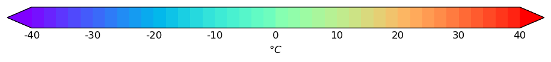
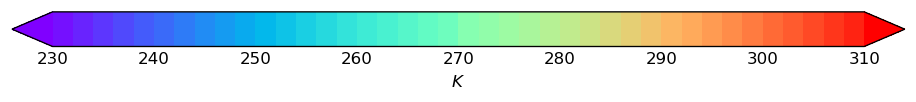
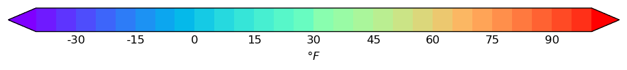
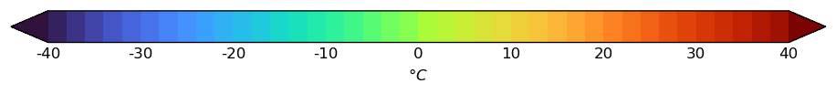
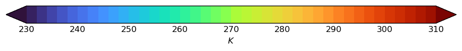
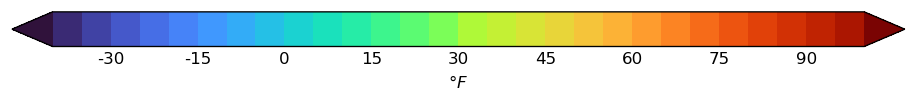

.. _styles-gallery:

Styles gallery
==============

This page lists all built-in styles shipped with **earthkit-plots**.
Each entry shows the style name and a preview of the colorbar.
Click the copy button next to any name to copy it for use in your code::

    chart.contourf(data, style="temperature-2m-turbo-celsius")

.. note::

   This page is auto-generated during the documentation build.
   Any new styles added to ``data/styles/auto-styles/`` will appear
   here automatically.

.. raw:: html

   
   

Mean sea level pressure
-----------------------

.. raw:: html

   

<code class="ek-style-name">mslp-contour-pa</code>
<button class="ek-copy-btn" onclick="ekCopy(this, 'mslp-contour-pa')"><svg xmlns="http://www.w3.org/2000/svg" width="14" height="14" viewBox="0 0 24 24" fill="none" stroke="currentColor" stroke-width="2" stroke-linecap="round" stroke-linejoin="round"><path stroke="none" d="M0 0h24v24H0z" fill="none"/><path d="M7 7m0 2.667a2.667 2.667 0 0 1 2.667 -2.667h8.666a2.667 2.667 0 0 1 2.667 2.667v8.666a2.667 2.667 0 0 1 -2.667 2.667h-8.666a2.667 2.667 0 0 1 -2.667 -2.667z" /><path d="M4.012 16.737a2.005 2.005 0 0 1 -1.012 -1.737v-10c0 -1.1 .9 -2 2 -2h10c.75 0 1.158 .385 1.5 1" /></svg> Copy this style name</button>

*(Contour style — levels are determined from data at plot time)*

.. raw:: html

   

<code class="ek-style-name">mslp-contour-hpa</code>
<button class="ek-copy-btn" onclick="ekCopy(this, 'mslp-contour-hpa')"><svg xmlns="http://www.w3.org/2000/svg" width="14" height="14" viewBox="0 0 24 24" fill="none" stroke="currentColor" stroke-width="2" stroke-linecap="round" stroke-linejoin="round"><path stroke="none" d="M0 0h24v24H0z" fill="none"/><path d="M7 7m0 2.667a2.667 2.667 0 0 1 2.667 -2.667h8.666a2.667 2.667 0 0 1 2.667 2.667v8.666a2.667 2.667 0 0 1 -2.667 2.667h-8.666a2.667 2.667 0 0 1 -2.667 -2.667z" /><path d="M4.012 16.737a2.005 2.005 0 0 1 -1.012 -1.737v-10c0 -1.1 .9 -2 2 -2h10c.75 0 1.158 .385 1.5 1" /></svg> Copy this style name</button>

*(Contour style — levels are determined from data at plot time)*

Temperature at 850hpa
---------------------

.. raw:: html

   

<code class="ek-style-name">temperature-850hpa-rainbow-celsius</code>
<button class="ek-copy-btn" onclick="ekCopy(this, 'temperature-850hpa-rainbow-celsius')"><svg xmlns="http://www.w3.org/2000/svg" width="14" height="14" viewBox="0 0 24 24" fill="none" stroke="currentColor" stroke-width="2" stroke-linecap="round" stroke-linejoin="round"><path stroke="none" d="M0 0h24v24H0z" fill="none"/><path d="M7 7m0 2.667a2.667 2.667 0 0 1 2.667 -2.667h8.666a2.667 2.667 0 0 1 2.667 2.667v8.666a2.667 2.667 0 0 1 -2.667 2.667h-8.666a2.667 2.667 0 0 1 -2.667 -2.667z" /><path d="M4.012 16.737a2.005 2.005 0 0 1 -1.012 -1.737v-10c0 -1.1 .9 -2 2 -2h10c.75 0 1.158 .385 1.5 1" /></svg> Copy this style name</button>

.. raw:: html

   

<code class="ek-style-name">temperature-850hpa-rainbow-kelvin</code>
<button class="ek-copy-btn" onclick="ekCopy(this, 'temperature-850hpa-rainbow-kelvin')"><svg xmlns="http://www.w3.org/2000/svg" width="14" height="14" viewBox="0 0 24 24" fill="none" stroke="currentColor" stroke-width="2" stroke-linecap="round" stroke-linejoin="round"><path stroke="none" d="M0 0h24v24H0z" fill="none"/><path d="M7 7m0 2.667a2.667 2.667 0 0 1 2.667 -2.667h8.666a2.667 2.667 0 0 1 2.667 2.667v8.666a2.667 2.667 0 0 1 -2.667 2.667h-8.666a2.667 2.667 0 0 1 -2.667 -2.667z" /><path d="M4.012 16.737a2.005 2.005 0 0 1 -1.012 -1.737v-10c0 -1.1 .9 -2 2 -2h10c.75 0 1.158 .385 1.5 1" /></svg> Copy this style name</button>

.. raw:: html

   

<code class="ek-style-name">temperature-850hpa-rainbow-fahrenheit</code>
<button class="ek-copy-btn" onclick="ekCopy(this, 'temperature-850hpa-rainbow-fahrenheit')"><svg xmlns="http://www.w3.org/2000/svg" width="14" height="14" viewBox="0 0 24 24" fill="none" stroke="currentColor" stroke-width="2" stroke-linecap="round" stroke-linejoin="round"><path stroke="none" d="M0 0h24v24H0z" fill="none"/><path d="M7 7m0 2.667a2.667 2.667 0 0 1 2.667 -2.667h8.666a2.667 2.667 0 0 1 2.667 2.667v8.666a2.667 2.667 0 0 1 -2.667 2.667h-8.666a2.667 2.667 0 0 1 -2.667 -2.667z" /><path d="M4.012 16.737a2.005 2.005 0 0 1 -1.012 -1.737v-10c0 -1.1 .9 -2 2 -2h10c.75 0 1.158 .385 1.5 1" /></svg> Copy this style name</button>

River discharge
---------------

.. raw:: html

   

<code class="ek-style-name">river-discharge-blues-europe</code>
<button class="ek-copy-btn" onclick="ekCopy(this, 'river-discharge-blues-europe')"><svg xmlns="http://www.w3.org/2000/svg" width="14" height="14" viewBox="0 0 24 24" fill="none" stroke="currentColor" stroke-width="2" stroke-linecap="round" stroke-linejoin="round"><path stroke="none" d="M0 0h24v24H0z" fill="none"/><path d="M7 7m0 2.667a2.667 2.667 0 0 1 2.667 -2.667h8.666a2.667 2.667 0 0 1 2.667 2.667v8.666a2.667 2.667 0 0 1 -2.667 2.667h-8.666a2.667 2.667 0 0 1 -2.667 -2.667z" /><path d="M4.012 16.737a2.005 2.005 0 0 1 -1.012 -1.737v-10c0 -1.1 .9 -2 2 -2h10c.75 0 1.158 .385 1.5 1" /></svg> Copy this style name</button>

.. image:: _static/styles/river-discharge-blues-europe.png
   :alt: colorbar preview

.. raw:: html

   

<code class="ek-style-name">river-discharge-blues-global</code>
<button class="ek-copy-btn" onclick="ekCopy(this, 'river-discharge-blues-global')"><svg xmlns="http://www.w3.org/2000/svg" width="14" height="14" viewBox="0 0 24 24" fill="none" stroke="currentColor" stroke-width="2" stroke-linecap="round" stroke-linejoin="round"><path stroke="none" d="M0 0h24v24H0z" fill="none"/><path d="M7 7m0 2.667a2.667 2.667 0 0 1 2.667 -2.667h8.666a2.667 2.667 0 0 1 2.667 2.667v8.666a2.667 2.667 0 0 1 -2.667 2.667h-8.666a2.667 2.667 0 0 1 -2.667 -2.667z" /><path d="M4.012 16.737a2.005 2.005 0 0 1 -1.012 -1.737v-10c0 -1.1 .9 -2 2 -2h10c.75 0 1.158 .385 1.5 1" /></svg> Copy this style name</button>

.. image:: _static/styles/river-discharge-blues-global.png
   :alt: colorbar preview

Sea surface temperature
-----------------------

.. raw:: html

   

<code class="ek-style-name">sst-spectral-celsius</code>
<button class="ek-copy-btn" onclick="ekCopy(this, 'sst-spectral-celsius')"><svg xmlns="http://www.w3.org/2000/svg" width="14" height="14" viewBox="0 0 24 24" fill="none" stroke="currentColor" stroke-width="2" stroke-linecap="round" stroke-linejoin="round"><path stroke="none" d="M0 0h24v24H0z" fill="none"/><path d="M7 7m0 2.667a2.667 2.667 0 0 1 2.667 -2.667h8.666a2.667 2.667 0 0 1 2.667 2.667v8.666a2.667 2.667 0 0 1 -2.667 2.667h-8.666a2.667 2.667 0 0 1 -2.667 -2.667z" /><path d="M4.012 16.737a2.005 2.005 0 0 1 -1.012 -1.737v-10c0 -1.1 .9 -2 2 -2h10c.75 0 1.158 .385 1.5 1" /></svg> Copy this style name</button>

.. image:: _static/styles/sst-spectral-celsius.png
   :alt: colorbar preview

.. raw:: html

   

<code class="ek-style-name">sst-spectral-kelvin</code>
<button class="ek-copy-btn" onclick="ekCopy(this, 'sst-spectral-kelvin')"><svg xmlns="http://www.w3.org/2000/svg" width="14" height="14" viewBox="0 0 24 24" fill="none" stroke="currentColor" stroke-width="2" stroke-linecap="round" stroke-linejoin="round"><path stroke="none" d="M0 0h24v24H0z" fill="none"/><path d="M7 7m0 2.667a2.667 2.667 0 0 1 2.667 -2.667h8.666a2.667 2.667 0 0 1 2.667 2.667v8.666a2.667 2.667 0 0 1 -2.667 2.667h-8.666a2.667 2.667 0 0 1 -2.667 -2.667z" /><path d="M4.012 16.737a2.005 2.005 0 0 1 -1.012 -1.737v-10c0 -1.1 .9 -2 2 -2h10c.75 0 1.158 .385 1.5 1" /></svg> Copy this style name</button>

.. image:: _static/styles/sst-spectral-kelvin.png
   :alt: colorbar preview

Snow water equivalent
---------------------

.. raw:: html

   

<code class="ek-style-name">snow-water-equivalent-kg-m2</code>
<button class="ek-copy-btn" onclick="ekCopy(this, 'snow-water-equivalent-kg-m2')"><svg xmlns="http://www.w3.org/2000/svg" width="14" height="14" viewBox="0 0 24 24" fill="none" stroke="currentColor" stroke-width="2" stroke-linecap="round" stroke-linejoin="round"><path stroke="none" d="M0 0h24v24H0z" fill="none"/><path d="M7 7m0 2.667a2.667 2.667 0 0 1 2.667 -2.667h8.666a2.667 2.667 0 0 1 2.667 2.667v8.666a2.667 2.667 0 0 1 -2.667 2.667h-8.666a2.667 2.667 0 0 1 -2.667 -2.667z" /><path d="M4.012 16.737a2.005 2.005 0 0 1 -1.012 -1.737v-10c0 -1.1 .9 -2 2 -2h10c.75 0 1.158 .385 1.5 1" /></svg> Copy this style name</button>

.. image:: _static/styles/snow-water-equivalent-kg-m2.png
   :alt: colorbar preview

Soil wetness index
------------------

.. raw:: html

   

<code class="ek-style-name">soil-wetness-greens</code>
<button class="ek-copy-btn" onclick="ekCopy(this, 'soil-wetness-greens')"><svg xmlns="http://www.w3.org/2000/svg" width="14" height="14" viewBox="0 0 24 24" fill="none" stroke="currentColor" stroke-width="2" stroke-linecap="round" stroke-linejoin="round"><path stroke="none" d="M0 0h24v24H0z" fill="none"/><path d="M7 7m0 2.667a2.667 2.667 0 0 1 2.667 -2.667h8.666a2.667 2.667 0 0 1 2.667 2.667v8.666a2.667 2.667 0 0 1 -2.667 2.667h-8.666a2.667 2.667 0 0 1 -2.667 -2.667z" /><path d="M4.012 16.737a2.005 2.005 0 0 1 -1.012 -1.737v-10c0 -1.1 .9 -2 2 -2h10c.75 0 1.158 .385 1.5 1" /></svg> Copy this style name</button>

.. image:: _static/styles/soil-wetness-greens.png
   :alt: colorbar preview

Near surface air temperature
----------------------------

.. raw:: html

   

<code class="ek-style-name">temperature-2m-turbo-celsius</code>
<button class="ek-copy-btn" onclick="ekCopy(this, 'temperature-2m-turbo-celsius')"><svg xmlns="http://www.w3.org/2000/svg" width="14" height="14" viewBox="0 0 24 24" fill="none" stroke="currentColor" stroke-width="2" stroke-linecap="round" stroke-linejoin="round"><path stroke="none" d="M0 0h24v24H0z" fill="none"/><path d="M7 7m0 2.667a2.667 2.667 0 0 1 2.667 -2.667h8.666a2.667 2.667 0 0 1 2.667 2.667v8.666a2.667 2.667 0 0 1 -2.667 2.667h-8.666a2.667 2.667 0 0 1 -2.667 -2.667z" /><path d="M4.012 16.737a2.005 2.005 0 0 1 -1.012 -1.737v-10c0 -1.1 .9 -2 2 -2h10c.75 0 1.158 .385 1.5 1" /></svg> Copy this style name</button>

.. raw:: html

   

<code class="ek-style-name">temperature-2m-turbo-kelvin</code>
<button class="ek-copy-btn" onclick="ekCopy(this, 'temperature-2m-turbo-kelvin')"><svg xmlns="http://www.w3.org/2000/svg" width="14" height="14" viewBox="0 0 24 24" fill="none" stroke="currentColor" stroke-width="2" stroke-linecap="round" stroke-linejoin="round"><path stroke="none" d="M0 0h24v24H0z" fill="none"/><path d="M7 7m0 2.667a2.667 2.667 0 0 1 2.667 -2.667h8.666a2.667 2.667 0 0 1 2.667 2.667v8.666a2.667 2.667 0 0 1 -2.667 2.667h-8.666a2.667 2.667 0 0 1 -2.667 -2.667z" /><path d="M4.012 16.737a2.005 2.005 0 0 1 -1.012 -1.737v-10c0 -1.1 .9 -2 2 -2h10c.75 0 1.158 .385 1.5 1" /></svg> Copy this style name</button>

.. raw:: html

   

<code class="ek-style-name">temperature-2m-turbo-fahrenheit</code>
<button class="ek-copy-btn" onclick="ekCopy(this, 'temperature-2m-turbo-fahrenheit')"><svg xmlns="http://www.w3.org/2000/svg" width="14" height="14" viewBox="0 0 24 24" fill="none" stroke="currentColor" stroke-width="2" stroke-linecap="round" stroke-linejoin="round"><path stroke="none" d="M0 0h24v24H0z" fill="none"/><path d="M7 7m0 2.667a2.667 2.667 0 0 1 2.667 -2.667h8.666a2.667 2.667 0 0 1 2.667 2.667v8.666a2.667 2.667 0 0 1 -2.667 2.667h-8.666a2.667 2.667 0 0 1 -2.667 -2.667z" /><path d="M4.012 16.737a2.005 2.005 0 0 1 -1.012 -1.737v-10c0 -1.1 .9 -2 2 -2h10c.75 0 1.158 .385 1.5 1" /></svg> Copy this style name</button>

Total precipitation
-------------------

.. raw:: html

   

<code class="ek-style-name">precipitation-turbo-mm</code>
<button class="ek-copy-btn" onclick="ekCopy(this, 'precipitation-turbo-mm')"><svg xmlns="http://www.w3.org/2000/svg" width="14" height="14" viewBox="0 0 24 24" fill="none" stroke="currentColor" stroke-width="2" stroke-linecap="round" stroke-linejoin="round"><path stroke="none" d="M0 0h24v24H0z" fill="none"/><path d="M7 7m0 2.667a2.667 2.667 0 0 1 2.667 -2.667h8.666a2.667 2.667 0 0 1 2.667 2.667v8.666a2.667 2.667 0 0 1 -2.667 2.667h-8.666a2.667 2.667 0 0 1 -2.667 -2.667z" /><path d="M4.012 16.737a2.005 2.005 0 0 1 -1.012 -1.737v-10c0 -1.1 .9 -2 2 -2h10c.75 0 1.158 .385 1.5 1" /></svg> Copy this style name</button>

.. image:: _static/styles/precipitation-turbo-mm.png
   :alt: colorbar preview

.. raw:: html

   

<code class="ek-style-name">precipitation-turbo-m</code>
<button class="ek-copy-btn" onclick="ekCopy(this, 'precipitation-turbo-m')"><svg xmlns="http://www.w3.org/2000/svg" width="14" height="14" viewBox="0 0 24 24" fill="none" stroke="currentColor" stroke-width="2" stroke-linecap="round" stroke-linejoin="round"><path stroke="none" d="M0 0h24v24H0z" fill="none"/><path d="M7 7m0 2.667a2.667 2.667 0 0 1 2.667 -2.667h8.666a2.667 2.667 0 0 1 2.667 2.667v8.666a2.667 2.667 0 0 1 -2.667 2.667h-8.666a2.667 2.667 0 0 1 -2.667 -2.667z" /><path d="M4.012 16.737a2.005 2.005 0 0 1 -1.012 -1.737v-10c0 -1.1 .9 -2 2 -2h10c.75 0 1.158 .385 1.5 1" /></svg> Copy this style name</button>

.. image:: _static/styles/precipitation-turbo-m.png
   :alt: colorbar preview

.. raw:: html

   

<code class="ek-style-name">precipitation-turbo-kg-m2</code>
<button class="ek-copy-btn" onclick="ekCopy(this, 'precipitation-turbo-kg-m2')"><svg xmlns="http://www.w3.org/2000/svg" width="14" height="14" viewBox="0 0 24 24" fill="none" stroke="currentColor" stroke-width="2" stroke-linecap="round" stroke-linejoin="round"><path stroke="none" d="M0 0h24v24H0z" fill="none"/><path d="M7 7m0 2.667a2.667 2.667 0 0 1 2.667 -2.667h8.666a2.667 2.667 0 0 1 2.667 2.667v8.666a2.667 2.667 0 0 1 -2.667 2.667h-8.666a2.667 2.667 0 0 1 -2.667 -2.667z" /><path d="M4.012 16.737a2.005 2.005 0 0 1 -1.012 -1.737v-10c0 -1.1 .9 -2 2 -2h10c.75 0 1.158 .385 1.5 1" /></svg> Copy this style name</button>

.. image:: _static/styles/precipitation-turbo-kg-m2.png
   :alt: colorbar preview

Total runoff water equivalent
-----------------------------

.. raw:: html

   

<code class="ek-style-name">runoff-blues-kg-m2</code>
<button class="ek-copy-btn" onclick="ekCopy(this, 'runoff-blues-kg-m2')"><svg xmlns="http://www.w3.org/2000/svg" width="14" height="14" viewBox="0 0 24 24" fill="none" stroke="currentColor" stroke-width="2" stroke-linecap="round" stroke-linejoin="round"><path stroke="none" d="M0 0h24v24H0z" fill="none"/><path d="M7 7m0 2.667a2.667 2.667 0 0 1 2.667 -2.667h8.666a2.667 2.667 0 0 1 2.667 2.667v8.666a2.667 2.667 0 0 1 -2.667 2.667h-8.666a2.667 2.667 0 0 1 -2.667 -2.667z" /><path d="M4.012 16.737a2.005 2.005 0 0 1 -1.012 -1.737v-10c0 -1.1 .9 -2 2 -2h10c.75 0 1.158 .385 1.5 1" /></svg> Copy this style name</button>

.. image:: _static/styles/runoff-blues-kg-m2.png
   :alt: colorbar preview

Wind gust at 10m in last 6 hours
--------------------------------

.. raw:: html

   

<code class="ek-style-name">wind-gust-6h-m-s</code>
<button class="ek-copy-btn" onclick="ekCopy(this, 'wind-gust-6h-m-s')"><svg xmlns="http://www.w3.org/2000/svg" width="14" height="14" viewBox="0 0 24 24" fill="none" stroke="currentColor" stroke-width="2" stroke-linecap="round" stroke-linejoin="round"><path stroke="none" d="M0 0h24v24H0z" fill="none"/><path d="M7 7m0 2.667a2.667 2.667 0 0 1 2.667 -2.667h8.666a2.667 2.667 0 0 1 2.667 2.667v8.666a2.667 2.667 0 0 1 -2.667 2.667h-8.666a2.667 2.667 0 0 1 -2.667 -2.667z" /><path d="M4.012 16.737a2.005 2.005 0 0 1 -1.012 -1.737v-10c0 -1.1 .9 -2 2 -2h10c.75 0 1.158 .385 1.5 1" /></svg> Copy this style name</button>

.. image:: _static/styles/wind-gust-6h-m-s.png
   :alt: colorbar preview

.. raw:: html

   

<code class="ek-style-name">wind-speed-10m-m-s</code>
<button class="ek-copy-btn" onclick="ekCopy(this, 'wind-speed-10m-m-s')"><svg xmlns="http://www.w3.org/2000/svg" width="14" height="14" viewBox="0 0 24 24" fill="none" stroke="currentColor" stroke-width="2" stroke-linecap="round" stroke-linejoin="round"><path stroke="none" d="M0 0h24v24H0z" fill="none"/><path d="M7 7m0 2.667a2.667 2.667 0 0 1 2.667 -2.667h8.666a2.667 2.667 0 0 1 2.667 2.667v8.666a2.667 2.667 0 0 1 -2.667 2.667h-8.666a2.667 2.667 0 0 1 -2.667 -2.667z" /><path d="M4.012 16.737a2.005 2.005 0 0 1 -1.012 -1.737v-10c0 -1.1 .9 -2 2 -2h10c.75 0 1.158 .385 1.5 1" /></svg> Copy this style name</button>

.. image:: _static/styles/wind-speed-10m-m-s.png
   :alt: colorbar preview

Wind
----

.. raw:: html

   

<code class="ek-style-name">wind-quiver-m-s</code>
<button class="ek-copy-btn" onclick="ekCopy(this, 'wind-quiver-m-s')"><svg xmlns="http://www.w3.org/2000/svg" width="14" height="14" viewBox="0 0 24 24" fill="none" stroke="currentColor" stroke-width="2" stroke-linecap="round" stroke-linejoin="round"><path stroke="none" d="M0 0h24v24H0z" fill="none"/><path d="M7 7m0 2.667a2.667 2.667 0 0 1 2.667 -2.667h8.666a2.667 2.667 0 0 1 2.667 2.667v8.666a2.667 2.667 0 0 1 -2.667 2.667h-8.666a2.667 2.667 0 0 1 -2.667 -2.667z" /><path d="M4.012 16.737a2.005 2.005 0 0 1 -1.012 -1.737v-10c0 -1.1 .9 -2 2 -2h10c.75 0 1.158 .385 1.5 1" /></svg> Copy this style name</button>

*(No colorbar — vector style)*
